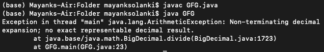
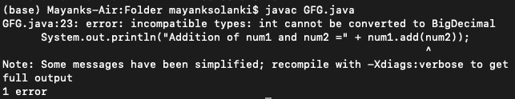

# 大十进制和原始数据类型之间算术运算的 Java 程序

> 原文:[https://www . geeksforgeeks . org/Java-big decimal 和基元数据类型之间算术运算程序/](https://www.geeksforgeeks.org/java-program-for-arithmetic-operations-between-bigdecimal-and-primitive-data-types/)

浮点数据类型(浮点型和双精度型)在财务计算中使用时不太准确。因此，Java 提供了一个单独的类“BigDecimal”来执行操作，并避免计算中出现错误的可能性极小。 [BigDecimal 类](https://www.geeksforgeeks.org/bigdecimal-class-java/)提供对双数的运算，用于算术、小数位数处理、舍入、比较、格式转换和散列。它可以非常精确地处理非常大和非常小的浮点数，但会稍微补偿时间复杂度。BigDecimal 提供了许多可以实现的方法。在本文中，我们将讨论可以在 BigDecimal 上执行的基本算术运算，以及在 BigDecimal 和原始数据类型(如 int、short、long 等)之间执行相同的运算。

**例 1:**

## Java 语言(一种计算机语言，尤用于创建网站)

```
// Java Program to Add, Subtract and Multiply
// Two big decimal numbers 

// Importing input output classes
import java.io.*;

// Importing BigDecimal class from
// java.math package
import java.math.BigDecimal;

// Main class
class GFG {

    // Main driver method
    public static void main(String[] args)
    {

        // Declaring two variables of type BigDecimal
        // Custom numbers for illustration
        BigDecimal num1 = new BigDecimal("15.3514628768");
        BigDecimal num2 = new BigDecimal("45.37844");

        // Mathematic operation over two numbers

        // Addition using add() method
        System.out.println("Addition of num1 and num2 = "
                           + (num1.add(num2)));

        // Subtraction using subtract() method
        System.out.println("Subtraction of num1 and num2 = "
                           + (num1.subtract(num2)));

        // Multiplication using multiply() method
        System.out.println(
            "Multiplication of num1 and num2 = "
            + (num1.multiply(num2)));
    }
}
```

**Output**

```
Addition of num1 and num2 = 60.7299028768
Subtraction of num1 and num2 = -30.0269771232
Multiplication of num1 and num2 = 696.625437067096192
```

**输出说明:**

请注意，操作的准确性非常高。现在对下面示例中的同一组数字执行除法运算，如下所示:

**例 2:**

## Java 语言(一种计算机语言，尤用于创建网站)

```
// Java Program to show exception thrown if blunt division
// of two big decimal numbers is carried on

// Importing input output classes
import java.io.*;
// Importing BigDecimal class from
// java.math package
import java.math.BigDecimal;

// Main class
class GFG {

    // Main driver method
    public static void main (String[] args) {

        // Creating an object of bigDecimal class and
        // initializing the big decimal values
        // Custom entry 
        BigDecimal num1 = new BigDecimal("15.3514628768");
        BigDecimal num2 = new BigDecimal("45.37844");

        // Division over two numbers
        // using divide() method and printing the resultant number
        System.out.println("Division of num1 and num2 = " + (num2.divide(num1)));
    }
}
```

**输出:**



**输出解释:**

出现这个错误是因为两个数字的除法是不可终止的，我们知道引入 BigDecimal 是为了提供最大的精度。因此，它会产生一个错误。我们将在下一个代码中纠正相同的情况，在下一个代码中，我们将对相同的数字进行除法运算，但是现在数据类型是 double，它应该不会产生任何错误，并给出一些答案。

**例 3:**

## Java 语言(一种计算机语言，尤用于创建网站)

```
// Java Program to show division of two big decimal numbers

// Importing input output classes
import java.io.*;

// Main class
class GFG {

    // Main driver method
    public static void main(String[] args)
    {

        // Creating and initializing double numbers
        // Custom entries
        double num1 = 15.3514628768;
        double num2 = 45.37844;

        // Dividing two big decimal numbers after which
        // numbers obtained will also be a big decimal
        // number

        // Print and display the resultant number
        System.out.println("Division of num1 and num2 = "
                           + (num2 / num1));
    }
}
```

**Output**

```
Division of num1 and num2 = 2.955968454874647
```

> 到目前为止，我们已经对两个大十进制对象执行了算术运算，现在我们将尝试对原始数据类型执行同样的操作。我们开始吧。

**例 4:**

## Java 语言(一种计算机语言，尤用于创建网站)

```
// Java Program to Add big decimal number
// with an Integer number

// Importing input output classes
import java.io.*;

// importing BigDecimal class from
// java.math package
import java.math.BigDecimal;

// main class
class GFG {

    // Main driver method
    public static void main(String[] args)
    {

        // Declaring a BigDecimal object
        BigDecimal num1 = new BigDecimal("12");

        // Declaring an integer number
        int num2 = 15;

        // Adding a big decimal number with
        // an integer number
        System.out.println("Addition of num1 and num2 ="
                           + num1.add(num2));
    }
}
```

**输出:**



**输出说明:**

这是因为 BigDecimal 只允许对 BigDecimal 对象执行操作。因此，我们需要使用 BigDecimal 类的构造函数将我们的原始数据类型变量转换为 BigDecimal 的对象。下面的代码解决了上述冲突，如下所示。

**例 5:**

## Java 语言(一种计算机语言，尤用于创建网站)

```
// Java Program to Add big decimal number
// with an Integer number

// Importing input output classes
import java.io.*;

// Importing BigDecimal class from
// java.math package
import java.math.BigDecimal;

// Main class
class GFG {

    // Main driver method
    public static void main(String[] args)
    {

        // Declaring a BigDecimal object
        BigDecimal num1 = new BigDecimal("12");

        // Declaring an integer number
        int num2 = 15;

        // Print the addition of two numbers
        System.out.println(
            "Addition of num1 and num2 = "
            + num1.add(new BigDecimal(num2)));
    }
}
```

**Output**

```
Addition of num1 and num2 = 27
```

**输出说明:**

这里发生的事情是，我们正在创建一个新的 BigDecimal 类对象，其值与 num2 相同，我们直接将通过构造函数创建的对象传递给 add()方法的参数。我们得到了我们需要的答案。BigDecimal 和 int 之间的算术运算如下所示。

**例 6:**

## Java 语言(一种计算机语言，尤用于创建网站)

```
// Importing all input output classes
import java.io.*;
// Importing BigDecimal class from
// java.math package
import java.math.BigDecimal;

// Main class
class GFG {

    // Main driver method
    public static void main(String[] args)
    {

        // Declaring a BigDecimal object
        BigDecimal num1 = new BigDecimal("12");

        // Declaring an integer number
        int num2 = 15;

        // Addition over numbers
        // Print the resultant desired number
        System.out.println(
            "Addition of num1 and num2 = "
            + num1.add(new BigDecimal(num2)));

        // Subtraction over numbers
        // Print the resultant desired number
        System.out.println(
            "Subtraction of num1 and num2 = "
            + num1.subtract(new BigDecimal(num2)));

        // Multiplication over numbers
        // Print the resultant desired number
        System.out.println(
            "Multiplication of num1 and num2 = "
            + num1.multiply(new BigDecimal(num2)));

        // Division over numbers
        // Print the resultant desired number
        System.out.println(
            "Division of num1 and num2 = "
            + num1.divide(new BigDecimal(num2)));
    }
}
```

**Output**

```
Addition of num1 and num2 = 27
Subtraction of num1 and num2 = -3
Multiplication of num1 and num2 = 180
Division of num1 and num2 = 0.8
```