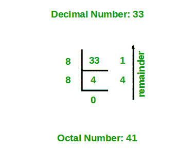

# 十进制到八进制转换的 Java 程序

> 原文:[https://www . geesforgeks . org/Java-十进制到八进制转换程序/](https://www.geeksforgeeks.org/java-program-for-decimal-to-octal-conversion/)

给定十进制数 N，将 N 转换为等效的八进制数，即将基数为 10 的数转换为基数为 8 的数。十进制数字系统使用 10 位数字 0-9，八进制数字系统使用 8 位数字 0-7 来表示任何数值。

插图:

```java
Input : 33
Output: 41

Input : 10
Output: 12
```

**方法 1:**

1.  当数组中的数字被 8 除时，存储余数。
2.  现在把这个数除以 8
3.  重复以上两个步骤，直到数字不等于 0。
4.  现在以相反的顺序打印数组。



将十进制数 33 转换为等效八进制数的示例。

**示例:**

## Java 语言(一种计算机语言，尤用于创建网站)

```java
// Java program to convert a Decimal Number to Octal Number

// Importing input output classes
import java.io.*;

// Main class
class GFG {

    // Method
    // To convert decimal to octal
    static void decToOctal(int n)
    {
        // Creating an Integer array of
        // array to store octal number
        int[] octalNum = new int[100];

        // counter for octal number array
        int i = 0;
        while (n != 0) {

            // Storing remainder in octal array
            octalNum[i] = n % 8;
            n = n / 8;
            i++;
        }

        // Printing octal number array in reverse order
        for (int j = i - 1; j >= 0; j--)
            System.out.print(octalNum[j]);
    }

    // Method 2
    // Main driver method
    public static void main(String[] args)
    {
        // Custom input Integer number
        int n = 33;

        // Calling the above method to convert
        // Decimal to Octal number
        decToOctal(n);
    }
}
```

**Output**

```java
41
```

> 时间复杂度:0(对数 N)

**方法 2:**

*   用 0 初始化位置，用 1 初始化计数，十进制数为 n
*   当十进制数除以 8 时计算余数
*   用八进制+(余数* countval)更新八进制数
*   将 countval 增加 countval*10
*   十进制数除以 8
*   重复步骤 2，直到十进制数为零

**示例:**

## Java 语言(一种计算机语言，尤用于创建网站)

```java
// Java Program to Convert Decimal Number to Octal Number

// Importing input output classes
import java.io.*;

// Main class
class GFG {

    // Method 1
    // To calculate the octal value of the given
    // decimal number
    static void decimaltooctal(int deciNum)
    {

        // Initially declaring and initializing the
        // octal number with zero
        int octalNum = 0, countval = 1;
        int dNo = deciNum;

        // Condition check
        while (deciNum != 0) {

            // Decimals remainder is calculated
            int remainder = deciNum % 8;

            // Storing the octalvalue
            octalNum += remainder * countval;

            // Storing exponential value
            countval = countval * 10;
            deciNum /= 8;
        }

        // Print and display the octal number
        System.out.println(octalNum);
    }

    // Method 2
    // Main driver method
    public static void main(String[] args)
    {
        // Custom input decimal number
        int n = 33;

        // Calling the Method1 to convert above number
        // to Octal number system
        decimaltooctal(n);
    }
}
```

**Output**

```java
41
```

时间复杂度:O(log N)
辅助空间:O(1)