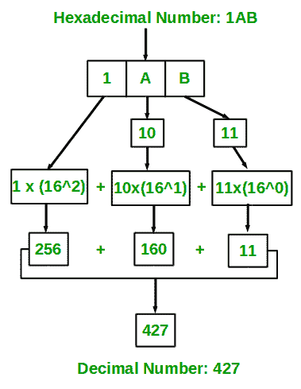

# 十六进制到十进制转换的 Java 程序

> 原文:[https://www . geesforgeks . org/Java-program-for-十六进制到十进制的转换/](https://www.geeksforgeeks.org/java-program-for-hexadecimal-to-decimal-conversion/)

给定一个十六进制数 N，将 N 转换为一个等价的十进制数，即将基数为 16 的数转换为基数为 10 的数。十进制数字系统使用 10 位数字 0-9，十六进制数字系统使用 0-9，A-F 来表示任何数值。

插图:

```
Input : 1AB
Output: 427

Input : 1A
Output: 26
```

**进场:**

1.  思路是从最右边的数字开始提取 a 给定十六进制数的数字。
2.  保留一个变量‘dec _ value’。
3.  在从十六进制数中提取数字时，将该数字与适当的基数(16 的幂)相乘，并将其添加到上面的变量“dec_value”中。
4.  最后，变量‘dec _ value’会存储需要的十进制数。



将十六进制数(1AB)转换为等效的十进制值

**实施:**

**例**

## Java 语言(一种计算机语言，尤用于创建网站)

```
// Java program to convert Hexadecimal to Decimal Number

// Importing input output classes
import java.io.*;

// Main class
class GFG {

    // Method
    // To convert hexadecimal to decimal
    static int hexadecimalToDecimal(String hexVal)
    {
        // Storing the length of the
        int len = hexVal.length();

        // Initializing base value to 1, i.e 16^0
        int base = 1;

        // Initially declaring and initializing
        // decimal value to zero
        int dec_val = 0;

        // Extracting characters as
        // digits from last character

        for (int i = len - 1; i >= 0; i--) {

            // Condition check
            // Case 1
            // If character lies in '0'-'9', converting
            // it to integral 0-9 by subtracting 48 from
            // ASCII value
            if (hexVal.charAt(i) >= '0'
                && hexVal.charAt(i) <= '9') {
                dec_val += (hexVal.charAt(i) - 48) * base;

                // Incrementing base by power
                base = base * 16;
            }

            // Case 2
            // if case 1 is bypassed

            // Now, if character lies in 'A'-'F' ,
            // converting it to integral 10 - 15 by
            // subtracting 55 from ASCII value
            else if (hexVal.charAt(i) >= 'A'
                     && hexVal.charAt(i) <= 'F') {
                dec_val += (hexVal.charAt(i) - 55) * base;

                // Incrementing base by power
                base = base * 16;
            }
        }

        // Returning the decimal value
        return dec_val;
    }

    // Method 2
    // Main driver method
    public static void main(String[] args)
    {
        // Custom input hexadecimal number to be
        // converted into decimal number
        String hexNum = "1A";

        // Calling the above method to convert and
        // alongside printing the hexadecimal number
        System.out.println(hexadecimalToDecimal(hexNum));
    }
}
```

**Output**

```
26
```