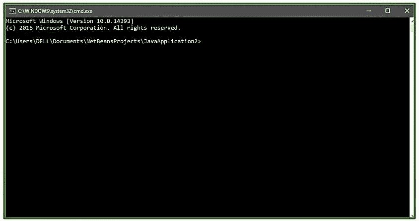
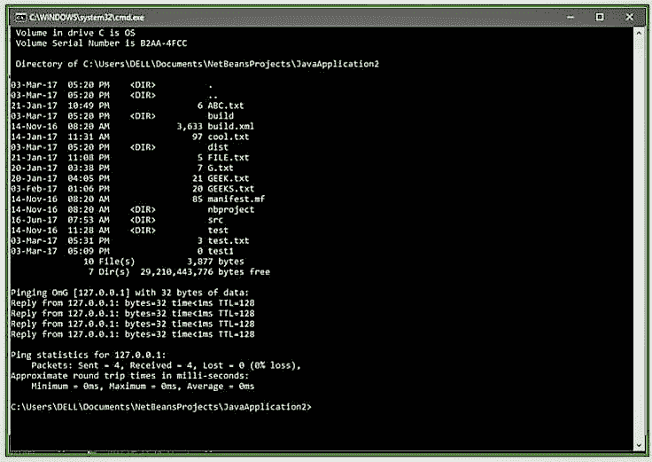

# Java 程序打开命令提示符，插入命令

> 原文:[https://www . geesforgeks . org/Java-program-open-command-prompt-insert-commands/](https://www.geeksforgeeks.org/java-program-open-command-prompt-insert-commands/)

本文旨在为您提供一个打开命令提示符的简单代码，以及如何使用 Java 语言在其中插入命令。

这里我们将使用 [java.lang 包](https://www.geeksforgeeks.org/java-lang-package-java/)的 **[运行时类](https://www.geeksforgeeks.org/java-lang-runtime-class-in-java/)** 。这个类允许 Java 应用程序干扰它运行的环境，因为每个 Java 应用程序都有一个 Runtime 类的实例。为了执行任务，让我们来看看 Runtime 类的 **exec()** 方法。

**Java . lang . runtime . exec(String 命令):**方法在执行指定的 String 命令中起主要作用。它在单独的进程中执行指定的字符串命令。

```java
Syntax: 
public Process exec(String command)
Parameters : 
command : specific command
Returns :
A new Process object for managing the subprocess
Throws:
SecurityException - If a security manager exists and its checkExec method doesn't 
allow creation of the subprocess
IOException - If an I/O error occurs
NullPointerException - If command is null
IllegalArgumentException - If command is empty

```

**如何运行命令提示符**

```java
// Java program to illustrate
// open cmd prompt

class NewClass
{
    public static void main(String[] args)
    {
        try
        {
            // Just one line and you are done ! 
            // We have given a command to start cmd
            // /K : Carries out command specified by string
           Runtime.getRuntime().exec(new String[] {"cmd", "/K", "Start"});

        }
        catch (Exception e)
        {
            System.out.println("HEY Buddy ! U r Doing Something Wrong ");
            e.printStackTrace();
        }
    }
}
```

**注意:**
这个程序不会在 Online-IDE 上运行，所以请在你的系统 JAVA 编译器上运行，看看工作情况。
**输出:**


**插入并运行命令**

使用这段代码，您可以在 cmd 中执行某些命令。给定程序在 cmd 中执行**“dir”**(列出所有目录)和**“ping”**(测试源计算机到达指定目标计算机的能力)命令。

```java
// Java program to illustrate
// executing commands on cmd prompt

class NewClass
{
    public static void main(String[] args)
    {
        try
        { 
         // We are running "dir" and "ping" command on cmd
         Runtime.getRuntime().exec("cmd /c start cmd.exe /K \"dir && ping localhost\"");
        }
        catch (Exception e)
        {
            System.out.println("HEY Buddy ! U r Doing Something Wrong ");
            e.printStackTrace();
        }
    }
}
```

**注意:**
这个程序不会在 Online-IDE 上运行，所以请在你的系统 JAVA 编译器上运行，看看工作情况。
**输出:** 

本文由 <font color="green">**Mohit Gupta_OMG 供稿😀**</font> 。如果你喜欢 GeeksforGeeks 并想投稿，你也可以使用[contribute.geeksforgeeks.org](http://www.contribute.geeksforgeeks.org)写一篇文章或者把你的文章邮寄到 contribute@geeksforgeeks.org。看到你的文章出现在极客博客主页上，帮助其他极客。

如果你发现任何不正确的地方，或者你想分享更多关于上面讨论的话题的信息，请写评论。