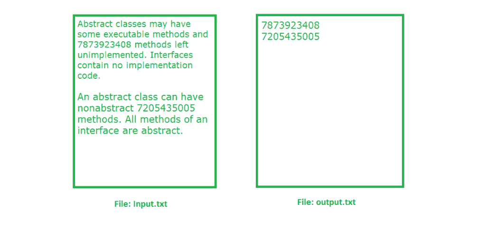

# 读取给定文件中所有手机号码的 Java 程序

> 原文:[https://www . geesforgeks . org/Java-program-read-mobile-numbers-present-given-file/](https://www.geeksforgeeks.org/java-program-read-mobile-numbers-present-given-file/)

**给定输入文本文件，读取所有存在的手机号码，并写入某个输出文件。**

假设我们有一个名为 **input.txt** 的文件，在这个输入文件中，我们有一些移动号码，它们与一些其他数据混合在一起。我们的任务是一行一行地读取输入文件，如果我们在那一行找到任何数字，我们必须将那个移动号码写入另一个文件，即 **output.txt** 文件。

示例:



**手机号码验证标准:**

*   第一个数字应该包含 7 到 9 之间的数字。
*   其余 9 位可以包含 0 到 9 之间的任何数字。
*   手机号码也可以有 11 位数字，开始时包含 0
    。
*   手机号码也可以是 12 位数字，在起始处包括 91

满足上述标准的号码是有效的手机号码。

**做法:**我们用 **[正则表达式](https://www.geeksforgeeks.org/regular-expressions-in-java/)** ，首先我们要对手机号形成一个正则表达式。每当 input.txt 文件中的任何数字与我们为 Mobile Number 形成的正则表达式匹配时，匹配的数字将被写入 output.txt 文件。

下面是 Java 实现上面是方法:

```java
// Java program to read all mobile numbers
// present in given file
import java.util.regex.*;
import java.io.*;

class MobileNumberExtraction 
{
    public static void main(String[] args) throws IOException
    {
        // Write Mobile Numbers to output.txt file
        PrintWriter pw = new PrintWriter("output.txt");

        // Regular expression for mobile number
        Pattern p = Pattern.compile("(0/91)?[7-9][0-9]{9}");

        // BufferedReader for reading from input.txt file
        BufferedReader br = new BufferedReader
                                (new FileReader("input.txt"));
        String line = br.readLine();

        while (line != null) 
        {
            Matcher m = p.matcher(line);

            while (m.find()) 
            {
                // Write the mobile number to output.txt file
                pw.println(m.group());
            }

            line = br.readLine();
        }
        pw.flush();
    }
}
```

输出:

```java
7873923408
7205435005

```

上面的输出是针对这个 input.txt 文件的:

```java
Abstract classes may have some executable methods
and 7873923408 methods left unimplemented. Interfaces 
contain no implementation code. An abstract
class can have non abstract 7205435005 methods. 
All methods 1234 of an interface are abstract.
```