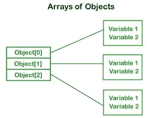

# 以对象数组形式访问所有数据的 Java 程序

> 原文:[https://www . geesforgeks . org/Java-程序访问所有数据作为对象数组/](https://www.geeksforgeeks.org/java-program-to-access-all-data-as-object-array/)

Java 是一种面向对象的编程语言。大部分工作是在物体的帮助下完成的。我们知道数组是动态创建对象的相同数据类型的集合，并且可以有基本类型的元素。

*   Java 允许我们将对象存储在数组中。在 Java 中，类也是用户定义的数据类型。包含类类型元素的数组称为对象数组。
*   它存储对象的引用变量。
*   这个数组用于在需要同时对不同数据类型执行操作的数据集上实现，就像 c 语言中的结构一样，这个对象数组为我们提供了计算的便利
*   例如，如果我们想编写一个处理图书详细信息的程序，它通常包含各种属性，如图书 id(整数)、名称(字符串)、作者名称(字符串)，..等等，这些都是不同的数据类型，所以我们为 Book 构造了一个数组 Object，并编写了获取这本书各种细节的方法。

插图:

```java
Book[] b = new Book[array_length];
```

在这里，我们为 book 类创建了一个带有实例 b 的数组，现在我们可以简单地为 Book 添加属性值及其数据类型，如下图所示



**为了创建对象数组，语法如下:**

**方式 1**

```java
ClassName object[]=new ClassName[array_length];
```

**方式二**

```java
ClassName[] objArray; 
```

**方式 3**

```java
ClassName objectArray[];  
```

**实现:**对象数组

假设我们创建了一个名为 Employee 的类。我们想保存一家有三个部门的公司的 20 名员工的记录。在这种情况下，我们不会创建 20 个单独的变量。相反，我们将创建一个对象数组:

```java
Employee_department1[20];  
Employee_department2[20]; 
Employee_department3[20];
```

**示例:**

## Java 语言(一种计算机语言，尤用于创建网站)

```java
// Java Program to Implement Array Of Objects

// Class 1
// Helper class
// Product class- product Id and product name as attributes
class Product {

    // Member variables
    // Product ID
    int pro_Id;
    // Product name
    String pro_name;

    // Constructor
    Product(int pid, String n)
    {
        pro_Id = pid;
        pro_name = n;
    }

    // Method of this class
    public void display()
    {

        // Print and display the productID and product name
        System.out.print("Product Id = " + pro_Id + "  "
                         + " Product Name = " + pro_name);

        System.out.println();
    }
}

// Class 2
// Main class
public class GFG {

    // Main driver method
    public static void main(String args[])
    {

        // Creating an array of product object, or simply
        // creating array of object of class 1
        Product[] obj = nzew Product[5];

        // Creating & initializing actual product objects
        // using constructor
        // Custom input arguments
        obj[0] = new Product(23907, "Hp Omen Gaming 15");
        obj[1] = new Product(91240, "Dell G3 Gaming");
        obj[2] = new Product(29823, "Asus TUF Gaming");
        obj[3] = new Product(11908, "Lenovo Legion Gaming");
        obj[4] = new Product(43590, "Acer Predator Gaming");

        // Lastly displaying the product object data
        System.out.println("Product Object 1:");
        obj[0].display();

        System.out.println("Product Object 2:");
        obj[1].display();

        System.out.println("Product Object 3:");
        obj[2].display();

        System.out.println("Product Object 4:");
        obj[3].display();

        System.out.println("Product Object 5:");
        obj[4].display();
    }
}
```

**Output**

```java
Product Object 1:
Product Id = 23907   Product Name = Hp Omen Gaming 15
Product Object 2:
Product Id = 91240   Product Name = Dell G3 Gaming
Product Object 3:
Product Id = 29823   Product Name = Asus TUF Gaming
Product Object 4:
Product Id = 11908   Product Name = Lenovo Legion Gamig
Product Object 5:
Product Id = 43590   Product Name = Acer Predator Gaming
```

**输出说明:**

*   在下面的程序中，我们创建了一个名为 Product 的类，并使用构造函数初始化了一个对象数组。
*   我们已经创建了包含产品标识和产品名称的产品类的构造函数。在主功能中，我们已经创建了产品类的单个对象。之后，我们使用构造函数将初始值传递给每个对象。
*   现在，该代码显示各种品牌游戏笔记本电脑的产品 id 和名称。
*   在这段代码中，对象数组的大小是这样设置的，但是可以根据需要增加。

同样，我们可以创建一个通用的数组对象来运行业务逻辑。