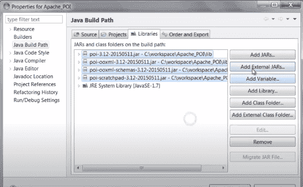
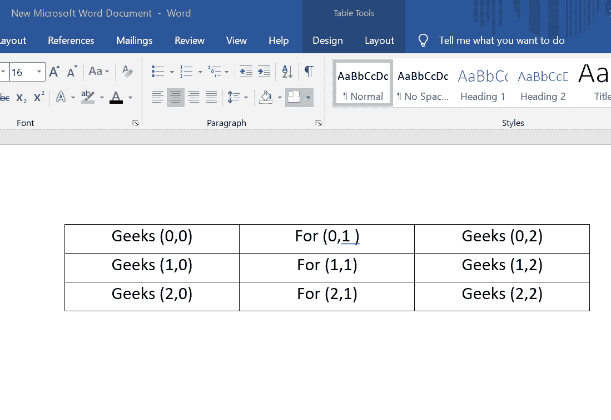

# 向 Word 文档添加表格的 Java 程序

> 原文:[https://www . geesforgeks . org/Java-程序-添加-表格-单词-文档/](https://www.geeksforgeeks.org/java-program-to-add-tables-to-a-word-document/)

OpenCV(开源计算机视觉库)是一个开源的计算机视觉和机器学习软件库。该库有 2500 多种优化算法，其中包括一套全面的经典和最先进的计算机视觉。它有 C++、Python、Java 和 MATLAB 接口，支持 Windows、Linux、Android 和 Mac OS。

OpenCV 为我们提供了各种类和接口，可以在 word 中添加/创建文档。在本文中，我们将讨论所有这些类及其实现，以及如何使用 Java 添加 word 文档的步骤。

**使用 java 访问文字文件**

Jar 文件是包含一个或多个 java 类文件的 Zip 档案。这使得库(由多个类组成)的使用更加方便。目录和 Jar 文件被添加到类路径中，并在运行时可供类加载器在其中查找特定的类。我们一般用。jar 文件以 Java 类文件和相关元数据和资源(文本、图像等)的形式分发 Java 应用程序或库。).你可以说 JAR = Java ARchive。

我们可以使用 apache poi 读取或访问 java 文件

**第一步:**下载阿帕奇POI API。你可以从[这里](https://www.iotools.net/download/java-apis/apache-poi)下载

**第二步:**导入。jar 文件。提取项目的 jar 文件，并将以下 jar 添加到您的构建路径中:

*   夏威夷芋泥饼
*   然后-ooxml
*   then-ooxml 架构
*   后 scratchpad
*   ooxml-lib–> xmlbeans



**步骤 3:** 创建一个新的 java 文件，在其中编写代码，并将其添加到您的项目中

**用于添加表格的 Java 类**

> xwpfddocument
> 
> *   组织 Apache . then . xwpf . user model . xwpfdocument
> *   用于创建文档
> 
> XWPFTable
> 
> *   组织 Apache . then . xwpf . user model . xwpftable
> *   用于创建一个简单的表格
> 
> XWPFTableRow
> 
> *   组织 Apache . then . xwpf . user model . xwpftablerow
> *   用于向表中添加行

**过程:**下面是使用 Java 实现类来添加文档的步骤

**第一步:**导入 io 的 XWPFDocument、XWPFTable、XWPFTableRow 等类。文件包，有助于创建文档，将表格添加到文档中，然后向其中添加行。

**步骤 2:** 使用类 XWPFDocument 创建一个文档，并将其存储在一个变量中

**步骤 3:** 使用类 XWPFTable 创建表

**步骤 4:** 添加行

使用 XWPFTableRow 类添加行。我们可以添加任意多的行，每次在创建新行之前，我们都必须调用类 XWPFTableRow

**实施:**

**样本输入图像:**要插入行的图像


**示例:**

## Java 语言(一种计算机语言，尤用于创建网站)

```
// Java Program to Add Tables to a Word Document

// Importing I/O file libraries
import java.io.File;
import java.io.FileOutputStream;

import org.apache.poi.xwpf.usermodel.XWPFDocument;
// Creating a simple table
import org.apache.poi.xwpf.usermodel.XWPFTable;
// Creating a row of the table
import org.apache.poi.xwpf.usermodel.XWPFTableRow;

// Java class converting tables to Word
public class GFG {

  // Main driver method
    public static void main(String[] args) throws Exception
    {

        // Creating a blank Document
        XWPFDocument document = new XWPFDocument();

        // Writing the Document in file system
        FileOutputStream out = new FileOutputStream(
            new File("create_table.docx"));

        // Creating a table
        XWPFTable table = document.createTable();

        // Create first row in a table
        XWPFTableRow tableRowOne = table.getRow(0);

        // Attributes added to the first table
        tableRowOne.getCell(0).setText("Geeks (0,0)");
        tableRowOne.addNewTableCell().setText("For (0,1)");
        tableRowOne.addNewTableCell().setText(
            "Geeks (0,2)");

        // Creating a second row
        XWPFTableRow tableRowTwo = table.createRow();

        // Attributes of second row
        tableRowTwo.getCell(0).setText("Geeks (1,0)");
        tableRowTwo.getCell(1).setText("For (1,1)");
        tableRowTwo.getCell(2).setText("Geeks (1,2)");

        // Creating a third row
        XWPFTableRow tableRowThree = table.createRow();

        // Attibutes of row
        tableRowThree.getCell(0).setText("Geeks (2,0)");
        tableRowThree.getCell(1).setText("For (2,1)");
        tableRowThree.getCell(2).setText("Geeks (2,2)");

        document.write(out);
        out.close();

        // Display message when
        // all data to the rows are inserted
        System.out.println(
            "create_table.docx written successfully");
    }
}
```

**输出:**在第一个输入中添加行的图像

