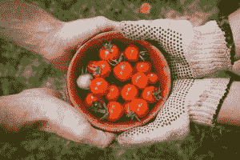
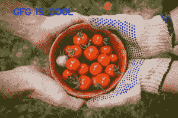

# 在 OpenCV 中给图像添加文本的 Java 程序

> 原文:[https://www . geesforgeks . org/Java-program-to-add-text-to-a-image-in-opencv/](https://www.geeksforgeeks.org/java-program-to-add-text-to-an-image-in-opencv/)

**OpenCV** 是面向计算机视觉、图像处理和机器学习的跨平台开源库。如今，它在实时操作中发挥着重要作用，改进了模块，为图像处理提供了足够的功能。有 C++、C、Python 、和 Java 接口，支持 Windows、Linux、macOS、iOS 、和安卓。通过使用它，人们甚至可以处理图像和视频来识别物体、人脸，甚至是人类的笔迹

这里，***【putText()】***是一个内置方法，将在 java 程序中从下面给出的相应模块导入该方法后使用。

**语法:**导入模块处理图像:

```java
import org.opencv.imgproc.Imgproc;
```

**语法:**使用本类的 *putText()* 方法如下:

```java
putText(image, text, org, fontType, fontSize, color, thickness)

```

**参数:**

<figure class="table">

| 参数的数据类型 | 参数名称 | 功能 |
| --- | --- | --- |
| Mat 对象 | 图像 | 要添加到输入图像对象的文本 |
| 线 | 文本 | 要插入到输入图像中的文本 |
| 点(元组) | （同 organic）有机 | 图像中文本字符串左下角的坐标 |
| 整数 | fontType | 描绘字体的风格 |
| 两倍 | 字体大小 | 要添加到输入图像上的文本大小 |
| 数量 | 颜色 | 要在输入图像上绘制的文本字符串的颜色 |
| 整数 | 厚度 | 单位中线条的粗细，默认情况下是统一的 |

</figure>

**异常:**这个类的这个方法不会抛出异常，因为只是传递了元组。例如，在 BGR 色谱中，蓝光元组如下:(255，0，0)

**实现:**输入图像如下随机拍摄。现在文本——“GFG 很酷”将被添加到这张图片上。



输入图像

## Java 语言(一种计算机语言，尤用于创建网站)

```java
// Importing all OpenCV files
import org.opencv.*;
import org.opencv.imgproc.Imgproc;

public class GFG {

    // Main driver code
    public static void main(String args[]) throws Exception
    {

        // Loading the OpenCV core library
        System.loadLibrary(Core.NATIVE_LIBRARY_NAME);

        // Reading the contents of the image
        // from local computer directory
        String src = "D:\\InputImage.jpg";

        // Creating a Mat object
        Mat image = Imgcodecs.imread(src);

        // Text to be added
        String text = "GFG IS COOL";

        // Points from where text should be added
        Point org = new Point(170, 280);

        // Color of the text
        Scalar color = new Scalar(0, 0, 255);

        // Fonttype of the text to be added
        int fontType = Imgproc.FONT_HERSHEY_PLAIN;

        // Fontsize of the text to be added
        int fontSze = 1;

        // Thickness of the lines in px
        int thickness = 3;

        // Adding text to the image using putText method
        Imgproc.putText(image, text, org, fontType,
                        fontSize, color, thickness);

        // Displaying the Image after adding the Text
        HighGui.imshow("", image);

        // Waiting for a key event to delay
        HighGui.waitKey();
    }
}
```

**输出:**添加文字后的图像如下:



输出图像