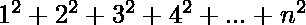

# Java 程序添加第 n 个方块系列

> 原文:[https://www . geesforgeks . org/Java-program-to-add-the-n-square-series/](https://www.geeksforgeeks.org/java-program-to-add-the-nth-square-series/)

要处理的系列如下:



插图

```
Input : N = 4
Output: 30
Explanation: 12 + 22 + 32 + 42
           = 1 + 4 + 9 + 16
           = 30

Input: N = 5
Output: 55
Explanation: 12 + 22 + 32 + 42 + 52
           = 1 + 4 + 9 + 16 + 25
           = 55
```

**方法:**这里将提供该系列计算总和的值。为此，标准方法如下:

*   **简单方法:**使用 for 循环计算值
*   **优化方法:**利用公式求数列的和。

**方法 1:** 使用循环 a 在循环内的变量施加条件下保持计数。

**示例:**通过使用 for 循环对系列求和，并计算每个实例的平方。这是最幼稚的做法。

## Java 语言(一种计算机语言，尤用于创建网站)

```
// Java Program to Add the nth Square Series

// Importing java input output libraries
import java.io.*;

class GFG {

    // Main driven Program
    public static void main(String args[])
        throws IOException
    {
        // Declaring and initializing holding current sum
        int sum = 0;

        // Declaring VARIABLE holding term
        // Initializing to random value
        // to show output
        int n = 4;

        System.out.println("Enter number of terms:" + n);

        // For-loop for Iterating from 1 and Nth term
        for (int i = 1; i <= n; i++) {

            // finding square of cuttent term and updating
            // current sum
            sum += (i * i);
        }

        // Printing final sum i.e
        // last updated current sum
        System.out.println("Sum for entered N terms:"
                           + sum);
    }
}
```

**输出:**

```
30
```

**时间复杂度:** O(N)

**方法 2:** 在这种方法中，我们将使用下面提到的公式来找到级数的和。这个公式可以用来求第 n <sup>次</sup>次平方级数的和，通过数学归纳法可以证明其正确性。它比上面说明的要优化得多。

> 1<sup>2</sup>+2<sup>2</sup>+3<sup>2</sup>+…+n<sup>2</sup>= n *(n+1)*(2 *(n+1))/6

**示例:**

## Java 语言(一种计算机语言，尤用于创建网站)

```
// Java Program to Add the nth Square Series

// Importing java input output libraries
import java.io.*;

class GFG {

    // Main driven Program
    public static void main(String args[]) throws IOException {

           // Declaring VARIABLE holding term
           // Initializing to random value
           // to show output
           int n = 4;

         // Finding sum using formula
        int sum = (n * (n + 1) * (2 * n + 1)) / 6;

        // Displaying result
        System.out.println("Sum upto entered N series :"+sum);
    }
}
```

**输出:**

```
30
```

**时间复杂度:** O(1)