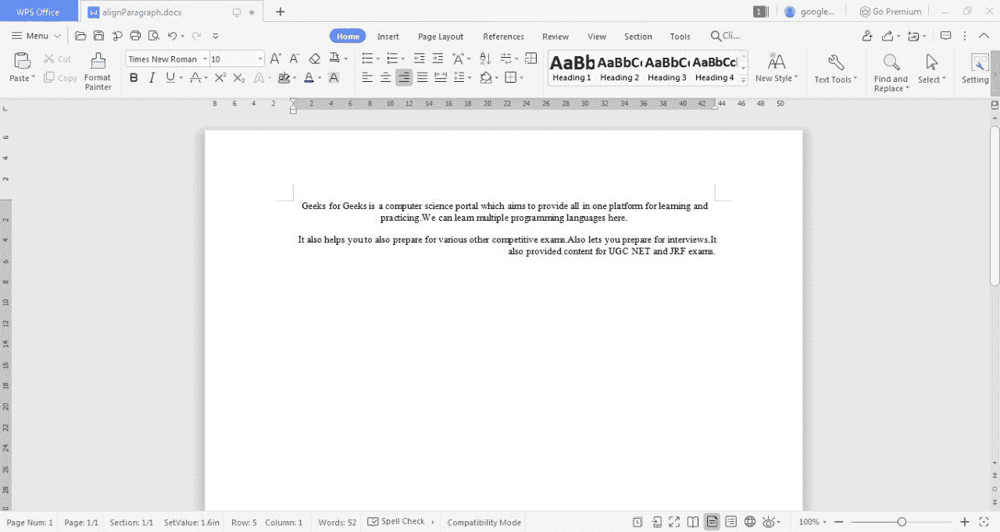

# 在 Word 文档中对齐文本的 Java 程序

> 原文:[https://www . geesforgeks . org/Java-program-to-align-the-text-in-word-document/](https://www.geeksforgeeks.org/java-program-to-align-the-text-in-a-word-document/)

文本将首先使用 Apache 从一个 Word 文件中提取。Apache POI 允许我们访问微软文档，包括 Word、Excel 和 PowerPoint。Java 为我们提供了内置于环境中的各种包，这有助于轻松阅读、编写和修改文档。包**org . Apache . poi . xwpf . user model**为我们提供了在 word 文档中格式化和追加内容的各种功能。这个包中有各种各样的类，比如创建新的 Word 文档的 XWPFDocument 和创建新段落并将新段落写入相应创建的文档的 XWPFParagraph。文件类可用于在指定的路径名创建文件，文件输出流可用于创建文件流连接。方法很简单，首先创建一个段落，为其设置对齐方式，并使用内置函数向其中插入文本。

**算法:**

1.  在为 java 程序创建包时导入 jar 文件，并根据 IDE 的需要添加 jar 文件 9)和导入文件类。
2.  通过创建 XWPFDocument 的对象来调用它。
    *   将文件输入流作为参数传递来处理本地目录
    *   在其中传递路径名或文件扩展名。
3.  创建一个空白文件和文件输出流连接。
4.  使用 *createParagraph()* 方法创建段落。
    *   使用内置功能*设置对齐方式()*。
    *   使用*设置文本()*功能插入文本。
5.  使用 XWPF 类编写段落内容
6.  关闭连接。

**实现:**假设输入一个空白的 Word 文档，其中进行了处理，以在处理后的同一 Word 文档中显示输出。

## Java 语言(一种计算机语言，尤用于创建网站)

```java
// Java Program to Align the Text in a Word document

// importing file libraries
import java.io.File;
import java.io.FileOutputStream;
// Importing API packages
import org.apache.poi.xwpf.usermodel.XWPFDocument;
import org.apache.poi.xwpf.usermodel.XWPFParagraph;
import org.apache.poi.xwpf.usermodel.XWPFRun;

public class GFG {

    // Main driver method
    public static void main(String[] args) throws Exception
    {

        // Create a blank document
        XWPFDocument xwpfdocument = new XWPFDocument();

        // Create a blank file at C:
        File file = new File("C:/alignParagraph.docx");

        // Create a file output stream connection
        FileOutputStream ostream
            = new FileOutputStream(file);

        // Creating new paragraph using the document
        // createParagraph() for instantiate new paragraph
        XWPFParagraph para = xwpfdocument.createParagraph();

        // Set center alignment to paragraph in Java
        paragraph.setAlignment(ParagraphAlignment.CENTER);

        // createRun() method appends a new run to the
        // paragraph created
        XWPFRun xwpfrun = para.createRun();

        /* Setting text to a paragraph */

        // setText() method sets the text to the run
        // created using XWPF run
        xwpfrun.setText(
            "Geeks for Geeks is a computer science portal which aims "
            + "to provide all in one platform for learning and "
            + "practicing.We can learn multiple "
            + "programming languages here. It also provided content for"
            + "UGC NET and JRF exams.");

        // Create another paragraph
        para = xwpfdocument.createParagraph();

        // Set alignment of paragraph to right
        para.setAlignment(ParagraphAlignment.RIGHT);

        xwpfrun = para.createRun();

        /* Set text to another paragraph */
        xwpfrun.setText(
            "It also helps you to also prepare for various other "
            + "competitive exams.Also lets you prepare for interviews.");

        // Write content set using XWPF classes available
        xwpfdocument.write(ostream);

        // Close connection
        ostream.close();
    }
}
```

**输出:**代码在本地目录中创建一个文件:

