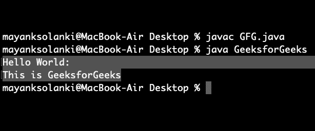

# 在现有文件中添加字符串的 Java 程序

> 原文:[https://www . geesforgeks . org/Java-program-to-append-a-string-in-existing-file/](https://www.geeksforgeeks.org/java-program-to-append-a-string-in-an-existing-file/)

在 Java 中，我们可以使用 [FileWriter](https://www.geeksforgeeks.org/file-handling-java-using-filewriter-filereader/) 在现有文件中追加一个字符串，后者可以选择在追加模式下打开一个文件。Java FileWriter 类用于将面向字符的数据写入文件。这是一个面向字符的类，用于 Java 中的文件处理。与 FileOutputStream 类不同，我们不需要将字符串转换为字节数组，因为它提供了一种直接写入字符串的方法。

> **注意:**可以指定缓冲区大小，也可以使用默认大小。编写器将其输出立即发送到底层字符或字节流。

让我们看看稍后使用的构造函数是如何坚持这个类的常规方法的

**构造函数:**文件编写器(文件文件，布尔追加):

它在追加模式下给定一个文件对象，构造一个文件写入器对象。现在让我们切换到这个类的方法，这个类在这里被调用，并在将一个字符串附加到一个现有文件中时起着关键作用，如下所示:

**方法 1:** 写()

此方法写入字符串的一部分

**语法:**

```
void write(String s,int off,int len);
```

**返回类型:**虚空

**参数:**

*   输入语符列
*   int 关闭
*   字符串长度

**方法二:关闭()**

此方法在刷新后关闭流。

**返回类型:**无效

**例**

## Java 语言(一种计算机语言，尤用于创建网站)

```
// Java Program to Append a String to the
// End of a File

// Importing input output classes
import java.io.*;

// Main class
class GeeksforGeeks {

    // Method 1
    // TO append string into a file
    public static void appendStrToFile(String fileName,
                                       String str)
    {
        // Try block to check for exceptions
        try {

            // Open given file in append mode by creating an
            // object of BufferedWriter class
            BufferedWriter out = new BufferedWriter(
                new FileWriter(fileName, true));

            // Writing on output stream
            out.write(str);
            // Closing the connection
            out.close();
        }

        // Catch block to handle the exceptions
        catch (IOException e) {

            // Display message when exception occurs
            System.out.println("exception occurred" + e);
        }
    }

    // Method 2
    // main driver method
    public static void main(String[] args) throws Exception
    {
        // Creating a sample file with some random text
        String fileName = "Geek.txt";

        // Try block to check for exceptions
        try {

            // Again operating same operations by passing
            // file as
            // parameter to read it
            BufferedWriter out = new BufferedWriter(
                new FileWriter(fileName));

            // Writing on. file
            out.write("Hello World:\n");

            // Closing file connections
            out.close();
        }

        // Catch block to handle exceptions
        catch (IOException e) {

            // Display message when error occurs
            System.out.println("Exception Occurred" + e);
        }

        // Now appendinggiven str to above
        // created file
        String str = "This is GeeksforGeeks";

        // Calling the above method
        appendStrToFile(fileName, str);

        // Let us print modified file
        try {
            BufferedReader in = new BufferedReader(
                new FileReader("Geek.txt"));

            String mystring;

            // TIll there is content in string
            // condition holds true
            while ((mystring = in.readLine()) != null) {
                System.out.println(mystring);
            }
        }

        // Catch block to handle IO exceptions
        catch (IOException e) {
            System.out.println("Exception Occurred" + e);
        }
    }
}
```

**输出:**

