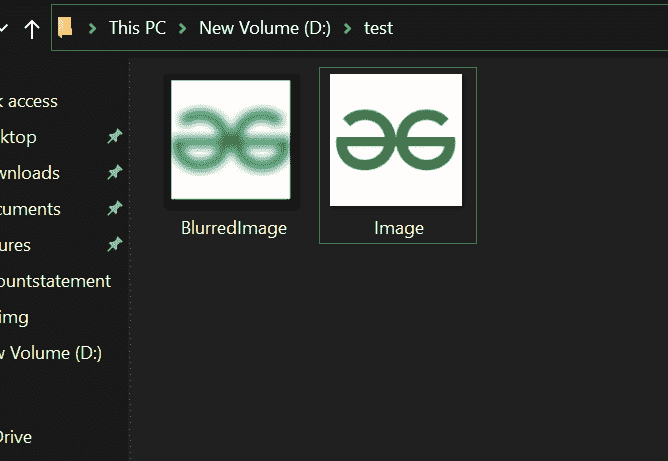

# 使用平滑模糊图像的 Java 程序

> 原文:[https://www . geesforgeks . org/Java-程序-模糊-图像-使用-平滑/](https://www.geeksforgeeks.org/java-program-to-blur-image-using-smoothing/)

[模糊](https://www.geeksforgeeks.org/what-is-image-blurring/)是一个简单而常用的图像处理操作。它也被称为平滑。图像的平滑从图像中去除有噪声的像素，并对图像应用低通滤波器。低通滤波器意味着从图像中去除噪声，同时保持图像的大部分不被损坏。最常见的滤波器类型是线性滤波器。在线性滤波器中，输入像素值的加权和决定输出像素值。

**先决条件:**

执行操作所需的类:

*   要读写图像文件，我们必须导入文件类[import Java . io . File；].这个类通常表示文件和目录路径名。
*   为了处理错误，我们使用 [IOException 类](https://www.geeksforgeeks.org/java-io-bufferedreader-class-java/)【导入 Java . io . IOException；]
*   为了保存图像，我们使用 BufferedImage 类[import Java . awt . image . BufferedImage；].该对象用于在内存中存储图像。
*   为了执行图像读写操作，我们将导入 [ImageIO 类](https://www.geeksforgeeks.org/image-processing-java-set-1-read-write/)【导入 javax . ImageIO . ImageIO；].这个类有读写图像的静态方法。

**进场:**

*   以 2D 矩阵平滑图像的每个像素
*   使用 BufferedImage 类和 Color c 的一些内置方法

**实施:**

**例**

## Java 语言(一种计算机语言，尤用于创建网站)

```
// Java Program to Blur Image using Smoothing

// Importing required packages
import java.awt.*;
import java.awt.image.BufferedImage;
import java.io.File;
import java.io.IOException;
import javax.imageio.ImageIO;

// Main class
public class GFG {

    // Main driver method
    public static void main(String[] args)
        throws IOException, InterruptedException
    {

        Color color[];

        // Creating a File class object to
        // read the image in the form of file from directory

        // Directory path is passed as an argument
        File fin = new File("D:/test/Image.jpeg");

        // Now object of BufferedImage class is created to
        // convert file into into image form
        BufferedImage input = ImageIO.read(fin);

        // Again creating an object of BufferedImage to
        // create output Image
        BufferedImage output = new BufferedImage(
            input.getWidth(), input.getHeight(),
            BufferedImage.TYPE_INT_RGB);

        // Setting dimensions for the image to be processed
        int i = 0;
        int max = 400, rad = 10;
        int a1 = 0, r1 = 0, g1 = 0, b1 = 0;
        color = new Color[max];

        // Now this core section of code is responsible for
        // blurring of an image

        int x = 1, y = 1, x1, y1, ex = 5, d = 0;

        // Running nested for loops for each pixel
        // and blurring it
        for (x = rad; x < input.getHeight() - rad; x++) {
            for (y = rad; y < input.getWidth() - rad; y++) {
                for (x1 = x - rad; x1 < x + rad; x1++) {
                    for (y1 = y - rad; y1 < y + rad; y1++) {
                        color[i++] = new Color(
                            input.getRGB(y1, x1));
                    }
                }

                // Smoothing colors of image
                i = 0;
                for (d = 0; d < max; d++) {
                    a1 = a1 + color[d].getAlpha();
                }

                a1 = a1 / (max);
                for (d = 0; d < max; d++) {
                    r1 = r1 + color[d].getRed();
                }

                r1 = r1 / (max);
                for (d = 0; d < max; d++) {
                    g1 = g1 + color[d].getGreen();
                }

                g1 = g1 / (max);
                for (d = 0; d < max; d++) {
                    b1 = b1 + color[d].getBlue();
                }

                b1 = b1 / (max);
                int sum1 = (a1 << 24) + (r1 << 16)
                           + (g1 << 8) + b1;
                output.setRGB(y, x, (int)(sum1));
            }
        }

        // Writing the blurred image on the disc where
        // directory is passed as an argument
        ImageIO.write(
            output, "jpeg",
            new File("D:/test/BlurredImage.jpeg"));

        // Message to be displayed in the console when
        // program is successfully executed
        System.out.println("Image blurred successfully !");
    }
}
```

**输出:**在控制台上

```
Java Program to Blur Image using Smoothing
```

执行完程序后控制台会显示一条信息图像模糊成功！此代码不会在联机 IDE 上运行，因为它需要磁盘上的映像。它以图示形式描述如下:

