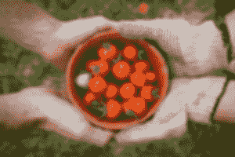

# 使用 OpenCV 模糊图像的 Java 程序

> 原文:[https://www . geesforgeks . org/Java-程序到模糊图像-使用-opencv/](https://www.geeksforgeeks.org/java-program-to-blur-images-using-opencv/)

模糊是一种简单而常用的图像处理操作。它也被称为平滑。OpenCV 库提供了许多功能，可以将不同的线性滤镜应用于平滑图像或模糊图像。

图像的平滑从图像中去除有噪声的像素，并对图像应用低通滤波器。低通滤波器意味着从图像中去除噪声，同时保持图像的大部分不被损坏。最常见的滤波器类型是线性滤波器。在线性滤波器中，输入像素值的加权和决定输出像素值。

**可用于模糊图像的 OpenCV 功能**如下:

*   **模糊()**
*   **Gaussian bulr()**
*   **中位数()**
*   **双边滤波器()**

> 上述函数的返回类型是假定作为样本输入图像的同一目录的修改图像。上述所有功能如下

**方法 1。** ***【模糊()*** **:** 此功能使用归一化块过滤器执行平滑。

**语法:**

```java
Imgproc.blur(src, dst, new Size(i, i), new Point(-1, -1));
```

**参数:**该函数需要 4 个参数

*   源图像
*   dst:影像目标
*   大小(w，h):宽 w 像素和高 h 像素的内核大小
*   点(-1，-1):指示相对于邻域的锚点位置。如果有负值，内核的中心被认为是锚点。

**方法二。** ***高斯滤波器()*** **:** 该函数使用高斯滤波器执行平滑。

**语法:**

```java
Imgproc.GaussianBlur(src, dst, new Size(i, i), 0, 0);
```

**参数:**该函数需要 4 个参数

*   源图像
*   dst:影像目标
*   大小(w，h):要使用的内核的大小。如果 w 和 h 不是奇数和正数，将使用σx 和σy 参数计算大小。
*   σx，σy:x 和 y 中的标准差，写 0 意味着σx 和σy 是用核大小计算的。

**方法三。*****medianBlur()*****:**此功能使用中值滤波器执行平滑。

**语法:**

```java
Imgproc.medianBlur(src, dst, i);
```

**参数:**这个函数需要 3 个参数

*   源图像
*   dst:影像目标
*   I:内核的大小。一定很奇怪。

**方法 4。** ***双边滤波器()*** **:** 该功能使用双边滤波器执行平滑。

**语法:**

```java
Imgproc.bilateralFilter(src, dst, i, i * 2, i / 2);
```

**参数:**该函数需要 5 个参数

*   源图像
*   dst:影像目标
*   d:每个像素邻域的直径。
*   σ颜色:颜色空间中的标准差。
*   σ空间:坐标空间中的标准偏差(以像素为单位)

**实现:**输入图像如下，假设模糊掉。


输入图像

## Java 语言(一种计算机语言，尤用于创建网站)

```java
// Importing OpenCV libraries
// to use inbuilt methods
import org.opencv.core.*;
import org.opencv.highgui.HighGui;
import org.opencv.imgcodecs.Imgcodecs;
import org.opencv.imgproc.Imgproc;

class GFG {

    int DELAY_BLUR = 100;
    int MAX_KERNEL_LENGTH = 31;

    // Source Image by creating Matlab object
    Mat src = new Mat();

    // Destination Image by creating Matlab object
    Mat dst = new Mat();

    // Main driver code
    public static void main(String[] args)
    {
        // Load the native library
        System.loadLibrary(Core.NATIVE_LIBRARY_NAME);

        // Taking input image from directory
        String filename = "D:\\InputImage.jpg";
        src = Imgcodecs.imread(filename,
                               Imgcodecs.IMREAD_COLOR);

        // 4 different methods of Imgproc class
        // to blur out input image

        // Method 1\. Standard blur method
        // using blur()
        for (int i = 1; i < MAX_KERNEL_LENGTH; i = i + 2) {
            Imgproc.blur(src, dst, new Size(i, i),
                         new Point(-1, -1));

            // Display blurred input image
            displayDst(DELAY_BLUR);
        }

        // Method 2\. Gaussian blur method
        // using GaussianBlur()
        for (int i = 1; i < MAX_KERNEL_LENGTH; i = i + 2) {
            Imgproc.GaussianBlur(src, dst, new Size(i, i),
                                 0, 0);
            // Display blurred input image
            displayDst(DELAY_BLUR);
        }

        // Method 3\. Median blur method
        // using medianBlur()
        for (int i = 1; i < MAX_KERNEL_LENGTH; i = i + 2) {
            Imgproc.medianBlur(src, dst, i);

            // Display blurred input image
            displayDst(DELAY_BLUR);
        }

        // Method 4\. Bilateral filter Method
        // using bilateralFilter()
        for (int i = 1; i < MAX_KERNEL_LENGTH; i = i + 2) {
            Imgproc.bilateralFilter(src, dst, i, i * 2,
                                    i / 2);

            // Display blurred input image
            displayDst(DELAY_BLUR);
        }
    }
}
```

**输出:**输出图像是对应输入图像的模糊图像:



输出图像