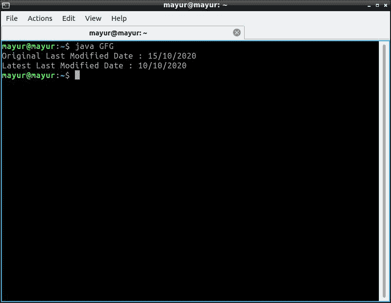

# 改变文件最后修改时间的 Java 程序

> 原文:[https://www . geesforgeks . org/Java-程序到更改-文件的最后修改时间/](https://www.geeksforgeeks.org/java-program-to-change-last-modification-time-of-a-file/)

使用 Java 的 **File** 类，即**File . setlastpmodified()**方法，可以通过 Java 修改文件的日期

**Java 文件类**

[文件类是 Java 对文件或目录路径名的](https://www.geeksforgeeks.org/file-class-in-java/)表示。文件类包含几种方法，用于处理路径名、删除和重命名文件、创建新目录、列出目录内容以及确定文件和目录的几种常见属性。

**设置最后修改的方法**

函数是一个在 Java 文件类中预先定义的方法。该函数设置文件或目录的最后修改时间。该函数以毫秒为单位设置文件的最后修改值(长类型)。

**<u>参数</u>**–由新的上次修改时间(毫秒)组成的字符串。

**<u>返回值</u>**–返回一个布尔值。(如果操作成功，则为 True，否则为 false)。

如果在系统中找不到该文件，默认日期将在 1970 年 1 月 30 日打印，因为默认文件由系统生成。

**现在要更改文件的最后修改日期，请按照给定的步骤操作。**

1.  首先，使用 SimpleDateFormat("mm/dd/yyyy ")构造函数创建一个新的 SimpleDateFormat 类实例。
2.  然后，用“mm/dd/yyyy”格式构造一个 String 对象。
3.  使用 SimpleDateFormat 类的 parse(String)方法，用我们创建的字符串的日期值创建一个新的 Date 对象。
4.  最后，使用 file . setlastpmodified(date . gettime())方法来设置我们文件的新的“上次修改”日期。

## Java 语言(一种计算机语言，尤用于创建网站)

```
// Java program to change last 
// modification time of a File

import java.io.File;
import java.text.ParseException;
import java.text.SimpleDateFormat;
import java.util.Date;

public class GFG {

    public static void main(String[] args)
    {

        try {

            // Create an object of the File class
            // Replace the file path with path of the file
            // who's "last modified" date you want to change
            File file = new File("/home/mayur/file.txt");

            // Create an object of the SimpleDateFormat
            // class
            SimpleDateFormat sdf
                = new SimpleDateFormat("mm/dd/yyyy");

            // Print the current "last modified" date of the
            // file
            System.out.println(
                "Original Last Modified Date : "
                + sdf.format((long)file.lastModified()));

            // Create a string containing a new date that
            // has to be set as "last modified" date
            String newLastModified = "10/10/2020";

            // Convert this new date into milliseconds
            // format (in long type)
            Date newDate = sdf.parse(newLastModified);

            // Set the new date as the "last modified"
            // date of the our file
            file.setLastModified(newDate.getTime());

            // Print the updated "last modified" date
            System.out.println(
                "Latest Last Modified Date : "
                + sdf.format(file.lastModified()));
        }
        catch (ParseException e) {

            // In case of any errors
            e.printStackTrace();
        }
    }
}
```

**输出:**

