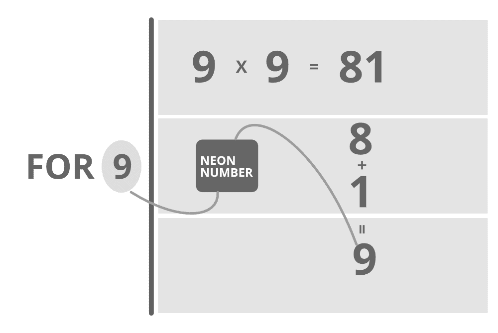

# 检查一个号码是否是霓虹号码的 Java 程序

> 原文:[https://www . geesforgeks . org/Java-程序检查一个数字是不是氖数字/](https://www.geeksforgeeks.org/java-program-to-check-if-a-number-is-neon-number-or-not/)

霓虹数字是一个数字的平方的位数和等于这个数字。任务是检查和打印一定范围内的霓虹灯号码。



插图:

> ```java
> Case 1:
> 
> Input  : 9
> Output : Given number  9 is Neon number
> 
> Explanation : square of 9=9*9=81;
>               sum of digit of square : 8+1=9(which is equal to given number)
> 
> Case 2:
> 
> Input : 8
> Output : Given number is not a Neon number
>  
> Explanation : square of 8=8*8=64
>               sum of digit of square : 6+4=10(which is not equal to given number)
> ```

**算法:**

1.  首先，求给定数的平方。
2.  用一个循环求正方形的数字之和。

3.  条件校验和等于给定的数字
    1.  返回真
    2.  否则返回 false。

```java
Pseudo code : Square =n*n;
              while(square>0)
              {
              int r=square%10;
              sum+=r;
              square=square/10;
              }
```

**示例:**

## Java 语言(一种计算机语言，尤用于创建网站)

```java
// Java Program to Check If a Number is Neon number or not

// Importing java input/output library
import java.io.*;

class GFG {

    // Method to check whether number is neon or not
    // Boolean type
    public static boolean checkNeon(int n)
    {
        // squaring the number to be checked
        int square = n * n;

        // Initializing current sum to 0
        int sum = 0;

        // If product is positive
        while (square > 0) {

            // Step 1: Find remainder
            int r = square % 10;

            // Add remainder to the current sum
            sum += r;

            // Drop last digit of the product
            // and store the number
            square = square / 10;
        }

        // Condition check
        // Sum of digits of number obtained is
        // equal to original number
        if (sum == n)

            // number is neon
            return true;
        else

            // number is not neon
            return false;
    }

    // Main driver method
    public static void main(String[] args)
    {
        // Custom input
        int n = 9;

        // Calling above function to check custom number or
        // if user entered number via Scanner class
        if (checkNeon(n))

            // Print number considered is neon
            System.out.println("Given number " + n
                               + " is Neon number");
        else

            // Print number considered is not neon
            System.out.println("Given number " + n
                               + " is not a Neon number");
    }
}
```

**Output**

```java
Given number 9 is Neon number
```

时间复杂度:O(l)，其中 l 是给定数字的平方中的位数