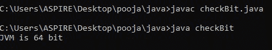
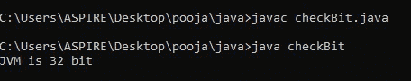
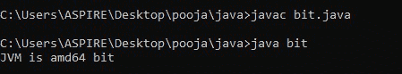
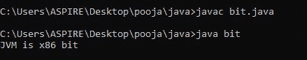
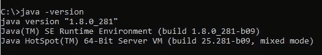
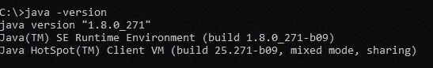

# 检查 JVM 是 32 位还是 64 位的 Java 程序

> 原文:[https://www . geesforgeks . org/Java-program-to-check-if-JVM-is-32 或-64 位/](https://www.geeksforgeeks.org/java-program-to-check-if-jvm-is-32-or-64-bit/)

JVM 代表 Java 虚拟机。它是一个抽象的计算机器，允许计算机运行一个 Java 程序。它是一个独立于平台的环境，负责通过执行 Java 代码到机器语言(即字节代码)的转换来编译 Java 程序。JVM 运行一个 Java 程序所需要的内存叫做[堆内存](https://www.geeksforgeeks.org/stack-vs-heap-memory-allocation/)。

在 Java 中，getProperty()方法用于获取与系统相关的各种属性的信息。类似地，有两种不同的方法通过使用系统属性“sun . arch . data . model”**或“os”来检查 [JVM](https://www.geeksforgeeks.org/jvm-works-jvm-architecture/) 的位。**拱门。**它将根据您的 Java 安装返回 32 位或 64 位。**

****需要的方法:get。物业()****

> ****语法:****
> 
>  **字符串系统. getProperty(字符串键)
> 
> **参数:**
> 
> 密钥是操作系统的属性
> 
> **返回类型**
> 
> 1)返回包含属性值的字符串
> 
> 2)如果属性不存在，则返回空值**

**基本上有 3 种方法可以检查 JVM 是 32 位还是 64 位**

****使用 sun.arch.data.model****

## **Java 语言(一种计算机语言，尤用于创建网站)**

```
// Java Program to check bitness of JVM by
// using System property "sun.arch.data.model"
public class checkBit {
    // get bitness of JVM
    private static final String a
        = System.getProperty("sun.arch.data.model");

    public static void main(String[] args)
    {
        // printing the JVM version
        System.out.println("JVM is " + a + " bit");
    }
}
```

****输出:****

****情况 1:** 当 JVM 为 64 位时**

****

****情况 2:** 当 JVM 为 32 位时**

****

****使用 os.arch.model****

## **Java 语言(一种计算机语言，尤用于创建网站)**

```
// Java Program to check bitness of JVM by
// using System property "os.arch.model"
public class bit {
    // get bitness of JVM
    private static final String s
        = System.getProperty("os.arch");

    public static void main(String[] args)
    {
        // printing the of what bit JVM is
        System.out.println("JVM is " + s + " bit");
    }
}
```

****输出:****

****情况 1:** 当 JVM 为 64 位时**

****

****情况 2:** 当 JVM 为 32 位时**

****

****注意:**在没有 Java 程序的情况下，还有一种检查 JVM 位的方法，就是在命令提示符下执行指令‘Java-version’。**

****情况 1:** 当 JVM 为 64 位时**

****

****情况 2:** 当 JVM 为 32 位时**

****