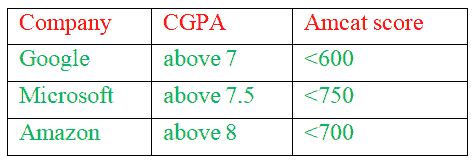

# 检查 TPP 学生面试资格的 Java 程序

> 原文:[https://www . geesforgeks . org/Java-program-to-check-TPP-学生参加面试的资格/](https://www.geeksforgeeks.org/java-program-to-check-the-eligibility-of-tpp-students-for-appearing-in-interviews/)

**问题陈述:**这是一个 Java 程序，用于放置和面试标准，例如有多少学生将出现在在线测试中，学术成绩，以及 Amcat 分数等。根据准则中设定的标准，很容易检查出哪些人有资格进入谷歌、亚马逊、微软等跨国公司。

**概念:**直接应用天真的方法，它确实包括数组和字符串的概念，在实现过程中发挥作用，以实现目标。

**程序:**

1.  制作一个 [java 类](https://www.geeksforgeeks.org/classes-objects-java/)称之为“面试”。
2.  输入 UID、姓名、GPA、Amcat 分数。
3.  如下所示设置资格标准，以展示实施情况。
    *   如果 GPA 高于 7，而 Amcat 分数高于 600
        *   那么这个学生就有资格参加谷歌面试。
    *   如果 GPA 在 7.5 以上，Amcat 分数在 750 以上
        *   那么这个学生就有资格参加微软的面试。
    *   如果 GPA 在 8 以上，Amcat 分数在 700 以上
        *   那么这个学生就有资格参加亚马逊面试。

标准的图示如下:



插图:

> **输入:**
> 
> 输入参加过 TPP 的学生人数:2
> 
> 输入学生 1: 11 的 UID
> 
> 输入学生 1 的姓名:帕万
> 
> 输入学生 1 的 CGPA:8.8
> 
> 输入学生 1: 805 的 AMCAT 分数
> 
> 输入学生 2: 22 的 UID
> 
> 输入学生 2 的姓名:阿曼
> 
> 输入学生 2 的 CGPA:7.5
> 
> 输入学生 2: 750 的 AMCAT 分数
> 
> **输出:**
> 
> 对于谷歌来说，CGPA 高于 7.00，AMCAT 分数高于 600 的学生有资格参加进一步的测试
> 
> 入围学生有:
> 
> UID 名称 CGPA AMCAT
> 
> 11 pavan 8.8000000 805
> 
> 22 Aman 7.500000 750
> 
> 对于微软学生，CGPA 高于 7.50，AMCAT 分数高于 750，有资格参加进一步的测试
> 
> 入围学生有:
> 
> UID 名称 CGPA AMCAT
> 
> 11 pavan 8.8000000 805
> 
> 22 Aman 7.500000 750
> 
> 对于亚马逊学生，CGPA 高于 8.00，AMCAT 分数高于 700，有资格参加进一步的测试
> 
> 入围学生有:
> 
> UID 名称 CGPA AMCAT
> 
> 11 pavan 8.8000000 805

> **输入:**
> 
> 输入谷歌的编码测试分数:
> 
> 输入 UID 11: 500 的编码测试分数
> 
> 输入 UID 22: 600 的编码测试分数
> 
> 输入微软的编码测试分数:
> 
> 输入 UID 11: 500 的编码测试分数
> 
> 输入 UID 22: 600 的编码测试分数
> 
> 输入亚马逊的编码测试分数:
> 
> 输入 UID 11: 500 的编码测试分数
> 
> **输出:**
> 
> 有资格参加谷歌面试的学生
> 
> UID 名称 CGPA AMCAT
> 
> 11 pavan 8.8000000 805
> 
> 22 Aman 7.500000 750
> 
> 有资格参加微软面试的学生
> 
> UID 名称 CGPA AMCAT
> 
> 11 pavan 8.8000000 805
> 
> 22 Aman 7.500000 750
> 
> 有资格参加亚马逊面试的学生
> 
> UID 名称 CGPA AMCAT
> 
> 11 pavan 8.8000000 805
> 
> 进程已完成，退出代码为 0

**例**

## Java 语言(一种计算机语言，尤用于创建网站)

```java
// Importing Scanner class to
// take input from th user
import java.util.Scanner;

// Class
public class interview {

    // Main driver method
    public static void main(String[] args)
    {

        // Creating an object of Scanner class
        // to read input fom keyboard
        Scanner sc = new Scanner(System.in);

        // Display message for better readability
        System.out.print(
            "Enter number of Students who have taken TPP: ");

        // Reading and storing primitive value
        // Integer type using nextInt() method
        int n = sc.nextInt();

        // Creating arrays
        String[] ar = new String[n];
        String[] arr = new String[n];
        double[] arr1 = new double[n];

        int[] arr2 = new int[n];

        double[] s1 = new double[n];
        double[] s2 = new double[n];
        double[] s3 = new double[n];

        // Iterating over th input values
        // as received from user
        for (int i = 0; i < n; i++) {
            sc.nextLine();
            System.out.print("Enter UID of Student "
                             + (i + 1) + ": ");
            ar[i] = sc.nextLine();
            System.out.print("Enter Name of Student "
                             + (i + 1) + ": ");
            arr[i] = sc.nextLine();
            System.out.print("Enter CGPA of Student "
                             + (i + 1) + ": ");
            arr1[i] = sc.nextDouble();
            System.out.print("Enter AMCAT Score of Student "
                             + (i + 1) + ": ");
            arr2[i] = sc.nextInt();
            System.out.print("\n");
        }

        System.out.println(
            "\nFor Google Students having CGPA above 7.00 and AMCAT score above 600 are eligible for further tests");
        System.out.println("\nShortlisted Students are:");
        System.out.print(
            "UID\t\t\tName\t\t\tCGPA\t\tAMCAT\n");
        for (int i = 0; i < n; i++) {
            if (arr1[i] >= 7.00) {
                if (arr2[i] >= 600) {
                    System.out.printf(
                        "%-12s%-16s%-12f%-6d\n", ar[i],
                        arr[i], arr1[i], arr2[i]);
                }
            }
        }

        System.out.println(
            "\nFor Microsoft Students having CGPA above 7.50 and AMCAT score above 750 are eligible for further tests");
        System.out.println("\nShortlisted Students are:");
        System.out.print(
            "UID\t\t\tName\t\t\tCGPA\t\tAMCAT\n");
        for (int i = 0; i < n; i++) {
            if (arr1[i] >= 7.50) {
                if (arr2[i] >= 750) {
                    System.out.printf(
                        "%-12s%-16s%-12f%-6d\n", ar[i],
                        arr[i], arr1[i], arr2[i]);
                }
            }
        }

        System.out.println(
            "\nFor Amazon Students having CGPA above 8.00 and AMCAT score above 700 are eligible for further tests");
        System.out.println("\nShortlisted Students are:");
        System.out.print(
            "UID\t\t\tName\t\t\tCGPA\t\tAMCAT\n");
        for (int i = 0; i < n; i++) {
            if (arr1[i] >= 8.00) {
                if (arr2[i] >= 700) {
                    System.out.printf(
                        "%-12s%-16s%-12f%-6d\n", ar[i],
                        arr[i], arr1[i], arr2[i]);
                }
            }
        }

        System.out.print(
            "\nEnter Coding test Scores for Google:");
        for (int i = 0; i < n; i++) {
            if (arr1[i] >= 7.00) {
                if (arr2[i] >= 600) {
                    System.out.print(
                        "\nEnter Coding Test score of UID "
                        + ar[i] + ": ");
                    s1[i] = sc.nextDouble();
                }
            }
        }

        System.out.print(
            "\nEnter Coding test Scores for Microsoft:");
        for (int i = 0; i < n; i++) {
            if (arr1[i] >= 7.50) {
                if (arr2[i] >= 750) {
                    System.out.print(
                        "\nEnter Coding Test score of UID "
                        + ar[i] + ": ");
                    s2[i] = sc.nextDouble();
                }
            }
        }
        System.out.print(
            "\nEnter Coding test Scores for Amazon:");
        for (int i = 0; i < n; i++) {
            if (arr1[i] >= 8.00) {
                if (arr2[i] >= 700) {
                    System.out.print(
                        "\nEnter Coding Test score of UID "
                        + ar[i] + ": ");
                    s3[i] = sc.nextDouble();
                }
            }
        }

        System.out.println(
            "\nStudents eligible to sit for Google interview ");
        System.out.print(
            "UID\t\t\tName\t\t\tCGPA\t\tAMCAT\n");
        for (int i = 0; i < n; i++) {
            if (arr1[i] >= 7.00) {
                if (arr2[i] >= 600) {
                    if (s1[i] > 80) {
                        System.out.printf(
                            "%-12s%-16s%-12f%-6d\n", ar[i],
                            arr[i], arr1[i], arr2[i]);
                    }
                }
            }
        }

        System.out.println(
            "\nStudents eligible to sit for Microsoft interview ");
        System.out.print(
            "UID\t\t\tName\t\t\tCGPA\t\tAMCAT\n");
        for (int i = 0; i < n; i++) {
            if (arr1[i] >= 7.50) {
                if (arr2[i] >= 750) {
                    if (s1[i] > 70) {
                        System.out.printf(
                            "%-12s%-16s%-12f%-6d\n", ar[i],
                            arr[i], arr1[i], arr2[i]);
                    }
                }
            }
        }
        System.out.println(
            "\nStudents eligible to sit for Amazon interview ");
        System.out.print(
            "UID\t\t\tName\t\t\tCGPA\t\tAMCAT\n");
        for (int i = 0; i < n; i++) {
            if (arr1[i] >= 8.00) {
                if (arr2[i] >= 700) {
                    if (s1[i] > 80) {
                        System.out.printf(
                            "%-12s%-16s%-12f%-6d\n", ar[i],
                            arr[i], arr1[i], arr2[i]);
                    }
                }
            }
        }
    }
}
```

> 这里的输出是通用的，它代表了有资格作为定制输入出现在面试中的学生的列表，在上面的插图部分已经解释过了。