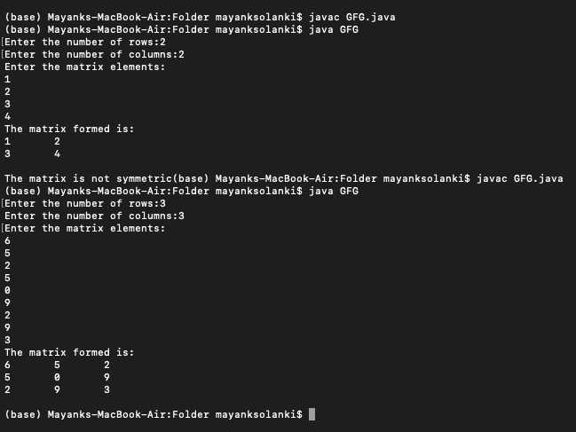

# 检查矩阵是否对称的 Java 程序

> 原文:[https://www . geesforgeks . org/Java-程序检查矩阵是否对称/](https://www.geeksforgeeks.org/java-program-to-check-whether-a-matrix-is-symmetric-or-not/)

对称矩阵是正方形矩阵，其中正方形矩阵的转置与原始正方形矩阵相同。方形矩阵是列数与行数相同的矩阵。如果矩阵是对称矩阵，那么它也是正方形矩阵，反之亦然。矩阵仅仅被认为是待执行动作的 2D 阵列。在这里，我们将看到检查输入的方阵是否对称的方法。

插图:

> ```java
> Input : 6 5 2
>         5 0 9
>         2 9 3
> Output: The matrix is symmetric
> 
> Input : 6 1 2
>         5 0 9
>         2 9 3
> Output: The matrix is not symmetric
> ```

**进场:**

*   将矩阵作为用户的输入
*   求矩阵的转置
*   比较两个矩阵
*   如果两个矩阵相同，那么它是对称的，否则就不是。

**实施:**

**例**

## Java 语言(一种计算机语言，尤用于创建网站)

```java
// Java Program to check whether matrix is
// symmetric or not

// Importing all classes of
// java.util package
import java.util.*;

// Class
public class GFG {
    // Matrix 1

    // Method to check whether the matrix is
    // symmetric or asymmetric
    static void checkSymmetric(int mat[][], int row,
                               int col)
    {
        int i, j, flag = 1;

        // Display message
        System.out.println("The matrix formed is:");

        // Nested for loop for matrix iteration

        // Outer loop for rows
        for (i = 0; i < row; i++) {
            // Inner loop for columns
            for (j = 0; j < col; j++) {
                // Print matrix
                System.out.print(mat[i][j] + "\t");
            }

            System.out.println("");
        }

        // Matrix 2

        // Finding transpose of the matrix
        int[][] transpose = new int[row][col];

        // Again, nested for loop for matrix iteration

        // Outer loop for rows
        for (i = 0; i < row; i++) {

            // Inner loop for columns
            for (j = 0; j < col; j++) {

                // Print matrix elements
                transpose[j][i] = mat[i][j];
            }
        }

        // Condition check over Matrix 1 with Matrix 2

        if (row == col) {

            // Outer loop for rows
            for (i = 0; i < row; i++) {

                // Inner loop for columns
                for (j = 0; j < col; j++) {

                    // Comparing two matrices
                    if (mat[i][j] != transpose[i][j]) {
                        flag = 0;
                        break;
                    }
                }

                // Setting a flag value for symmetric matrix
                if (flag == 0) {

                    // Display message
                    System.out.print(
                        "\nThe matrix is not symmetric");
                    break;
                }
            }

            // Setting a flag value different from above
            // for symmetric matrix
            if (flag == 1) {

                // Display message
                System.out.print(
                    "\nThe matrix is symmetric");
            }
        }

        // If it isn't a square matrix
        // then it can't be a symmetric matrix
        else {

            // Display message
            System.out.print(
                "\nThe matrix is not symmetric");
        }
    }

    // Main driver method
    public static void main(String args[])
    {
        // Taking input from the user
        Scanner sc = new Scanner(System.in);

        // Declaring variables and setting flag to 1
        int i, j, row, col, flag = 1;

        // Taking input from the user
        System.out.print("Enter the number of rows:");
        row = sc.nextInt();

        // Display message
        System.out.print("Enter the number of columns:");

        // Reading matrix elements individually using
        // nextInt() method
        col = sc.nextInt();

        // Declaring a 2D array(matrix)
        int[][] mat = new int[row][col];

        // Display message
        System.out.println("Enter the matrix elements:");

        // Nested for loop for traversing matrix

        // Outer loop for rows
        for (i = 0; i < row; i++) {

            // Inner loop for columns
            for (j = 0; j < col; j++) {

                // Print matrix element
                mat[i][j] = sc.nextInt();
            }
        }

        // calling function made above to check
        // whether matrix is symmetric or not
        checkSymmetric(mat, row, col);
    }
}
```

**输出:**以下，对称性和非对称性检查如下:

