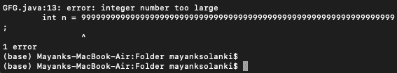

# 检查数字是否能被 5 整除的 Java 程序

> 原文:[https://www . geesforgeks . org/Java-程序检查数字是否可被 5 整除/](https://www.geeksforgeeks.org/java-program-to-check-whether-number-is-divisible-by-5/)

数学中测试数字系统中 5 除的一般规则是，以 5 或 0 结尾的数字可以被 5 整除。数字有多大并不重要。  当涉及到可除性**时，模运算符将在编程中被最频繁地使用。**

在输入自定义输入时，用户需要了解原始数据类型可以存储的数字范围，因为不同的数据类型具有不同的已定义值范围。下面简单介绍一下更常用的数据类型。

<figure class="table">

| **数据类型** | **尺寸** | **存储整数的范围** |
| --- | --- | --- |
| 短的 | 2 字节 | -32，768 至 32，767 |
| （同 Internationalorganizations）国际组织 | 4 字节 | -2，147，483，648 至 2，147，483，647 |
| 长的 | 8 字节 | -9，223，372，036，854，775，808 至 9，223，372，036，854，775，807 |

</figure>

**方法:**当涉及到检查可除性的算法时，使用了 e tic 运算符“%”，因为它返回两个数字的余数。现在对于一个给定的数字，它可以是任意的随机数，比如‘n’除以某个随机数‘m’，其中‘m’应该小于‘n’。假设 n=10，m=3，在使用上述方法后，n%m，即 10%3，将给出等于 1 的余数，说它是“r”，当 10 除以 3 时得到。

数学:10 % 5 = 0

**示例:**

> 余数 =被除数%除数
> 
> 1 = 10 % 3

**示例:**

```
Input n    : 464565625
Processing : n % 5 == 0 
Output : Yes

Input n    : 57867456354524524524635602
Processing : n % 5 == 0
Output : No

Input n    : 346356 56474675364354243220
Processing : n % 5 == 0
Output     : Yes

```

**方法 1:输入数量不是很大**

让我们首先假设这个数不是很大，因此我们可以将输入作为一个整数，并使用[模算术运算符](https://www.geeksforgeeks.org/operators-in-java/)来检查一个数是否能被 5 整除。因此，如果 n % 5 == 0，这个数可以被 5 整除。

以下是上述想法的实现。

## Java 语言(一种计算机语言，尤用于创建网站)

```
// Java program to find if a number
// is divisible by 5 or not

// importing Classes/Files
import java.util.*;

class GFG {

    // Main Driver function
    public static void main(String[] args)
    {
        // Taking any random number to test
        int n = 464565625;

        // Checking if remainder is 0 or not
        // when divided by 5
        if (n % 5 == 0)

            // Print yes iif no is divisible by 5
            System.out.println("Yes");
        else

            // Print no if no is not divisible by 5
            System.out.println("No");
    }
}
```

**Output**

```
Yes

```

如果这个数字是非常大的用户硬编码输入。程序会编译，但会在运行时抛出异常。当涉及到大数的可除性时，使用上述相同的方法会有一个问题，因为上面讨论的现有数据类型具有特定的大小，在该大小范围内，它们可以存储的内容是固定的。如果使用上面的方法，数据类型被迫在基元数据类型中存储大整数，则在编译时本身会引发错误:“整数太大。”



**方法二:输入数量不是很大**

*   使用 [Java 大整数](https://www.geeksforgeeks.org/biginteger-class-in-java/)并使用模运算符检查可除性，与上面提到的类似。
*   如果一个数的最后一位数字是 0 或 5，那么这个数可以被 5 整除。

利用上述事实，我们只需检查最后一位数字是 0 还是 5。以下是上述想法的实现。

## Java 语言(一种计算机语言，尤用于创建网站)

```
// Java program to find if a number
// is divisible by 5 or not

// Importing Classes/Files
import java.util.*;

public class GFG {

    // Function for divisibility by 5
    static boolean isDivisibleBy5(String num)
    {
        // Number of Digits
        int sz = num.length();

        // Checking if last digit is 5
        // Checking if last digit is 0
        return (
            (Integer.parseInt(num.substring(sz - 1)) == 5)
            || (Integer.parseInt(num.substring(sz - 1))
                == 0));
    }

    // Main Driver function
    public static void main(String[] args)
    {
        // Considering any big random number
        String num = "464565625";

        // Condition check for divisibility
        if (isDivisibleBy5(num))

            // Print yes if no is divisible
            System.out.println("Yes");
        else

            // Print no if no is not divisible
            System.out.println("No");
    }
}
```

**Output**

```
Yes

```