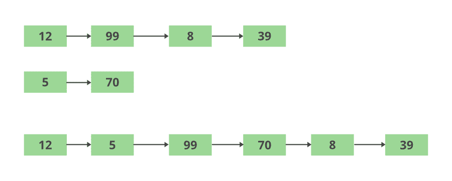

# Java 程序交替取元素合并两个列表

> 原文:[https://www . geeksforgeeks . org/Java-程序-通过交替获取元素来组合两个列表/](https://www.geeksforgeeks.org/java-program-to-combine-two-list-by-alternatively-taking-elements/)

列表是存储在一起形成集合的有序元素序列。列表可以包含重复条目，也可以包含空条目。列表允许我们执行基于索引的操作，即添加、删除、操作和位置访问。Java 提供了一个内置接口<<java.util>>来执行列表以及其他基于类的功能。</java.util>

**案例:**根据列表的长度，可能会出现两种不同的情况

1.  如果列表 2 在添加元素时耗尽，则列表 1 的剩余元素是第二个列表，列表 1 的剩余元素将以相同的出现顺序添加。
2.  如果列表 1 被用尽，以此类推，如上述情况中所讨论的，反之亦然

> 因此，目标是从第二个列表中完全移除元素，并添加到第一个列表中，剩下的将是第二个列表。



**方法:**采用以下方法在合并列表中交替存储元素。

*   用一组元素声明和初始化两个列表。
*   维护两个计数器 I 和 j 来遍历列表的长度。循环一直运行到两个列表的较短长度。
*   维护一个空列表，以列表 1 后跟列表 2 的顺序存储两个列表的合并内容。
*   在循环结束时，列表中的一个，即较短的一个被用尽。然后使用一个循环来迭代较长列表的剩余元素，并将它们逐个存储在末尾。
*   合并列表的数据类型应该类似于单个列表。

**实现:**下面讨论考虑整数列表和字符串列表的两个例子

**示例 1:** 字符串列表

## Java 语言(一种计算机语言，尤用于创建网站)

```java
// Java Program to Combine Two List
// by Alternatingly Taking Elements

// importing required packages
import java.io.*;
import java.util.*;
import java.util.Iterator;

// Class to access alterate elements
class GFG {

    // Main driver method
    public static void main(String[] args)
    {

        // Creating(declaring) list1
        List<String> list1 = new ArrayList<String>();
        // Adding elements to list1
        // Custom inputs
        list1.add("Geeks");
        list1.add("Geeks");
        list1.add("portal");

        // Creating(declaring) list2
        List<String> list2 = new ArrayList<String>();

        // Adding elements to list2
        // Custom inputs
        list2.add("for");
        list2.add("is CSE");
        list2.add("portal");

        // Display message
        System.out.print("List1 contents: ");

        // Iterating over List1
        Iterator iterator = list1.iterator();

        // Condition check using hasNext() which holds true
        // till there is single element remaining in the
        // List
        while (iterator.hasNext()) {

            // Printing elements of List 1
            System.out.print(iterator.next() + " ");
        }

        // Next Line
        System.out.println();

        // Display message
        System.out.print("List2 contents: ");

        // Iterating over List 2
        iterator = list2.iterator();

        // Condition check using hasNext() which holds true
        // till there is single element remaining in the
        // List
        while (iterator.hasNext()) {

            // Printing elements of List 2
            System.out.print(iterator.next() + " ");
        }

        // Declaring counters
        int i = 0;
        int j = 0;

        // Creating(declaring) merged List
        List<String> merged_list = new ArrayList<String>();

        // Iterating over both the lists until
        // the elements of shorter List are exhausted
        while (i < list1.size() && j < list2.size()) {

            // Step 1: Adding List1 element
            merged_list.add(list1.get(i));

            // Step 2: Adding List2 element
            merged_list.add(list2.get(j));

            // Incrementing counters
            i++;
            j++;
        }

        // Iterating over the remaining part of List1
        while (i < list1.size()) {
            merged_list.add(list1.get(i));

            // Incrementing List1 counter
            i++;
        }

        // Iterating over the remaining part of List2
        while (j < list2.size()) {
            merged_list.add(list2.get(j));

            // Incrementing List1 counter
            j++;
        }

        // Next line
        System.out.println();

        // Display message
        System.out.print("Merged List contents: ");

        // Iterators
        iterator = merged_list.iterator();

        // Iterating over merged List using hasNext() method
        // which holds true till there is single element
        // remaining
        while (iterator.hasNext()) {

            // Printing merged list contents
            System.out.print(iterator.next() + " ");
        }
    }
}
```

**Output**

```java
List1 contents: Geeks Geeks portal 
List2 contents: for is CSE portal 
Merged List contents: Geeks for Geeks is CSE portal portal 
```

**示例 2:** 整数列表

## Java 语言(一种计算机语言，尤用于创建网站)

```java
// Java Program to Combine Two List
// by Alternatingly Taking Elements

// importing required packages
import java.io.*;
import java.util.*;
import java.util.Iterator;

// Class
class GFG {

    // Main driver method
    public static void main(String[] args)
    {
        // Creating(declaring) List1
        List<Integer> list1 = new ArrayList<Integer>();
        // Adding elements to List1
        // Custom inputs
        list1.add(2);
        list1.add(4);
        list1.add(6);

        // Creating(declaring) List2
        List<Integer> list2 = new ArrayList<Integer>();

        // Adding elements to List2
        // Custom inputs
        list2.add(1);
        list2.add(3);
        list2.add(5);
        list2.add(7);

        // Display message
        System.out.print("List1 contents: ");

        // Iterating over List1
        Iterator iterator = list1.iterator();

        // ConditionCheck using hasNext() method which hold
        // true till single element in remaining List
        while (iterator.hasNext()) {

            // Printing List1 contents
            System.out.print(iterator.next() + " ");
        }

        // New line
        System.out.println();

        // Display message
        System.out.print("List2 contents: ");
        iterator = list2.iterator();

        // ConditionCheck using hasNext() method which hold
        // true till single element in remaining List
        while (iterator.hasNext()) {

            // Printing List2 contents
            System.out.print(iterator.next() + " ");
        }
        // Setting counters to zeros
        int i = 0;
        int j = 0;

        // Creating(declaring) merged list
        List<Integer> merged_list
            = new ArrayList<Integer>();

        // Iterating over both the lists
        // until the shorter list
        while (i < list1.size() && j < list2.size()) {

            // Step 1: Adding List2 element
            merged_list.add(list2.get(j));

            // Step 2: Adding List1 element
            merged_list.add(list1.get(i));

            // Incrementing counters
            i++;
            j++;
        }

        // Iterating over the remaining part of List1

        // Case 1: Input: ShorterList following BiggerList
        while (i < list1.size()) {

            // Merge remaining List to List1, and
            // making List2 final as NULL List
            merged_list.add(list1.get(i));
            i++;
        }

        // Case 2: Input: BiggerList following ShorterList
        while (j < list2.size()) {

            // Merge remaining List to List1,an d
            // making List2 -> NULL List
            merged_list.add(list2.get(j));
            j++;
        }

        // New line
        System.out.println();

        // Display message
        System.out.print("Merged List contents: ");

        // Iterating over merged list
        iterator = merged_list.iterator();

        // Condition check using hasNext() method which
        // holds true till there is single element remaining
        // in the List
        while (iterator.hasNext()) {

            // Printing merged List contents i.e
            // FinalList = List1 + List2(Null final List)
            System.out.print(iterator.next() + " ");
        }
    }
}
```

**Output**

```java
List1 contents: 2 4 6 
List2 contents: 1 3 5 7 
Merged List contents: 1 2 3 4 5 6 7 
```