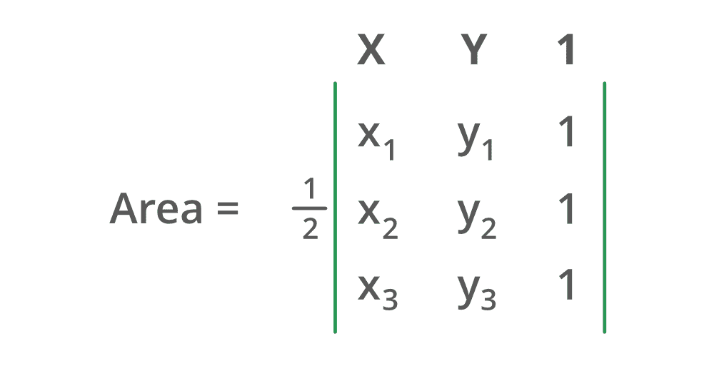

# 利用行列式计算三角形面积的 Java 程序

> 原文:[https://www . geeksforgeeks . org/Java-程序计算三角形面积-使用行列式/](https://www.geeksforgeeks.org/java-program-to-compute-the-area-of-a-triangle-using-determinants/)

为了计算三角形的面积，需要两个参数，即底和高。简单地说，变量被赋零。三角形的面积可以用同样的三年级数学公式计算出来。

```java
*Area = 1/2(Base * Height)*
```

插图:

> **输入:** (1，3) (5，-2) (-3，6)
> 
> **输出:**三角形面积:4
> 
> 处理:1/2 (|3*3 行列式|)

**行列式:**在线性代数中，行列式是一个标量值，可以从方阵的元素中计算出来，并对矩阵所描述的线性变换的某些性质进行编码。矩阵只是一个两**–**次元阵。数组是线性数据结构，其中元素以连续的方式存储。

**算法:**

1.  用户一个接一个地询问坐标
2.  1 被分配给矩阵中的第三列
3.  导入数学库是为了使用输入元素上的公式计算数字
4.  绝对方法应用于存储在变量中的值



**语法:**

```java
datatype typename = Math.abs(value)
```

**返回类型:**位于 0 右侧的数字线上的值

数学是 java 中的一个库，用于计算由绝对值函数组成的数字，绝对值函数的作用是将正值或负值转换为正值。在这里，它被用作一个实际的思考区域，在现实空间中永远不会是负面的。如果一个东西占据了空间，它肯定会占据空间，会占有面积。

**实现:**计算三角形面积的 Java 程序

## Java 语言(一种计算机语言，尤用于创建网站)

```java
// java program for computing area of
// triangle by using determinant

// Importing generic libraries
import java.io.*;
import java.util.*;

class GFG {

    // Function to compute area of triangle
    static double area(double[][] a)
    {

        // Formula for calculating triangle area
        // using math library absolute function
        double area = (Math.abs((a[0][0] * a[1][1])
                                - (a[0][0] * a[2][1])
                                + (a[1][0] * a[2][1])
                                - (a[1][0] * a[0][1])
                                + (a[2][0] * a[0][1])
                                - (a[2][0] * a[1][1])))
                      / 2;

        // Return area of triangle
        return area;
    }

    // Main driver method
    public static void main(String[] args)
    {

        // Scanner for taking input from user
        Scanner scan = new Scanner(System.in);

        // hard coded Input to show working

        // Storing vertices in a 3 * 3 matrix
        // store x and y coordinate first then 1
        double[][] vertices
            = { { 1, 1, 1 }, { 1, 3, 1 }, { 3, 1, 1 } };
        // example x1=3 and y1 =1, then
        // store them like {3, 1, 1}

        // Calling area function by passing vertices as
        // parameters and storing in big data-type
        double Area = area(vertices);

        // Print area of triangle on screen
        System.out.println("Area of triangle: " + Area);
    }
}
```

**Output**

```java
Area of triangle: 2.0
```