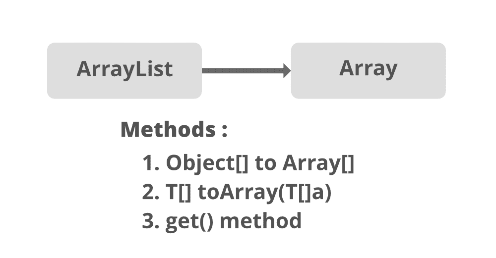
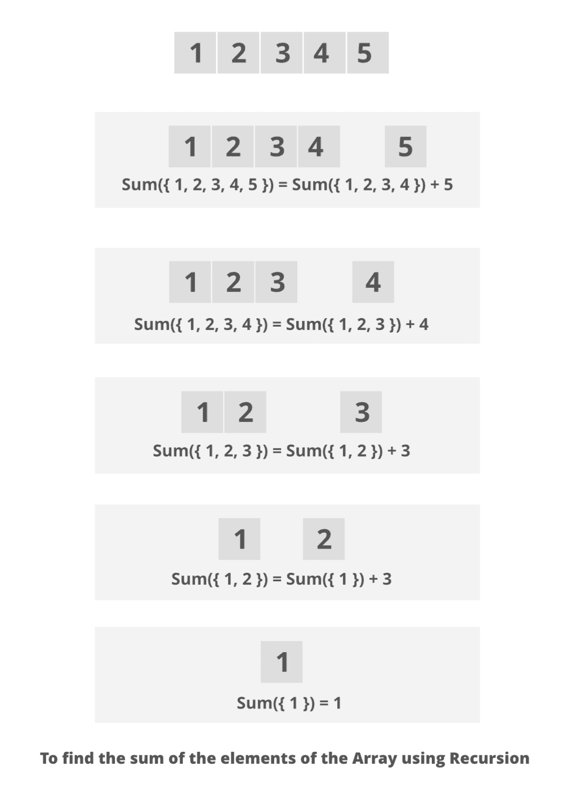

# 使用递归计算列表中数字总和的 Java 程序

> 原文:[https://www . geesforgeks . org/Java-程序到计算列表中数字的总和-使用递归/](https://www.geeksforgeeks.org/java-program-to-compute-the-sum-of-numbers-in-a-list-using-recursion/)

**ArrayList** 是 Collection 框架的一部分，存在于 java.util 包中。它为我们提供了 Java 中的动态数组。尽管它可能比标准数组慢，但在需要对数组进行大量操作的程序中会很有帮助。这个类可以在 java.util 包中找到。

插图:

```
Input  : [1, 3, 9]  
Output : 13
```

在这里，最简单的方法是将列表的元素相加，并在遍历列表时维护一个存储总和的计数器。提前一步的方法可以是将列表转换为数组，并执行相同的操作。现在更好的方法是使用递归，在这样做的时候，列表或数组的哪个子部分是通过递归原理自动计算的。这里描述并实现了这种最佳方法，如图所示。

**方法:**

1.  将数组列表转换为数组，并在数组上使用递归原理。
2.  使用 [*数组列表()*](https://www.geeksforgeeks.org/java-util-arraylist-add-method-java/) 方法

**方法 1:** 将数组列表转换为数组，并在数组上使用递归原理。**T3】**



它是通过将数组列表转换为数组并在数组上使用递归原理来实现的。使用 add()方法将列表中的递归转换为数组并计算元素的和。

**进场:**

1.  将列表的元素作为用户的输入。
2.  将列表转换为相同大小的数组。
3.  向其中添加元素。
4.  用递归原理计算数组的和。



**例**

## Java 语言(一种计算机语言，尤用于创建网站)

```
// Java Program to Compute Sum of Numbers in a List
// by converting to arrays and applying recursion

// Importing java input/output classes
import java.io.*;
// Importing List and ArrayList class from
// java.util package
import java.util.ArrayList;
import java.util.List;

// Class
public class GFG {

    // Method to calculate sum recursively
    public static int sumOfArray(Integer[] a, int n)
    {
        if (n == 0)
            return a[n];
        else
            return a[n] + sumOfArray(a, n - 1);
    }

    // Method- main()
    public static void main(String[] args)
    {
        // Creating a List of Integer type
        // Declaring an object- 'al'
        List<Integer> al = new ArrayList<Integer>();

        // Adding elements to the List
        // Custom inputs
        al.add(1);
        al.add(2);
        al.add(3);
        al.add(4);
        al.add(5);

        // Converting above List to array
        // using toArray() mmethod
        Integer a[] = new Integer[al.size()];
        al.toArray(a);

        // Display message
        System.out.print("Elements in List : ");

        // Printing array of objects
        // using for each loop
        for (Integer obj : a) {
            System.out.print(obj + " ");
        }

        // Recursion math to calculate sum snd
        // storing sum in a variable
        int sum = sumOfArray(a, a.length - 1);

        // Next line
        System.out.println();

        // Print the sum returned above
        System.out.println("Sum of elements  : " + sum);
    }
}
```

**Output**

```
Elements in List : 1 2 3 4 5 
Sum of elements  : 15
```

**方法二:**使用 [*ArrayList.add()*](https://www.geeksforgeeks.org/java-util-arraylist-add-method-java/) 方法

此方法将指定的元素追加到此列表的末尾

**语法:**

```
public boolean add(E element) ;
```

**参数:**要附加到此列表的对象。

**返回类型:**它将总是返回一个布尔值 true，签名也是如此，因为集合族中的其他类需要一个返回类型。

**异常:** NA

**示例:**

## Java 语言(一种计算机语言，尤用于创建网站)

```
// Java Program to Compute the Sum of Numbers in a List
// using Recursion via ArrayList.add() method

// Importing all classes of
// java.util package
import java.util.*;

// Class
public class GFG
{  
  // Declaring variables outside main class
  int sum = 0, j = 0;

  // Main driver method
  public static void main(String[]args)
  {
    /*
    // Taking the input from the user
    int n;
    Scanner s = new Scanner(System.in);

    // Display message
    System.out.print("Enter the no. of elements :");

    // Reading integer elements using nextInt() method
    n = s.nextInt();

    // Display message
    System.out.println("Enter all the elements you want:");
    */

    // Creating an object of List of Integer type
    List < Integer > list = new ArrayList < Integer > ();

    // Adding elements to object of List
    // Custom inputs to show sum
    list.add(10);
    list.add(90);
    list.add(30);
    list.add(40);
    list.add(70);
    list.add(100);
    list.add(0);

    System.out.println("Elements in List : " + list);
    /*
    // If input is through user than

    // For loop to add elements inside List
    for (int i = 0; i < n; i++)
    {
      // Adding integer elements in the list
      list.add(s.nextInt());
    }
    */

    // Converting List to Array
    Integer[] a = list.toArray(new Integer[list.size()]);

    // Initialising object of Main class
    GFG elem = new GFG();

    // Finding sum of elements in array
    // via add() method using recursion
    int x = elem.add(a, a.length, 0);

    // Print the sum of array/elements initially in List
    System.out.println("Sum of elements in List :" + x);
  }

  // add() method to add elements in array
  // using recursion
  int add(Integer arr[], int n, int i)
  {
    if(i < n)
    {
        return arr[i] + add(arr, n, ++i);
    }
    else
    {
        return 0;
    }
  }
}
```

**Output**

```
Elements in List : [10, 90, 30, 40, 70, 100, 0]
Sum of elements in List :340
```