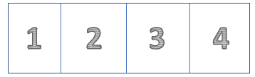
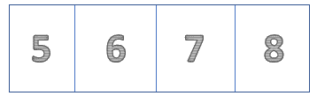
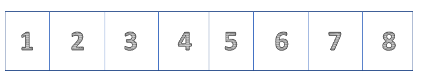
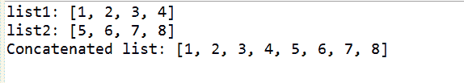

# 连接两个列表的 Java 程序

> 原文:[https://www . geesforgeks . org/Java-程序到连接-两个列表/](https://www.geeksforgeeks.org/java-program-to-concatenate-two-list/)

连接两个列表意味着将两个列表合并成一个列表。

**考虑给定的列表:**



清单 1



清单 2



串联后的列表

**有几种方法可以进行串联运算:**

1.  使用 addAll()方法
2.  使用流
3.  使用 union()

**方法 1:使用** [**addAll()**](https://www.geeksforgeeks.org/java-util-arraylist-addall-method-java/) **方法**

**语法:**

```
addAll ( list name ) 
```

此方法以列表的名称作为参数，并按照与原始列表相同的顺序添加指定列表的所有元素。

*   创建新的空列表(串联列表)
*   使用 addAll()方法将给定的列表 1 和列表 2 连接到新创建的列表中。

> 串联 _list.addAll (list1) //串联第一个列表
> 
> 串联 _list.addAll (list2) //串联第二个列表

执行上述步骤后，我们的空列表现在包含这两个列表。

## Java 语言(一种计算机语言，尤用于创建网站)

```
// Java Program to Concatenate Two List
// using addAll() method

import java.io.*;
import java.util.ArrayList;
import java.util.List;

public class GFG {

    public static void main(String[] args)
    {
        // given list 1
        List<Integer> list1 = new ArrayList<Integer>();
        list1.add(1);
        list1.add(2);
        list1.add(3);
        list1.add(4);

        // given list 2
        List<Integer> list2 = new ArrayList<Integer>();
        list2.add(5);
        list2.add(6);
        list2.add(7);
        list2.add(8);

        // creating new empty list
        List<Integer> concatenated_list
            = new ArrayList<Integer>();

        // using addAll( ) method to concatenate the lists
        concatenated_list.addAll(list1);
        concatenated_list.addAll(list2);

        System.out.println("list1: " + list1);
        System.out.println("list2: " + list2);
        System.out.println("Concatenated list: "
                           + concatenated_list);
    }
}
```

**Output**

```
list1: [1, 2, 3, 4]
list2: [5, 6, 7, 8]
Concatenated list: [1, 2, 3, 4, 5, 6, 7, 8]
```

**方法 2:使用流**

```
Stream.concat(list1.stream(),list2.stream()).collect(Collectors.toList())
```

它将两个流作为参数，并从中创建一个串联流。第二个列表附加到第一个列表。

## Java 语言(一种计算机语言，尤用于创建网站)

```
// Java Program to Concatenate Two List 
// using streams

import java.io.*;
import java.util.ArrayList;
import java.util.List;
import java.util.stream.Collectors;
import java.util.stream.Stream;

public class GFG {

    public static void main(String[] args)
    {
        // given list 1
        List<Integer> list1 = new ArrayList<Integer>();
        list1.add(1);
        list1.add(2);
        list1.add(3);
        list1.add(4);

        // given list 2
        List<Integer> list2 = new ArrayList<Integer>();
        list2.add(5);
        list2.add(6);
        list2.add(7);
        list2.add(8);

        // creating new empty list
        List<Integer> concatenated_list = new ArrayList<Integer>();

        // using Stream.concat() method to concatenate the lists
        concatenated_list = Stream.concat(list1.stream(), list2.stream())
                  .collect(Collectors.toList());

        System.out.println("list1: " + list1);
        System.out.println("list2: " + list2);
        System.out.println("Concatenated list: "+ concatenated_list);

    }
}
```

**Output**

```
list1: [1, 2, 3, 4]
list2: [5, 6, 7, 8]
Concatenated list: [1, 2, 3, 4, 5, 6, 7, 8]
```

**方法三:使用** [**工会()**](https://www.geeksforgeeks.org/sets-union-function-guava-java/)

```
ListUtils.union( list1, list2) 
```

它以两个列表作为参数，并返回新的串联列表。第二个列表附加到第一个列表。

## Java 语言(一种计算机语言，尤用于创建网站)

```
// Java program to concatenate two lists
// using union()

import java.io.*;
import java.util.*;
import java.lang.*;
import org.apache.commons.collections.ListUtils;

public class GFG {

    public static void main(String[] args)
    {
        // given list 1
        List<Integer> list1 = new ArrayList<Integer>();
        list1.add(1);
        list1.add(2);
        list1.add(3);
        list1.add(4);

        // given list 2
        List<Integer> list2 = new ArrayList<Integer>();
        list2.add(5);
        list2.add(6);
        list2.add(7);
        list2.add(8);

        // creating new empty list
        List<Integer> concatenated_list = new ArrayList<Integer>();

        // using ListUtils.union() method to concatenate
        // the lists
        concatenated_list = ListUtils.union(list1, list2);

        System.out.println("list1: " + list1);
        System.out.println("list2: " + list2);
        System.out.println("Concatenated list: "
                           + concatenated_list);
    }
}
```

**输出:**



**运行上述代码的先决条件:**

*   下载并安装以下 Apache Commons Collections 库
*   现在转到项目的属性。
*   选择 Java 构建路径。
*   在 Java 构建路径下，转到库。
*   在库下，选择类路径。
*   现在转到添加外部 JAR，并添加从给定链接下载的 JAR 可执行文件。