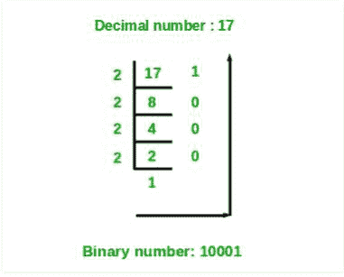

# 使用数组作为堆栈将十进制数转换为二进制数的 Java 程序

> 原文:[https://www . geesforgeks . org/Java-program-to-convert-a-十进制数转二进制数-使用数组作为堆栈/](https://www.geeksforgeeks.org/java-program-to-convert-a-decimal-number-to-binary-number-using-arrays-as-stacks/)

给定一个整数，使用数组作为堆栈转换为二进制数。

**示例:**

```
Input : 10
Output: 1010
Input : 16
Output: 10000
```

**进场:**

1.  将该数除以 2，并将该数的余数存储在数组中。
2.  把这个数除以 2。
3.  重复这个过程，直到数字变为零。
4.  以相反的顺序打印数组。



## Java 语言(一种计算机语言，尤用于创建网站)

```
// Java Program to Convert a Decimal Number
// to Binary Number using Arrays as Stacks

import java.util.*;
public class DecimalToBinary {
    static int arr[] = new int[1000];

    // maintaining count variable
    // as the top of the stack
    static int count;

    // push at the count index and increment the count
    public static void push(int n) { 
      arr[count++] = n; 
    }

    // pop all the elements starting
    // from count-1 till 0
    public static void pop()
    {
        for (int i = count - 1; i >= 0; i--) {
            System.out.print(arr[i]);
        }
    }

    public static void main(String args[])
    {
        int num = 46;

        while (num > 0) {
            int r = num % 2;
            push(r);
            num /= 2;
        }

        System.out.print("Binary equivalent: ");

        pop();
    }
}
```

**Output**

```
Binary equivalent: 101110
```