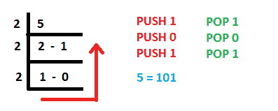

# 使用堆栈将十进制数转换为二进制数的 Java 程序

> 原文:[https://www . geesforgeks . org/Java-program-to-convert-a-decimal-number-to-binary-number-using-stacks/](https://www.geeksforgeeks.org/java-program-to-convert-a-decimal-number-to-binary-number-using-stacks/)

[Java](https://www.geeksforgeeks.org/introduction-to-java/) 是高级的、编译的以及解释的编程语言。[栈](https://www.geeksforgeeks.org/stack-data-structure/)是大多数编程语言中使用的抽象数据类型，可以使用数组或链表来实现。堆栈数据结构遵循后进先出原则。堆栈允许执行推送、弹出、查看操作。推送操作用于将新元素插入堆栈。pop 操作用于从堆栈顶部移除元素。peek 操作用于获取堆栈的顶部元素，而不将其从堆栈中移除。使用堆栈的推入和弹出操作，可以将十进制数转换为二进制数。现在，Java 提供了内置的堆栈类，可以用来满足我们的目的。

**使用堆栈将十进制数转换为二进制数:**

1.  使用预定义的堆栈。
2.  使用数组作为堆栈。

**方法 1:使用预定义堆栈**

**进场:**

*   预定义的堆栈类用于创建堆栈。
*   要求用户输入一个十进制数。
*   接下来，执行 while 循环，其中数字 2 的 mod 结果被推入堆栈，并且数字被 2 除。
*   重复这一过程，直到数字大于 0。
*   当数字为 0 时，while 循环终止，另一个 while 循环开始打印十进制数字的二进制等价物。
*   存储在堆栈中的余数在后进先出法中弹出，给出所需的二进制表示。



**代码实现:**

## Java 语言(一种计算机语言，尤用于创建网站)

```
// Java Program to Convert a Decimal Number 
// to Binary Number using Stacks

import java.util.*;
public class DecimalToBinary
{
public static void main(String args[])
{
    // creating a stack 
    Stack<Integer> stack = new Stack<Integer>();

    System.out.println("Enter a decimal number: ");
    int num = 23;

    while(num>0)
    {
        int r = num%2;

        // pushing the remainder inside the stack
        stack.push(r);
        num/=2;
    }

     System.out.print("Binary equivalent: ");

     while (!(stack.isEmpty() ))
     {
         // printing the resultant binary number stored in the 
         // stack in LIFO manner
         System.out.print(stack.pop());
     }
}
}
```

**Output**

```
Enter a decimal number: 
Binary equivalent: 10111
```

**方法二:使用数组作为堆栈**

**进场:**

*   不使用内置的堆栈类，而是使用数组，并定义 push 和 pop 方法来执行元素的插入和移除。
*   堆栈是使用静态数组实现的。
*   静态变量计数跟踪插入的元素数量。
*   剩下的过程与前面的例子完全相似。

## Java 语言(一种计算机语言，尤用于创建网站)

```
// Java Program to Convert a Decimal Number
// to Binary Number using Stacks

import java.util.*;
public class DecimalToBinary {
    static int arr[] = new int[1000];

    // maintaining count variable as the top
    // of the stack
    static int count;

    // push at the count index and increment the count
    public static void push(int n) { arr[count++] = n; }

    // pop all the elements starting from count-1
    // till 0
    public static void pop()
    {
        for (int i = count - 1; i >= 0; i--) {
            System.out.print(arr[i]);
        }
    }

    public static void main(String args[])
    {
        System.out.println("Enter a decimal number: ");
        int num = 46;

        while (num > 0) {
            int r = num % 2;
            push(r);
            num /= 2;
        }

        System.out.print("Binary equivalent: ");

        pop();
    }
}
```

**Output**

```
Enter a decimal number: 
Binary equivalent: 101110
```