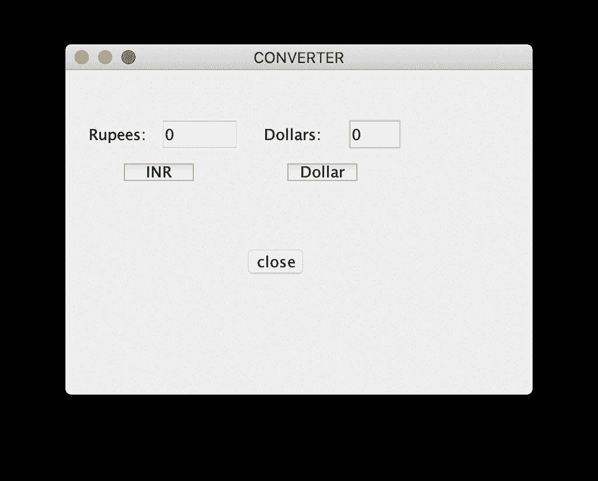
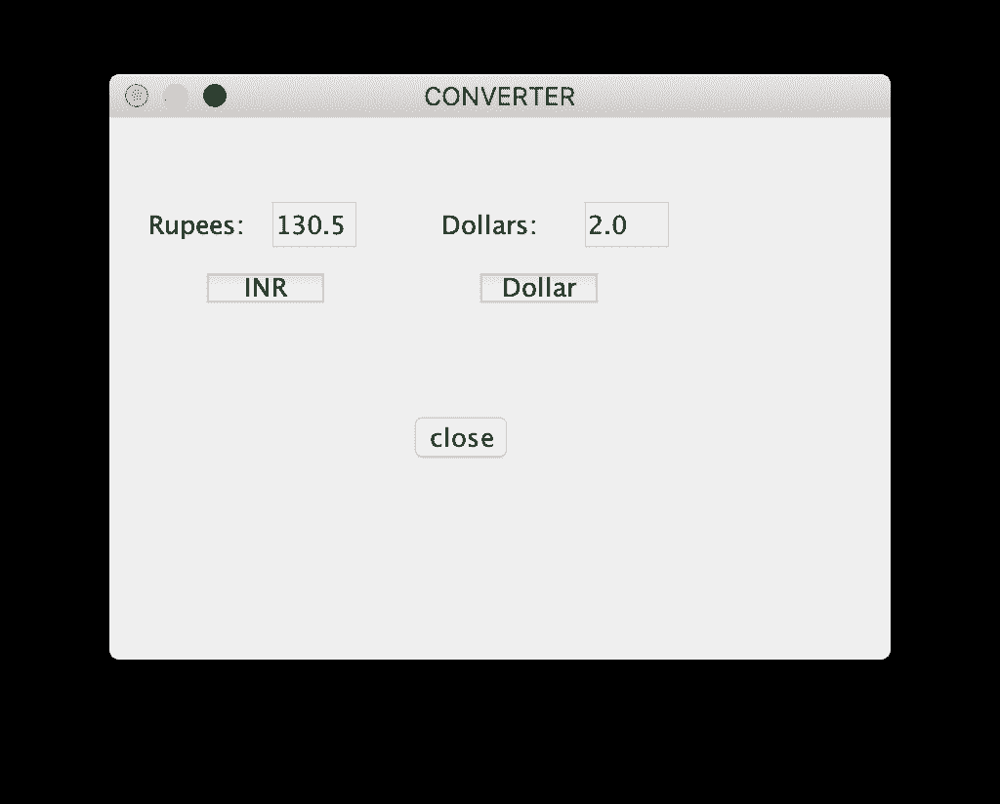
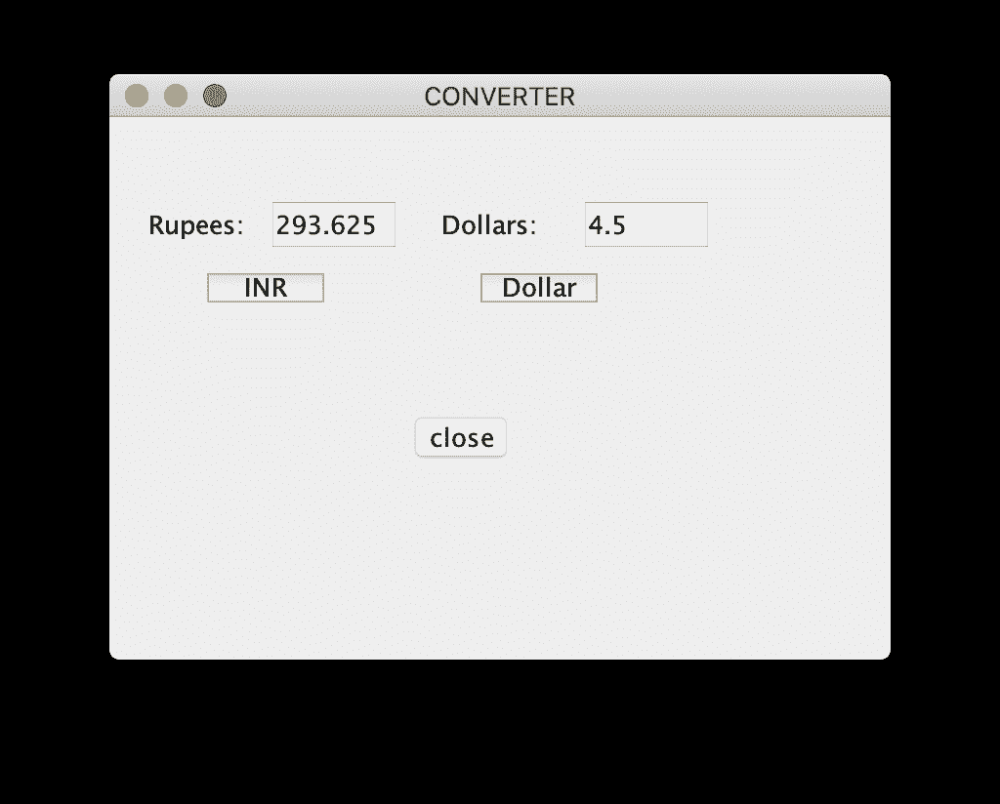

# 使用 AWT

转换货币的 Java 程序

> 原文:[https://www . geesforgeks . org/Java-程序转货币-使用-awt/](https://www.geeksforgeeks.org/java-program-to-convert-currency-using-awt/)

**[Swing](https://www.geeksforgeeks.org/java-swing-create-a-simple-text-editor/)** 是 **JFC (Java 基础类)**的一部分。用 Java 构建[图形用户界面](https://www.geeksforgeeks.org/what-is-the-difference-between-gui-and-cui/)需要使用 Swings。 **[Swing Framework](https://www.geeksforgeeks.org/tag/java-swing/)** 包含大量组件，这些组件允许高级定制并提供丰富的功能，用于创建基于窗口的应用程序。Java swing 组件是轻量级的，独立于平台，提供强大的组件，如表格、滚动面板、按钮、列表、颜色选择器等。

在本文中，我们将看到如何制作一个[货币转换器](https://www.geeksforgeeks.org/currency-converter-in-python/)，其中包括 INR 和 Dollar 之间的转换。两个文本字段用标签卢比和美元实现。

**注:**假设 1 美元等于 65.25 卢比。

**示例:**

> **投入:** INR = 130.5
> **产出:** 2.0
> **说明:**
> 1 美元 65.25 卢比。所以，130.5 卢比是两美元。
> 
> **输入:**美元= 4.5
> T3】输出: 293.625

**方法:**要解决此问题，请遵循以下步骤:

1.  首先，我们需要使用 [JFrame](https://www.geeksforgeeks.org/creating-frames-using-swings-java/) 创建一个框架。
2.  然后，使用 [JLabel](https://www.geeksforgeeks.org/jlabel-java-swing/) 、 [JTextField](https://www.geeksforgeeks.org/java-swing-jtextfield/) 和 [JButton](https://www.geeksforgeeks.org/jradiobutton-java-swing/) 创建两个标签、两个文本字段和三个按钮(第一个按钮代表卢比，第二个按钮代表美元)。
3.  相应地命名这些组件并设置它们的边界。
4.  现在，为了在按钮点击时执行转换，我们需要添加事件处理程序。在这种情况下，我们将添加 ActionListener 来执行一个称为 actionPerformed 的操作方法，首先我们需要从默认为“字符串”的文本字段中获取值。
5.  因此，为了执行数学运算，我们需要使用**Double . parsedouble(object . gettext())**将它们转换为 double 数据类型，并再次使用 **String.valueOf(object)** 将它们从 double 转换为 string，以将最终值放在另一个文本字段中。
6.  最后，为了改变值，我们使用 Object.setText(对象)，第二个对象是选择我们想要替换的字段。

下面是上述方法的实现:

```
// Java program to convert from
// rupee to the dollar and vice-versa
// using Java Swing

import javax.swing.*;
import java.awt.*;
import java.awt.event.*;
public class GFG {

    // Function to convert from rupee
    // to the dollar and vice-versa
    // using Java Swing
    public static void converter()
    {

        // Creating a new frame using JFrame
        JFrame f = new JFrame("CONVERTER");

        // Creating two labels
        JLabel l1, l2;

        // Creating two text fields.
        // One for rupee and one for
        // the dollar
        JTextField t1, t2;

        // Creating three buttons
        JButton b1, b2, b3;

        // Naming the labels and setting
        // the bounds for the labels
        l1 = new JLabel("Rupees:");
        l1.setBounds(20, 40, 60, 30);
        l2 = new JLabel("Dollars:");
        l2.setBounds(170, 40, 60, 30);

        // Initializing the text fields with
        // 0 by default and setting the
        // bounds for the text fields
        t1 = new JTextField("0");
        t1.setBounds(80, 40, 50, 30);
        t2 = new JTextField("0");
        t2.setBounds(240, 40, 50, 30);

        // Creating a button for INR,
        // one button for the dollar
        // and one button to close
        // and setting the bounds
        b1 = new JButton("INR");
        b1.setBounds(50, 80, 60, 15);
        b2 = new JButton("Dollar");
        b2.setBounds(190, 80, 60, 15);
        b3 = new JButton("close");
        b3.setBounds(150, 150, 60, 30);

        // Adding action listener
        b1.addActionListener(new ActionListener() {
            public void actionPerformed(ActionEvent e)
            {
                // Converting to double
                double d
                    = Double.parseDouble(t1.getText());

                // Converting rupees to dollars
                double d1 = (d / 65.25);

                // Getting the string value of the
                // calculated value
                String str1 = String.valueOf(d1);

                // Placing it in the text box
                t2.setText(str1);
            }
        });

        // Adding action listener
        b2.addActionListener(new ActionListener() {
            public void actionPerformed(ActionEvent e)
            {
                // Converting to double
                double d2
                    = Double.parseDouble(t2.getText());

                // converting Dollars to rupees
                double d3 = (d2 * 65.25);

                // Getting the string value of the
                // calculated value
                String str2 = String.valueOf(d3);

                // Placing it in the text box
                t1.setText(str2);
            }
        });

        // Action listener to close the form
        b3.addActionListener(new ActionListener() {
            public void actionPerformed(ActionEvent e)
            {
                f.dispose();
            }
        });

        // Default method for closing the frame
        f.addWindowListener(new WindowAdapter() {
            public void windowClosing(WindowEvent e)
            {
                System.exit(0);
            }
        });

        // Adding the created objects
        // to the form
        f.add(l1);
        f.add(t1);
        f.add(l2);
        f.add(t2);
        f.add(b1);
        f.add(b2);
        f.add(b3);

        f.setLayout(null);
        f.setSize(400, 300);
        f.setVisible(true);
    }

    // Driver code
    public static void main(String args[])
    {
        converter();
    }
}
```

**输出:**

1.  The window displayed on running the program:

    [](https://media.geeksforgeeks.org/wp-content/uploads/20200430133116/Screenshot-2020-04-28-at-7.51.26-PM.png)

2.  Converting from INR to the Dollar, i.e., when INR button is clicked:

    [](https://media.geeksforgeeks.org/wp-content/uploads/20200430133144/Screenshot-2020-04-28-at-7.48.40-PM.png)

3.  从美元转换为印度卢比，即点击美元按钮时:
    [](https://media.geeksforgeeks.org/wp-content/uploads/20200430133206/Screenshot-2020-04-30-at-1.30.45-PM.png)