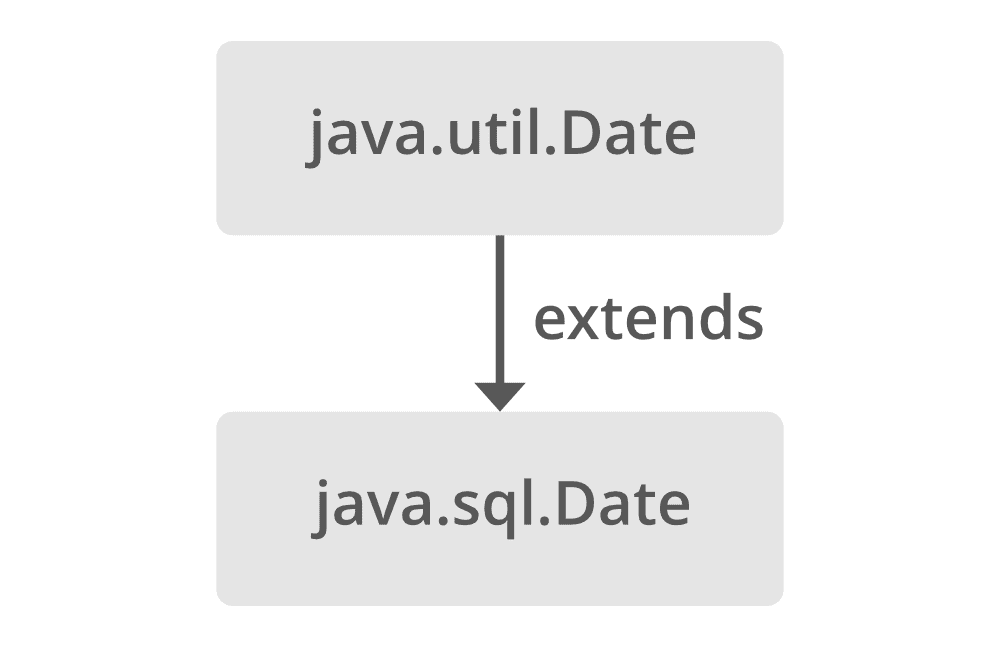

# 将枚举转换为字符串的 Java 程序

> 原文:[https://www . geesforgeks . org/Java-program-to-convert-enum-to-string/](https://www.geeksforgeeks.org/java-program-to-convert-enum-to-string/)

给定一个包含一组常数的枚举，任务是将[枚举](https://www.geeksforgeeks.org/enum-in-java/)转换为[字符串](https://www.geeksforgeeks.org/string-data-structure/)。



**方法:**

我们可以用两种方法解决这个问题:

1.  使用名称()方法
2.  使用 toString()方法

让我们详细讨论这两者并实现它们，以便更好地理解它们。

**方法 1:** 使用名称()方法

它返回与其枚举声明中声明的相同的枚举常量的名称。

*   我们将使用 name()方法返回枚举常量的名称。
*   在主类中，我们只需要打印它。
*   内部给出的值首先是我们将进一步创建的枚举类的名称，然后调用名为的常量，最后使用 name()方法。
*   现在在创建主文件的同一个文件夹中创建另一个名为**Fruits.java**的 java 枚举文件，并声明如下枚举:

**例**

```
public enum Fruits {
    Orange, Apple, Banana, Mango;
}
```

## Java 语言(一种计算机语言，尤用于创建网站)

```
// Java Program to Convert Enum to String
// using 

// Importing input output classes
import java.io.*;

// Enum
enum Fruits {
    Orange,
    Apple,
    Banana,
    Mango;
}

// Main class
class GFG {

    // Main driver method
    public static void main(String[] args) {

        // Printing all the values
        System.out.println(Fruits.Orange.name());
        System.out.println(Fruits.Apple.name());
        System.out.println(Fruits.Banana.name());
        System.out.println(Fruits.Mango.name());
    }
}
```

**Output**

```
Orange
Apple
Banana
Mango

```

**方法二:** [使用 toString()方法](https://www.geeksforgeeks.org/object-tostring-method-in-java/)

用于获取代表数字对象值的字符串对象。

*   我们将遵循与前面使用的相同的过程，但是这里唯一的区别是我们将使用 toString()方法。所以就把**名()法**换成**托斯特林()法**。

> **注意:**不要忘记在同一个文件夹中创建一个**Fruits.java**枚举文件。

插图:

```
public enum Fruits {
    Orange, Apple, Banana, Mango;
}
```

**例 2**

## Java 语言(一种计算机语言，尤用于创建网站)

```
// Java Program to Convert Enum to String
// Using toString() Method

// Importing input output classes 
import java.io.*;

// Enum
enum Fruits {

  // Custom entries 
    Orange,
    Apple,
    Banana,
    Mango;
}

// Main class 
class Main {

    // Main driver method 
    public static void main (String[] args) {

        // Printing all the values
        System.out.println(Fruits.Orange.toString());
        System.out.println(Fruits.Apple.toString());
        System.out.println(Fruits.Banana.toString());
        System.out.println(Fruits.Mango.toString());
    }
}
```

**Output**

```
Orange
Apple
Banana
Mango

```