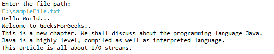

# 将输入流转换为字符串的 Java 程序

> 原文:[https://www . geesforgeks . org/Java-program-to-convert-inputstream-to-string/](https://www.geeksforgeeks.org/java-program-to-convert-inputstream-to-string/)

读写操作是用户在任何应用程序中执行的基本功能。每种编程语言都提供读写数据的输入/输出流。Java 的 FileInputStream 类和 FileOutputStream 类对文件执行 I/O 操作。FileInputStream 类用于从文件中读取数据，FileOutputStream 类用于将数据写入文件。在 Java 中，有几种方法可以使用内置库和外部库将输入流对象转换为字符串。

**方法:**将输入流对象转换为字符串的三种方法是:

1.  使用[输入流阅读器](https://www.geeksforgeeks.org/inputstreamreader-class-in-java/)类
2.  使用[buffer reader](https://www.geeksforgeeks.org/java-io-bufferedreader-class-java/)类
3.  使用[扫描仪](https://www.geeksforgeeks.org/scanner-class-in-java/)类

**方法 1:使用** [**输入流阅读器**](https://www.geeksforgeeks.org/inputstreamreader-class-in-java/) **类**

输入流阅读器将字节流转换成字符流。它读取字节流，并使用指定的字符集将其解码为字符。如果没有指定字符集，则使用默认的 [*字符集*](https://www.geeksforgeeks.org/charset-name-method-in-java-with-examples/) 。

在此方法中，用户提供的文件名作为文件对象初始化的参数传递。该文件对象再次作为输入流对象初始化的参数传递。通过传递输入流对象来启动输入流读取器对象。InputStreamReader 将字节流转换为字符流。提取的字符流使用 InputStreamReader 类的 read()方法存储在字符数组中。最后，字符数组被转换为字符串。

**实施:**

## Java 语言(一种计算机语言，尤用于创建网站)

```
import java.util.*;
import java.io.*;
public class InputStreamReaderDemo {

    public static void main(String[] args)
    {
        Scanner s = new Scanner(System.in);
        System.out.println("Enter the file path: ");
        String filename = s.nextLine();

        // Creating a File object
        File file = new File(filename);
        try {
            // Creating an InputStream object
            InputStream is = new FileInputStream(file);

            // creating an InputStreamReader object
            InputStreamReader isr = new InputStreamReader(is);

            // Creating a character array
            char charArray[] = new char[(int)file.length()];

            // Reading the contents of the reader
            isr.read(charArray);

            // Converting character array to a String
            String contents = new String(charArray);
            System.out.println(contents);
        }
        catch (IOException e) {
            System.out.println(e);
        }
    }
}
```

**输出:**



**方法二:使用**[**buffere reader**](https://www.geeksforgeeks.org/java-io-bufferedreader-class-java/)**类**

BufferedReader 类用于从输入源(这里是文件)读取字符流。BufferedReader 类的 readLine()方法从缓冲区读取器对象的内容中读取每一行。

在下面的例子中，用户指定传递给输入流构造函数的文件名，用于输入流对象初始化。输入流对象被传递给输入流读取器构造函数。BufferedReader 对象是使用 InputStreamReader 对象实例化的。创建一个 StringBuffer 对象，用于存储从 BufferedReader 对象中读取的行。最后，StringBuffer 对象的内容被转换为 String。

**实施:**

## Java 语言(一种计算机语言，尤用于创建网站)

```
// Importing java libraries
import java.io.*;
import java.util.Scanner;

public class GFG {

    // Main driver method
    public static void main(String[] args)
    {
        Scanner s = new Scanner(System.in);
        System.out.println("Enter the file path: ");
        String filename = s.nextLine();
        try {
            // Creating an InputStream object
            InputStream is = new FileInputStream(filename);

            // creating an InputStreamReader object
            InputStreamReader isr
                = new InputStreamReader(is);

            // Creating a BufferedReader object
            BufferedReader br = new BufferedReader(isr);
            StringBuffer sb = new StringBuffer();

            String str;

            while ((str = br.readLine()) != null) {
                sb.append(str);
            }
            System.out.println(sb.toString());
        }
        catch (IOException e) {
            System.out.println(e);
        }
    }
}
```

**输出:**


**方法三:使用** [**扫描仪**](https://www.geeksforgeeks.org/scanner-class-in-java/) **类**

Scanner 类用于从 stdin 读取输入。Scanner 类有接受基本类型输入的方法，如整数、双精度、浮点以及字符串输入。

在下面的示例中，用户指定传递给输入流构造函数的文件名，用于文件输入流对象初始化。文件输入流对象然后被传递给扫描器类构造函数。扫描器对象内容被迭代，提取的每一行都被附加到 StringBuffer 对象。最后，StringBuffer 内容被转换为 String 并打印到标准输出。

**实施:**

## Java 语言(一种计算机语言，尤用于创建网站)

```
// Importing java libraries
import java.io.FileInputStream;
import java.io.IOException;
import java.util.Scanner;

public class GFG {

    // Main driver method
    public static void main(String[] args)
    {

        // Taking input from the user
        Scanner s = new Scanner(System.in);
        System.out.println("Enter the file path: ");
        String filename = s.nextLine();
        try {

            // Creating an InputStream object
            FileInputStream fis
                = new FileInputStream(filename);

            // Creating a Scanner object
            Scanner sc = new Scanner(fis);

            // Reading line by line from scanner to
            // StringBuffer

            StringBuffer sb = new StringBuffer();
            while (sc.hasNext()) {
                sb.append(sc.nextLine());
            }

            System.out.println(sb.toString());
        }

        // Catch block to handle exceptions
        catch (IOException e) {
            System.out.println(e);
        }
    }
}
```

**<u>输出</u>**

