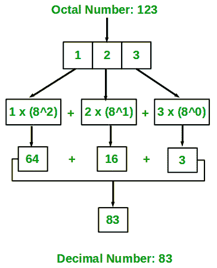

# 八进制到十进制转换的 Java 程序

> 原文:[https://www . geesforgeks . org/Java-程序转八进制转十进制/](https://www.geeksforgeeks.org/java-program-to-convert-octal-to-decimal/)

**八进制数**是 8 进制数，使用 0-7 的数字。这个系统是一个基数为 8 的数字系统。**十进制数字**是以 10 为基数的数字，用 0-9 之间的数字表示十进制数字。它们还需要点来表示十进制分数。

我们必须把八进制数转换成十进制数。

八进制数的基数是 8，这意味着一个八进制数的位数范围是 **0** 到 **7** 。

> #### 例如:
> 
> 八进制:167
> 
> 十进制:(7 * 8<sup>0</sup>)+(6 * 8<sup>1</sup>)+(1 * 8<sup>2</sup>)= 119

下图说明了如何将一个八进制数(123)转换为一个等效十进制值:



**方法 1:使用 Integer.parseInt()方法**

要将任意字符串形式转换为十进制，我们可以使用 **type.parseType()方法。**比如这里需要从八进制转换到十进制，八进制形式是整数，可以用**integer . parsent()**来转换。

## Java 语言(一种计算机语言，尤用于创建网站)

```java
// Java program to convert 
// octal number to decimal using
// Integer.parseInt()

public class GFG {

public static void main(String args[])
    {
        // octal value
        String onum = "157";

        // octal to decimal using Integer.parseInt()
        int num = Integer.parseInt(onum, 8);

        System.out.println(
            "Decimal equivalent of Octal value 157 is: "
            + num);
    }
}
```

**Output**

```java
Decimal equivalent of Octal value 157 is: 111
```

**方法 2:**

**算法:**

1.  开始并接受用户的八进制输入。
2.  创建一个初始值为 0 的结果变量来存储结果十进制数。
3.  创建一个循环来获取输入中的每个数字。
4.  将数字中的每个数字乘以 8 <sup>n-1</sup> ，其中 n 是数字的位置。
5.  然后将其添加到结果中。
6.  将步骤(5)中的值存储到结果变量中。
7.  打印结果变量。

## Java 语言(一种计算机语言，尤用于创建网站)

```java
// Java program to convert octal
// to decimal number using custom code

import java.util.Scanner;
import java.lang.Math;
public class Main {

    public static void main(String[] args)
    {

        int a = 167;

        // Initialize result variable to 0.
        int result = 0;

        // Take a copy of input
        int copy_a = a;

        for (int i = 0; copy_a > 0; i++) {

            // Take the last digit
            int temp = copy_a % 10;

            // Appropriate power on 8 suitable to
            // its position.
            double p = Math.pow(8, i);

            // Multiply the digits to the  into the Input
            // and
            //  then add it to result
            result += (temp * p);
            copy_a = copy_a / 10;
        }

        System.out.print("Decimal of Octal Number (" + a
                         + ") : " + result);
    }
}
```

**Output**

```java
Decimal of Octal Number (167) : 119
```