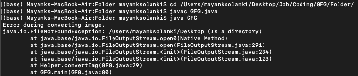
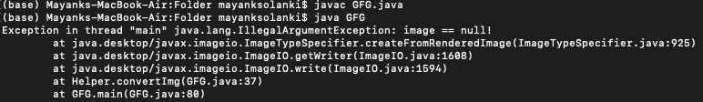

# 将 PNG 图像转换为 JPEG 的 Java 程序

> 原文:[https://www . geesforgeks . org/Java-program-to-convert-png-images-to-JPEG/](https://www.geeksforgeeks.org/java-program-to-convert-png-images-to-jpeg/)

**PNG 和 JPG** 格式用于图像插图。这两种格式都被用来为某些类型的图像提供良好的兼容性，比如巴布亚新几内亚更适合线条画和图标图形，而 JPG 适合照片。然而，对于媒体和图片的使用和存储，两者都是可以相互转换的。

在 Java 中，write()方法用于将一个图像从 gif 类型的格式转换为 jpg，使用 *javax.imageio 包*下 ImageIO 类提供的静态方法 write()。下面的实用程序类实现了一个名为 *converImg()* 的静态方法，该方法以输入和输出图像路径为参数，格式化输出图像。

**语法:**

```java
boolean write(RenderedImage image, String formatName, OutputStream output)
```

**参数:** write()方法接受 3 个参数，即图像、formatName 和输出。

1.  **图像:**作为 RenderedImage 界面子类的输入图像，如 BufferedImage。要从输入图像文件中获取 BufferedImage 对象，我们可以使用 read( [InputStream](https://www.geeksforgeeks.org/java-io-inputstream-class-in-java/) )，它也是由 ImageIO 类提供的。
2.  **formatName:** 指定输出图像的格式类型。
3.  **输出**指定输出图像将写入的[输出流](https://www.geeksforgeeks.org/java-io-outputstream-class-java/)。

**返回类型:**布尔值，如果可以找到 ImageWriter 并成功执行转换，则返回 true，否则返回 false。

**异常:**如果执行过程中出现错误，将抛出 [IOException](https://www.geeksforgeeks.org/why-does-bufferedreader-throw-ioexception-in-java/) 。稍后将在实现部分显示。

**实施:**

> 注意:对于输入和输出图像路径，已传递的输入和输入图像显示在机器的桌面上
> 
> *   输入名为“demoImage.png”的图像
> *   名为“demoImage.jpeg”的输出图像
> 
> 代码位于下面提到的目录中
> 
> *   */用户/mayanksolanki/桌面/作业/编码/GFG/文件夹/*

**例**

## Java 语言(一种计算机语言，尤用于创建网站)

```java
// Java Program to Convert PNG Image to JPEG Image

// Importing BufferedImage class from java.awt package
// to describe an image with accessible buffer of image
import java.awt.image.BufferedImage;
// Importing all input output classes
import java.io.*;
// Importing an interface
// to determine the setting of IIOParam object
import javax.imageio.ImageIO;

// Class 1
// helper class
class HelperClass {

    // Method
    // To convert image format
    public static boolean convertImg(String inputImgPath,
                                     String outputImgPath,
                                     String formatType)

        throws IOException
    {

        // Creating an object  of FileInputStream to read
        FileInputStream inputStream
            = new FileInputStream(inputImgPath);

        // Creating an object  of FileOutputStream to write
        FileOutputStream outputStream
            = new FileOutputStream(outputImgPath);

        // Reading the  input image from file
        BufferedImage inputImage
            = ImageIO.read(inputStream);

        // Writing to the output image in specified format
        boolean result = ImageIO.write(
            inputImage, formatType, outputStream);

        // Closing the streams in order to avoid read write
        // operations
        outputStream.close();
        inputStream.close();

        return result;
    }
}

// Class 2
// Main class
public class GFG {

    // Main class
    public static void main(String[] args)
    {

        // Here, the local directories from machine
        //  is passed as in strings

        // Creating a string to store the path of image
        // to be converted
        String inputImage
            = "/Users/mayanksolanki/Desktop/demoImage.png";

        // Creating a string to
        // store path of converted image
        String outputImage
            = "/Users/mayanksolanki/Desktop/demoImage.jpeg";
        // Creating another string that will be
        // store format of converted image

        // Simply creating  creating just to hold the format
        // type
        String formatType = "JPEG";

        // Try block to check for exceptions
        try {
            // result will store boolean value whether image
            // is converted successfully or not

            boolean result = HelperClass.convertImg(
                inputImage, outputImage, formatType);

            if (result) {

                // Display message when image is converted
                // successfully
                System.out.println(
                    "Image converted to jpeg successfully.");
            }
            else {

                // Display message when image is not
                // converted successfully
                System.out.println(
                    "Could not convert image.");
            }
        }

        // Catch block to handle the exceptions
        catch (IOException ex) {

            // Display message when exception is thrown
            System.out.println(
                "Error during converting image.");

            // Print the line number
            // where the exception occured
            ex.printStackTrace();
        }
    }
}
```

**输出:**

**情况 1:** 当抛出错误时



**情况 2:** 编译成功，但运行时抛出异常(未能正常运行)



**案例 3:** 编译成功，运行成功

```java
Image converted to jpeg successfully.
```

当执行时，它将显示成功转换为 jpeg 的图像，我们可以在控制台上找到它，并在文件中创建一个新的 jpeg 图像