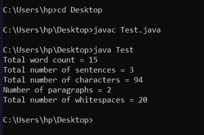

# 计算文本文件中行数、字数、字符数和段落数的 Java 程序

> 原文:[https://www . geesforgeks . org/Java-program-to-count-行数-单词-字符-文本文件中的段落/](https://www.geeksforgeeks.org/java-program-to-count-the-number-of-lines-words-characters-and-paragraphs-in-a-text-file/)

计算字符数是非常重要的，因为几乎所有依赖用户输入的文本框都对插入的字符数有一定的限制。例如，脸书帖子的字符限制为 63206 个字符。而对于推特上的一条推文，字符限制是 140 个字符，Snapchat 的每个帖子的字符限制是 80 个。

当推文和脸书邮报的更新通过 API 完成时，确定字符限制变得至关重要。

### **使用的内置功能**

#### **1。文件(字符串路径名):**

该功能存在于 **java.io.File** 包下。它通过将给定的路径名字符串转换为抽象路径名来创建一个新的文件实例。

**语法:**

```
public File(String pathname)
```

**参数:**

```
pathname - A pathname string
```

#### **2 .FileInputStream(文件):**

该功能出现在 **java.io.FileInputStream** 包**下。**它通过打开到文件系统中由文件对象文件命名的实际文件的连接来创建文件输入流。

**语法:**

```
public FileInputStream(File file) throws FileNotFoundException
```

**参数:**

```
file - the file to be opened for reading.
```

**投掷:**

*   **file notfoundexception–**如果文件不存在，是目录而不是常规文件，或者由于某种其他原因无法打开进行读取。
*   **security exception–**如果安全管理器存在，并且其 checkRead 方法拒绝对文件的读取访问。

#### **3 .input stream reader(input stream in):**

该功能存在于**Java . io . InputStreamReader**包下。它创建了一个使用默认字符集的 InputStreamReader。

**语法:**

```
public InputStreamReader(InputStream in)
```

**参数:**

```
in - An InputStream
```

#### **4。BufferedReader(阅读器入):**

该功能存在于**Java . io . buffere reader**包下。它创建一个使用默认大小的输入缓冲区的缓冲字符输入流。

**语法:**

```
public BufferedReader(Reader in)
```

**参数:**

```
in - A Reader
```

### 示例:

## Java 语言(一种计算机语言，尤用于创建网站)

```
// Java program to count the
// number of lines, words, sentences,  
// characters, and whitespaces in a file
import java.io.*;

public class Test {
    public static void main(String[] args)
        throws IOException
    {
        File file = new File("C:\\Users\\hp\\Desktop\\TextReader.txt");
        FileInputStream fileInputStream = new FileInputStream(file);
        InputStreamReader inputStreamReader = new InputStreamReader(fileInputStream);
        BufferedReader bufferedReader = new BufferedReader(inputStreamReader);

        String line;
        int wordCount = 0;
        int characterCount = 0;
        int paraCount = 0;
        int whiteSpaceCount = 0;
        int sentenceCount = 0;

        while ((line = bufferedReader.readLine()) != null) {
            if (line.equals("")) {
                paraCount += 1;
            }
            else {
                characterCount += line.length();
                String words[] = line.split("\\s+");
                wordCount += words.length;
                whiteSpaceCount += wordCount - 1;
                String sentence[] = line.split("[!?.:]+");
                sentenceCount += sentence.length;
            }
        }
        if (sentenceCount >= 1) {
            paraCount++;
        }
        System.out.println("Total word count = "+ wordCount);
        System.out.println("Total number of sentences = "+ sentenceCount);
        System.out.println("Total number of characters = "+ characterCount);
        System.out.println("Number of paragraphs = "+ paraCount);
        System.out.println("Total number of whitespaces = "+ whiteSpaceCount);
    }
}
```

**文本阅读器. txt** 文件包含以下数据–

```
Hello Geeks. My name is Nishkarsh Gandhi.
GeeksforGeeks is a Computer Science portal for geeks.
```

**输出:**



> **注意:**这个程序不会在在线编译器上运行。请在您的系统上创建一个 txt 文件，并给出它在您的系统上运行该程序的路径。

本文由 **Mayank Kumar** 供稿。如果你喜欢极客博客并想投稿，你可以用[write.geeksforgeeks.org](https://write.geeksforgeeks.org)写一篇文章，或者把你的文章邮寄到 review-team@geeksforgeeks.org。看到你的文章出现在极客博客主页上，帮助其他极客。如果你发现任何不正确的地方，或者你想分享更多关于上面讨论的话题的信息，请写评论。