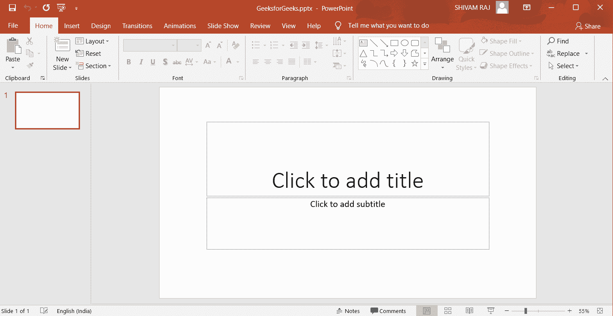

# 创建空白 PPT 文档的 Java 程序

> 原文:[https://www . geesforgeks . org/Java-program-to-create-a-blank-PPT-document/](https://www.geeksforgeeks.org/java-program-to-create-a-blank-ppt-document/)

程序使用 Java 创建一个空白的 PPT 文档。创建新的 PPT 文档需要外部 jar(Java 档案)文件。下面是相同的实现。创建新的 PPT 需要外部 Apache POI 模块中的 XMLSlideShow 类的对象。

**算法:**

*   使用 APACHE POI 模块创建。
*   通过创建 XMLSlideShow 类的对象来创建新的空幻灯片放映。
*   创建文件输出流对象。
*   之后将更改写入文件。

**注意:** [执行](https://poi.apache.org/download.html)操作需要下载外部文件。有关所用模块的更多文件，请参考[本](https://poi.apache.org/)。

**实施:**

## Java 语言(一种计算机语言，尤用于创建网站)

```java
// Creating a blank PPT document using java
import org.apache.poi.xslf.usermodel.XMLSlideShow;
import java.io.*;

class GFG {
    public static void main(String[] args)
        throws IOException
    {
        // Creating a new empty slide show
        // by creating an object of XMLSlideShow class.
        XMLSlideShow PPT = new XMLSlideShow();

        // Creating a FileOutputStream object
        File newFile = new File("GeeksforGeeks.pptx");
        FileOutputStream output
            = new FileOutputStream(newFile);

        // After that writing
        // the changes to the file.
        PPT.write(output);
        System.out.println(
            "Blank PPT has been created successfully");
        output.close();
    }
}
```

**输出:**

