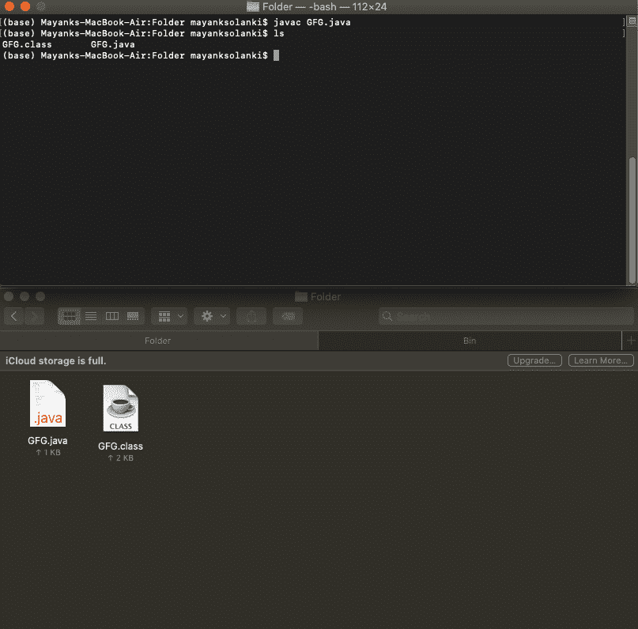
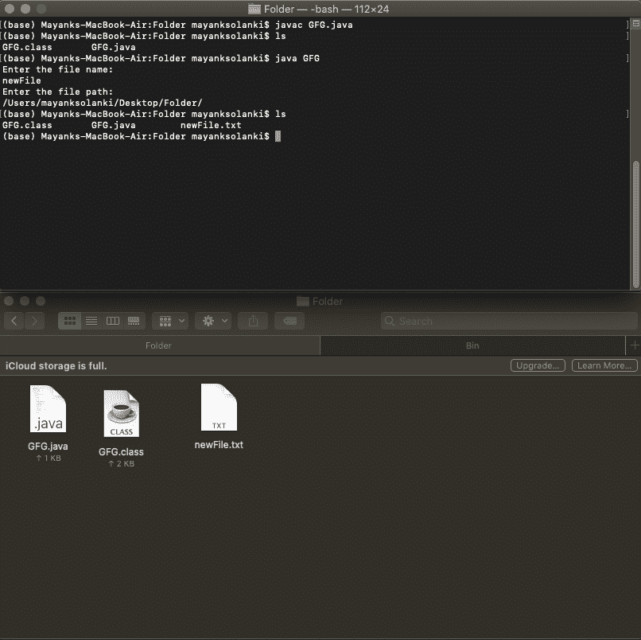

# 创建新文件的 Java 程序

> 原文:[https://www . geesforgeks . org/Java-program-to-create-new-file/](https://www.geeksforgeeks.org/java-program-to-create-a-new-file/)

文件是一个抽象的路径，它没有物理存在。只有在“使用”该文件时，底层物理存储才会受到影响。当文件被间接创建时，抽象路径被创建。文件是一种方式，其中数据将按照要求存储。

主要的，为了创建一个新的文件，使用了内置的文件和函数，为了安全起见，这里肯定会抛出[异常](https://www.geeksforgeeks.org/exceptions-in-java/)。所以为了处理它，我们将使用异常处理技术。在这里，我们将使用其中一种被称为尝试-捕获块的技术。

第二，额外的工作只是我们将导入文件类，我们将为其导入文件类。

**语法:**导入文件库或类

```
import java.util.File ;
```

**语法:**创建新文件

```
File object_name = new File(Directory)
```

**语法:**指定目录在不同的操作系统中是不同的(假设 java 文件在一个名为‘Folder’的文件夹中是在桌面上创建的)

在 Linux 和 Mac 中

```
/Users/mayanksolanki/Desttop/Folder/
```

在 Windows 中，使用“\\”代替“/”来转义“\”字符。所以访问相同的目录

```
\\Users\\mayanksolanki\\Desktop\\Folder\\
```

**创建新文件**有两种标准方法，或者直接借助 file 类，或者通过在两种方法中创建文件的对象，间接借助 FileOutputStream。

*   **使用文件类**
*   **通过使用文件输出流类**

<figure class="table">

| 

文件类别

 | 

文件输出流类

 |
| --- | --- |
| 这是一个类，只是一个句柄 | 它是一个可以写入[文件输出流 JavaDoc](https://www.geeksforgeeks.org/dataoutputstream-in-java/) 的输出流 |
| 方法:File.createNewFile() | 方法:文件输出流

示例:echo > myFile.txt |
| 它用于那些没有物理存在的物体 | 它用于那些已经存在的对象 |

</figure>

这两个类都提供了一些主要用于文件操作的方法。例如，创建、写入、比较两个路径名、检查特定文件是否存在**、**等等。要理解这个话题，首先**，**考虑两种方法的一个例子。

> 1.  用于在机器上编译任何 java 代码的终端命令
> 2.  用于在机器上运行任何 java 代码的终端命令
> 
> *   javac _ class _ name . Java//用于编译
> *   java 类名//用于执行
> 
> Mac 操作系统的终端将用于实现和提供访问目录的输出
> 
> 使用的目录:/Users/mayanksolanki/Desktop/Folder/

**方法 1:使用文件类**创建新文件

## Java 语言(一种计算机语言，尤用于创建网站)

```
// Java Program to create new file using File class

// Importing new files
import java.io.File;
import java.io.BufferedReader;

// Importing as it converts bits to strings
import java.io.InputStreamReader;

public class GFG {

    // Main Driver Method
    public static void main(String args[])
    {
        // Creating New File via function
        GFG gfg = new GFG();
        gfg.newFile();
    }

    // Function To Make New File
    public void newFile()
    {
        String strPath = "", strName = "";

        // Try-catch Block
        try {

            // Creating BufferedReadered object
            BufferedReader br = new BufferedReader(
                new InputStreamReader(System.in));
            System.out.println("Enter the file name:");

            // Reading File name
            strName = br.readLine();
            System.out.println("Enter the file path:");

            // Reading File Path
            strPath = br.readLine();

            // Creating File Object
            File file1
                = new File(strPath + "" + strName + ".txt");

            // Method createNewFile() method creates blank
            // file.
            file1.createNewFile();
        }

        // Try-Catch Block
        catch (Exception ex1) {
        }
    }
}
```

**输出:**



```
Name of file to be added                    : newFile.txt
Directory where file is to be added         : /Users/mayanksolanki/Desktop/Folder/
```



```
Added file name            : newFile.txt
Added file name directory : /Users/mayanksolanki/Desktop/Folder/
```

**说明:**

1.  为了使用 java 语言创建一个新文件，这里使用了“文件”类。“[buffere reader](https://www.geeksforgeeks.org/java-io-bufferedreader-class-java/)”和“ [InputStreamReader](https://www.geeksforgeeks.org/inputstreamreader-class-in-java/) ”这两个类都用于将来自用户的文件名和路径作为输入。这些类位于“java.io”包中。因此，为了利用这些类，有必要在程序开始时导入这些类。
2.  这里的阶级即被创造出来，“GFG”。在该类中，定义了“main()”方法，将从该方法开始执行。
3.  在*“main()*”内部创建类的方法对象。而这个对象是用来调用“ *newFile()* 的”方法。
4.  在 *main()* 方法之外，声明了 [*newFile()*](https://www.geeksforgeeks.org/file-createnewfile-method-in-java-with-examples/) 方法，该方法包含从用户处获取输入并根据输入创建文件的代码。
5.  因为文件有它自己的名称和路径，所以有必要给出文件的名称(我们想要创建的)和路径(创建文件的位置)。在这一行中，声明了两个空白字符串，即 strName 和 strPath。“当用户给出这个信息时，strName 和 strPath 用于存储文件名和路径。
6.  要从用户那里获取文件名和路径作为输入，这里使用了[buffere reader](https://www.geeksforgeeks.org/java-io-bufferedreader-class-java/)类和 [InputStreamReader](https://www.geeksforgeeks.org/inputstreamreader-class-in-java/) 类。buffere reader“br”的对象对于获取用户给出的输入值非常有用。
7.  这一行打印一些文本给用户一个指示，如“输入文件名:”等。要打印文本“[*【println()*](https://www.geeksforgeeks.org/difference-between-print-and-println-in-java/)”功能被使用。
8.  这里用“[*【readLine()*](https://www.geeksforgeeks.org/console-readline-method-in-java-with-examples/)”方法取输入并存储，在 strName 和 strPath 中。
9.  在这里，文件类的对象被创建，并且作为参数，文件路径和名称被提供给构造函数。在这一行代码中”。txt”是文件的一种格式。你可以根据需要改变它。File 类的对象是调用其类中提供的方法所必需的。
10.  这里 [*createNewFile()*](https://www.geeksforgeeks.org/file-createnewfile-method-in-java-with-examples/) 方法是借助 File 类对象调用的。此方法在给定的目录路径上创建一个空白文件。
11.  最后，用“try{ }”块括起来。因为像 *readLine()* 和 *createNewFile()* 这样的方法会产生异常。所以为了处理异常尝试，使用了 catch。

**方法 2:使用 FileOutputStream 类**创建新文件

## Java 语言(一种计算机语言，尤用于创建网站)

```
// Java Program to create new file
// using FileOutputStream class

// Importing File Classes
import java.io.FileOutputStream;

// Importing BufferedReader Class for taking input
import java.io.BufferedReader;

// Importing as it converts bits to strings
import java.io.InputStreamReader;

// Function Helping Create New File
public class GFG {

    // Main Driver Method
    public static void main(String args[])
    {
        // Creating File Object
        GFG gfg = new GFG();
        gfg.newFile();
    }

    // Function To Create A New File
    public void newFile()
    {
        String strFilePath = "", strFileName = "";

        // Try-Catch Block
        try {

            // Creating BufferClass Object
            BufferedReader br = new BufferedReader(
                new InputStreamReader(System.in));
            System.out.println("Enter the file name:");

            // Asking file name from User
            strFileName = br.readLine();
            System.out.println("Enter the file path:");

            // Asking file path from User
            strFilePath = br.readLine();

            // Creating Object of FileOutputStream Class
            FileOutputStream fos = new FileOutputStream(
                strFilePath + "" + strFileName + ".txt");
        }

        // Try-Catch Block
        catch (Exception ex1) {
        }
    }
}
```

**解说:**

在第二个示例中，文件类不用于以编程方式创建新文件。

1.  为了使用 java 语言创建一个新文件，这里使用了“FileOutputStream”类，并且“BufferedReader”和“InputStreamReader”都用于从用户那里获取文件名和路径作为输入。这些类位于“java.io”包中。因此，为了利用这些类，有必要在程序开始时导入它们。
2.  阶级即被创造出来，“GFG”。在该类中，定义了“main()”方法，将从该方法开始执行。
3.  在类的 main()方法对象内部创建。而这个对象是用来调用“newFile()”方法的。
4.  在 main()方法之外，声明了 newFile()方法，该方法包含从用户处获取输入并根据输入创建文件的代码。
5.  在这一行中，声明了两个空白字符串，即 strFileName 和 strFilePath。“当用户给出该信息时，strFileName 和 strFilePath 用于存储文件的名称和路径。
6.  为了将来自用户的文件名和路径作为输入，这里使用了 BufferedReader 类和 InputStreamReader 类。buffere reader“br”的对象对于获取用户给出的输入值非常有用。
7.  这一行打印一些文本给用户一个指示，如“输入文件名:”等。使用“println()”函数打印文本。
8.  这里“readLine()”方法用于获取输入并将其存储在 strFileName 和 strFilePath 中。
9.  在这里，文件输出流类的对象被创建，并且作为参数，文件路径和名称被提供给构造函数。在这一行代码中”。txt”是一种文件格式。你可以根据需要改变它。FileOutputStream 类的对象是调用其类中提供的方法所必需的。例如，如果用户想要以编程方式在新创建的文件中存储一些文本，那么 write()方法是有帮助的。
10.  最后，用“try{ }”块括起来。因为，readLine()方法会生成异常。所以为了处理异常尝试，使用了 catch 块。

**输出:**它将与前一个相同，因为只是创建新文件的方法改变了文件名的其余部分，并且添加它的目录保持不变。

```
Added file name            : newFile.txt
Added file name directory : /Users/mayanksolanki/Desktop/Folder/
```

