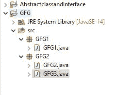
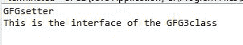

# Java 程序创建包访问外部类成员和同一个包

> 原文:[https://www . geesforgeks . org/Java-program-to-create-a-package-to-access-成员-外部类和同一个包/](https://www.geeksforgeeks.org/java-program-to-create-a-package-to-access-the-member-of-external-class-and-same-package/)

顾名思义，java 中的一个包包含所有相同类型的类，抽象类，接口等，它们具有相同的功能。单个包可以包含许多类，抽象类，例如 [java.util 包](https://www.geeksforgeeks.org/java-util-package-java/)等。


**套餐有两种**:

1.  **内置包:**这些是在 java jar 文件中预定义的包。java 中最常用的包。java 中的 util 和 java.io 包。
2.  **用户自定义包**:这些包是用户自己创建的，用来存储相关的类，其他一些为特定任务定义的实用函数、接口、抽象类等，称为用户自定义包。

**项目结构**:



```java
Project -- GFG 
           | 
           |  
Package 1 GFG1
           |
          GFG1.java (class)

Package 2 GFG2
           |
          GFG2.java (class)
           |
          GFG3.java (class)
```

**包装 1** :

**GFG1.java**

## Java 语言(一种计算机语言，尤用于创建网站)

```java
package GFG1;
// Creating Interface
interface GFG1Interface {
    String name = "This is the Interface of GF1";
    void GFG1Interface();
}
public class GFG1 {

    // Instance variable
    String name;

    // Getter Function
    public String getName() { return name; }

    // Setter Function
    public void setName(String name) { this.name = name; }
}
```

**套餐 2:**

**GFG3.java**

## Java 语言(一种计算机语言，尤用于创建网站)

```java
package GFG2;
// Creating Interface
interface GFG3Interface {
    String name = "GFG";
    public void interfaceGFG();
}
// Creating Abstract class
abstract class GFGabstract {
    String name = "GFGAbstract";

    // Abstract Method
    abstract public void print();
}
public class GFG3 {

    // Instance Variables
    int first;
    int second;

    // Creating Constructor
    GFG3(int a, int b)
    {
        this.first = a;
        this.second = b;
    }

    // Creating add Function
    public int add() { return this.first + this.second; }
}
```

**访问包 2 类中包 1 类的成员:**

**GFG2.java**

## Java 语言(一种计算机语言，尤用于创建网站)

```java
package GFG2;
// Importing the members of GFG1 package
import GFG1.*;
public class GFG2 implements GFG3Interface {

    @Override public void interfaceGFG()
    {
        System.out.println(
            "This is the interface of the GFG3class");
    }
    public static void main(String args[])
    {
        // Creating object of class GFG1
        GFG1 ob = new GFG1();

        // Calling setName Function
        ob.setName("GFGsetter");
        System.out.println(ob.getName());

        // Creating object of class GFG2
        GFG2 ob2 = new GFG2();

        ob2.interfaceGFG();
    }
}
```

**输出:**

