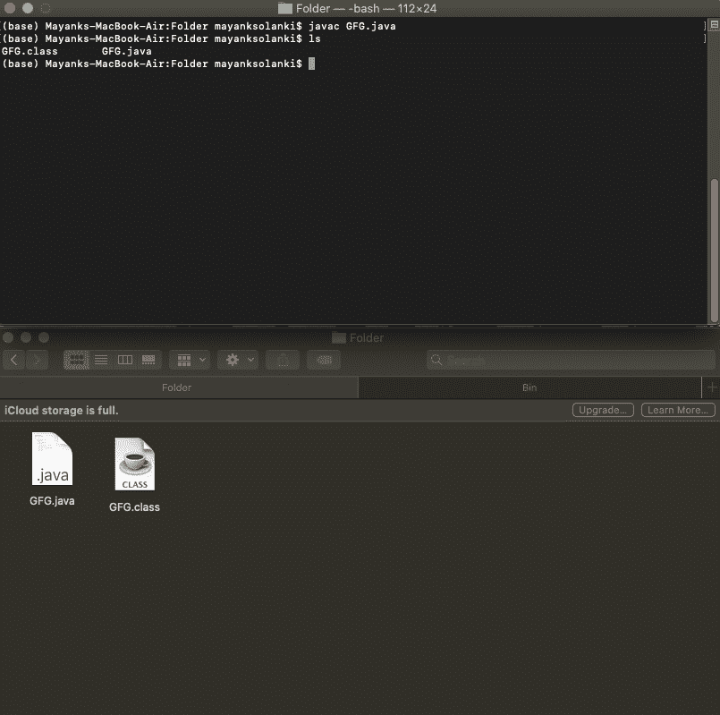
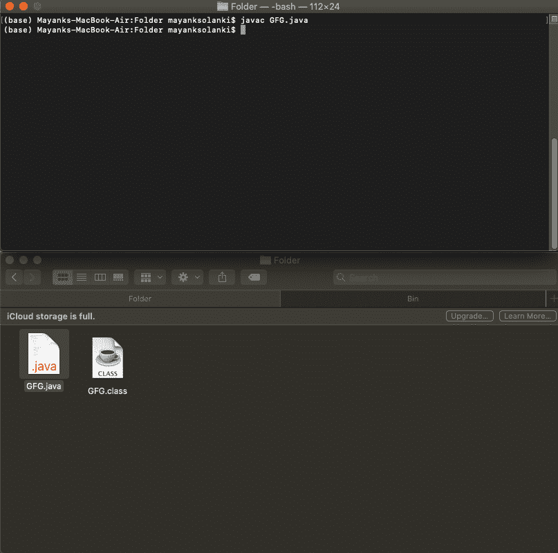
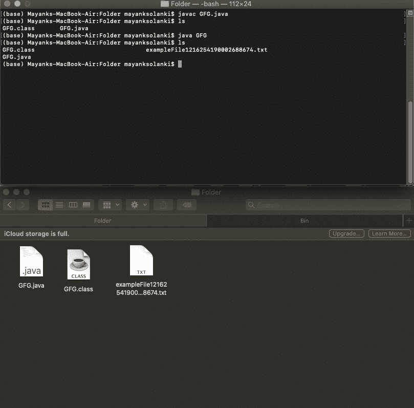
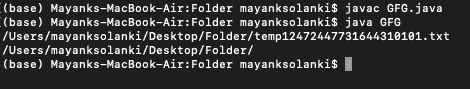

# 创建临时文件的 Java 程序

> 原文:[https://www . geesforgeks . org/Java-程序创建临时文件/](https://www.geeksforgeeks.org/java-program-to-create-a-temporary-file/)

文件是一个抽象的路径，它没有物理存在。只有在“使用”该文件时，底层物理存储才会受到影响。当文件被间接创建时，抽象路径被创建。文件是一种方式，其中数据将按照要求存储。

> 文件类型
> 
> *   。文本文件（textfile）
> *   。默认文件类型

主要的，为了创建一个临时文件，使用了内置的文件和函数，为了安全起见，这里肯定会抛出[异常](https://www.geeksforgeeks.org/exceptions-in-java/)。所以为了处理它，我们将使用异常处理技术。在这里，我们将使用其中一种被称为尝试-捕获块的技术。

第二，额外的工作只是我们将导入文件类，我们将为其导入文件类。

**语法:导入文件库或类**

```
import java.util.File ;

```

**语法:创建新文件**

```
File object_name = new File(Directory)

```

**语法:指定一个目录**在不同的操作系统中是不同的(假设 java 文件在桌面上创建的一个名为‘Folder’的文件夹中)

在 Linux 和 Mac 中

```
/Users/mayanksolanki/Desttop/Folder/

```

在 Windows 中，使用“\\”代替“/”来转义“\”字符。所以访问相同的目录

```
\\Users\\mayanksolanki\\Desktop\\Folder\\

```

一个临时文件，其本身意味着应该被创建，只是不太可能创建一个新的文件，并且稍后应该随着删除文件的命令被调用而被擦除。

**方法:**用 java 创建临时文件的标准方法是使用，例如，创建、写入、比较两个路径名、检查特定文件是否存在**、**等等。要理解这个话题，首先**，**考虑一个简单的代码作为例子。所以这里的任务被细分为两部分。首先，应该在指定的目录中创建新文件，并且应该在创建该文件的同一目录中删除该文件。Java 提供了许多处理文件的方法。

**临时文件创建有两种标准方法**

*   **档案. createTempFile**
*   **文件.getAbsolutePath**

### 方法 1:文件.创建临时文件(字符串前缀，字符串后缀，文件目录)

这是一种负责创建临时文件的内置标准方法。它会在本地个人计算机上指定的目录中创建一个临时文件，只要有访问许可。它需要 3 个参数，即前缀、后缀和应该创建临时文件的目录

该方法中的 ***参数*** 为:

*   **前缀**:前缀字符串是文件的名称。
*   **后缀**:后缀字符串是必须创建的文件类型的扩展名(例如:。txt)。但是，如果没有给出参数。tmp 将是默认的文件类型。
*   文件目录是存储临时文件的目录。必须为使用默认目录指定“空”。

**示例:**目录访问确实与操作系统不同。所以为了实现，mac 生态系统被考虑在内，访问目录的语法也被考虑在内。

基本终端命令

> 1.  用于在机器上编译任何 java 代码的终端命令
> 2.  用于在机器上运行任何 java 代码的终端命令
> 
> *   javac _ class _ name . Java//用于编译
> *   java 类名//用于执行
> 
> Mac 操作系统的终端将用于实现和提供访问目录的输出
> 
> 使用的目录:/Users/mayanksolanki/Desktop/Folder/

让我们举一个例子来说明在 Java 程序中创建临时文件

## Java 语言(一种计算机语言，尤用于创建网站)

```
/// Java program to illustrate a temporary file creation
import java.io.File;
import java.io.IOException;

public class GFG {

    // Main Method
    public static void main(String[] args)
        throws IOException
    {
        // Creating a string for the prefix
        String prefix = "exampleFile";

        // Creating a string for the suffix
        String suffix = ".txt";

        // Creating a File object for the directory path
        File directoryPath = new File(
            "/Users/mayanksolanki/Desktop/Folder/");

        // Creating the temporary file
        File tempFile = File.createTempFile(prefix, suffix,
                                            directoryPath);

        // Deleting the File after while exiting the
        // program(optional)
        tempFile.delete();
    }
}
```

**输出:**



> 歧义在于删除操作- tempFile.delete() //参考上面代码中的第 27 行
> 
> 上述 java 命令的执行速度太快，以至于在目录窗口中看不到文件。实际上，文件是在目录中创建的，同时被删除。其他证据可以是，如果在文件创建后，程序员插入打印语句“创建的临时文件”，它将显示为输出，但同样没有临时文件图标将在目录中可见。

通过实例可视化输出，以便更好地理解。在目录中，执行代码时:

**Image1:** 快照，表示成功编译代码时的实例，并且到目前为止代码没有在终端中执行



**图像 2:** 表示在系统上创建任何临时文件之前的实例的快照

```
ls // The terminal command used here to check files inside the current folder

```


**Image3:** 本来应该是通过眼球看到的实际输出，但其实不是。用户将无法看到在指定目录(此处为文件夹)中创建的任何临时文件，但它已创建。整个概念围绕着删除操作的速度，这是终止代码以创建应该临时创建的文件所必需的。



### 方法 2:

让我们再举一个对上述方法稍有改进的例子来说明 Java 程序中的一个临时文件

## Java 语言(一种计算机语言，尤用于创建网站)

```
// Importing Classes/Files
import java.io.File;

public class GFG {

    // Main Driver Method
    public static void main(String[] args) throws Exception
    {
        // Creating the temporary file
        File file = File.createTempFile(
            "temp", ".txt",
            new File(
                " /Users/mayanksolanki/Desktop/Folder/"));

        // Printing the path of the directory where the file
        // is created
        System.out.println(file.getAbsolutePath());
        Sysytem.out.print(/Users/mayanksolanki/Desktop/Folder/);

        // Deleting the file while exiting the program
        file.deleteOnExit();
    }
}
```

**输出:**



这里，程序返回在指定目录中创建的空临时文件的路径，并在退出时删除该文件。