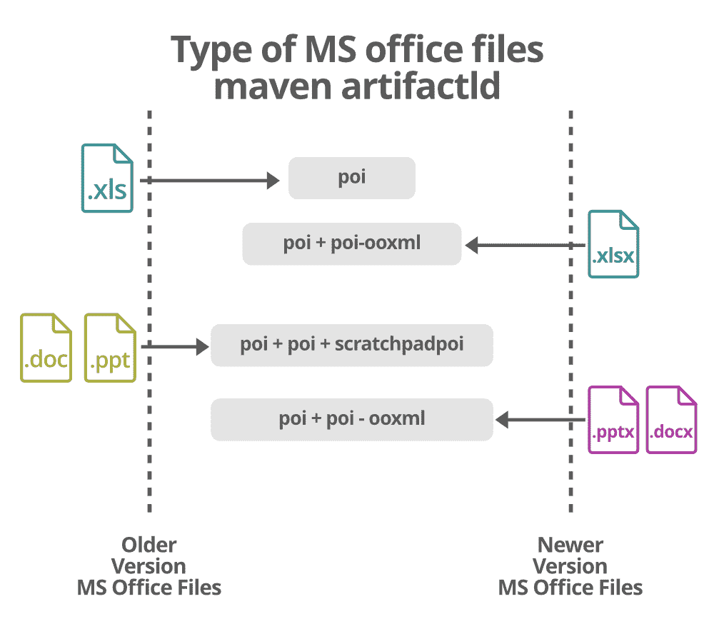
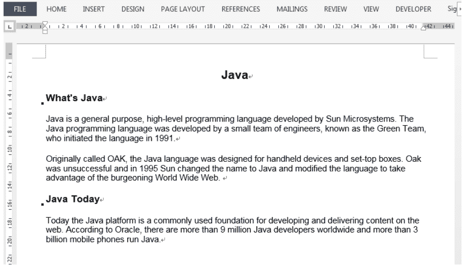

# 创建 Word 文档的 Java 程序

> 原文:[https://www . geesforgeks . org/Java-程序-创建单词-文档/](https://www.geeksforgeeks.org/java-program-to-create-a-word-document/)

Word 文件应该是在没有 Word 的情况下，借助 Java 应用程序协议接口创建的。

**相关概念:** ***阿帕奇 POI 和 Maven***

[Apache POI](https://www.geeksforgeeks.org/apache-poi-introduction/) 是 Apache 基金会提供的一个 API，是不同 java 库的集合。该工具使库可以读取、写入和操作不同的微软文件，如 Excel 工作表、PowerPoint 和 Word 文件。有两种类型，基本上是旧版本，包括。文档'，'。ppt '而较新版本的文件为'。docx '，'。pptx’。有两种方法可以处理 Apache POI，如下所述:

<figure class="table">

| 二元分布 | 源分布 |
| --- | --- |
| 生成 file.jar 文件不需要编译 | 为了生成 file.jar 文件，需要编译要生成的文件 |
| 如果使用 Linux，请选择“. tar.gz”版本(向后 3.5 版本)，否则只需下载. zip 文件扩展名进行安装，即可在 Apache POI 上运行。 | 这里格式无关紧要，因为文件不是编译的，所以可以根据需要修改 |

</figure>

这里考虑 zip 文件，如果操作系统是 Windows，zip 文件应该是首选。这是一个简单的 java 项目，因此使用了二进制分发 API。在创建文档的过程中，将插入几个段落作为示例来显示输出，并将为段落提供样式，例如字体颜色、字体名称和字体大小。

现在，为了在不使用微软 Word 的情况下创建 Word 文件，有一个名为 Spire 的 java 界面，如果需要在不使用 Adobe Acrobat 的情况下创建 PDF 文档，那么可以使用一个名为“E-Ice blue”的界面来完成。这里' Spire.doc '必须按照问题陈述导入，因为所有交易都是 word 格式。

***尖顶。文档*** for Java 是一个专业的 Java Word API，它使 Java 应用程序能够在不使用 Microsoft Office 的情况下创建、转换、操作和打印 Word 文档。它将被导入作为该程序的参考。

**语法:**用于导入 Spire 的 java 库

```java
import Spire.Doc.jar ;
```

Spire 涉及的组件如下:

<figure class="table">

| 成分 | 责任 |
| --- | --- |
| XML 文字处理器格式( **XWPF** | MS-Word 的“***【docx】***扩展名文件的读写 |
| 可怕的文字处理器格式( **HWPF** ) | MS-Word 的“**扩展文件读写** |

</figure>

此外，还有另一个用于 PDF 格式的 Java 应用编程接口，如上所述，它使开发人员能够在 Java 应用程序中读取、写入、转换和打印 PDF 文档，而无需使用 Adobe Acrobat。同样，PowerPoint 应用编程接口允许开发人员在 Java 应用程序中创建、读取、编辑、转换和打印 PowerPoint 文件。

> 如果用户正在创建 shear Maven 项目，可以通过向 pom.xml 添加以下配置来轻松添加 jar 依赖项。

现在，就像任何类一样，Apache POI 包含要处理的类和方法。Apache POI 的主要组件将在下面讨论，以了解文件的内部工作，以及它是如何在没有 Word 的情况下借助类和方法生成的。Word 本身基本上有两个版本的文件。



<figure class="table">

| 旧文件扩展名 | 较新的文件扩展名(3.5 版) |
| --- | --- |
| 文件 | docx |
| xls | xlsx |
| ppt | pptx |

</figure>

### 专家

使用 [Maven](https://www.geeksforgeeks.org/introduction-apache-maven-build-automation-tool-java-projects/) 访问这些文件。Maven 是一个基于 POM(项目对象模型)的强大项目管理工具。它用于项目的构建、依赖和文档。它像 ANT 一样简化了构建过程。但是它比 ANT 先进太多了。
简而言之，我们可以知道 maven 是一个工具，可以用来构建和管理任何基于 Java 的项目。Maven 使 Java 开发人员的日常工作变得更加容易，并且通常有助于理解任何基于 Java 的项目。

Maven 确实有一些特定的命令来处理文件。最常用的是:

```java
poi + poi + scratchpadpoi    // In order to deal with older Word file versions 
poi + poi-ooxml              // In order to deal with new Word file versions
```

**实现:**下面的程序描述了 Spire API 在创建 Word 文件中的职责:

## Java 语言(一种计算机语言，尤用于创建网站)

```java
// Java program to create a Word document
// Importing Spire Word libraries

import com.spire.doc.Document;
import com.spire.doc.FileFormat;
import com.spire.doc.Section;
import com.spire.doc.documents.BuiltinStyle;
import com.spire.doc.documents.Paragraph;
import com.spire.doc.documents.ParagraphStyle;

class GFG {

    // Main driver method
    public static void main(String[] args)
    {

        // create a Word document
        Document document = new Document();

        // Add a section
        Section section = document.addSection();

        // Add a heading
        Paragraph heading = section.addParagraph();
        heading.appendText("Java");

        // Add a subheading
        Paragraph subheading_1 = section.addParagraph();
        subheading_1.appendText("What's Java");

        // Adding sub-headings
        // two paragraph under the first subheading

        // Adding paragraph 1
        Paragraph para_1 = section.addParagraph();
        para_1.appendText(
            "Java is a general purpose, high-level programming language developed by Sun Microsystems."
            + " The Java programming language was developed by a small team of engineers, "
            + "known as the Green Team, who initiated the language in 1991.");

        // Adding paragraph 2
        Paragraph para_2 = section.addParagraph();
        para_2.appendText(
            "Originally called OAK, the Java language was designed for handheld devices and set-top boxes. "
            + "Oak was unsuccessful and in 1995 Sun changed the name to Java and modified the language to take "
            + "advantage of the burgeoning World Wide Web. ");

        // Adding another subheading
        Paragraph subheading_2 = section.addParagraph();
        subheading_2.appendText("Java Today");

        // Adding one paragraph under the second subheading
        Paragraph para_3 = section.addParagraph();
        para_3.appendText(
            "Today the Java platform is a commonly used foundation for developing and delivering content "
            + "on the web. According to Oracle, there are more than 9 million Java developers worldwide and more "
            + "than 3 billion mobile phones run Java.");

        // Apply built-in style to heading and subheadings
        // so that it is easily distinguishable
        heading.applyStyle(BuiltinStyle.Title);
        subheading_1.applyStyle(BuiltinStyle.Heading_3);
        subheading_2.applyStyle(BuiltinStyle.Heading_3);

        // Customize a paragraph style
        ParagraphStyle style = new ParagraphStyle(document);

        // Paragraph name
        style.setName("paraStyle");
        // Paragraph format
        style.getCharacterFormat().setFontName("Arial");
        // Paragraph font size
        style.getCharacterFormat().setFontSize(11f);
        // Adding styles using inbuilt method
        document.getStyles().add(style);

        // Apply the style to other paragraphs
        para_1.applyStyle("paraStyle");
        para_2.applyStyle("paraStyle");
        para_3.applyStyle("paraStyle");

        // Iteration for white spaces
        for (int i = 0;
             i < section.getParagraphs().getCount(); i++) {

            // Automatically add whitespaces
            // to every paragraph in the file
            section.getParagraphs()
                .get(i)
                .getFormat()
                .setAfterAutoSpacing(true);
        }

        // Save the document
        document.saveToFile(
            "output/CreateAWordDocument.docx",
            FileFormat.Docx);
    }
}
```

**输出:**

