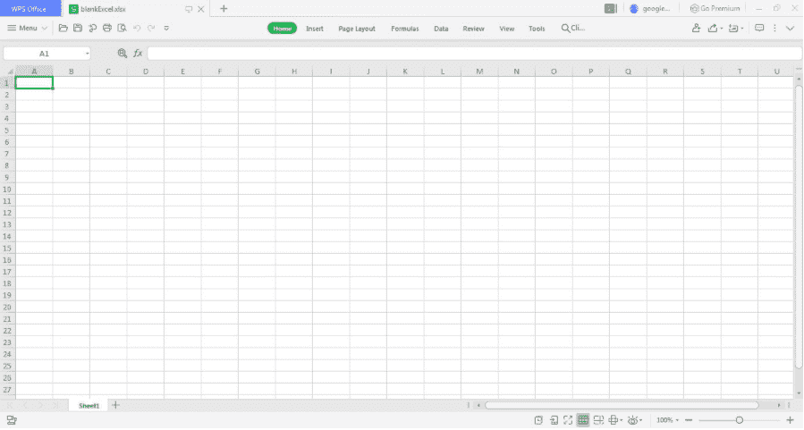

# 创建空白 Excel 表格的 Java 程序

> 原文:[https://www . geesforgeks . org/Java-程序-创建-空白-excel-sheet/](https://www.geeksforgeeks.org/java-program-to-create-blank-excel-sheet/)

**ApachePOI** 代表拙劣的混淆实现，这是一个用于读写微软文档的 Java API。它包含类和接口，即单词本、工作表、行和单元格。Apache POI 可用于访问“xls”扩展名文件以及“xlls”扩展名文件

**概念** : **ApachePOI，jar 文件和 File 方法**被解释到边缘，以显示它们是如何连接的以及程序执行拦截目录。

**第一步**:让项目准备好编码。一旦创建了包，仍然需要某些 jar 文件来访问 Apache，所以在进一步阅读之前一定要下载 jar 文件。有 4 个 **jar 文件**需要使用 java 访问 Excel，或者在 java 项目创建过程中简单地导入“usermodel”的所有 jar 文件。

**第 2 步:**创建一个新的类，并注意是否有任何警告显示有任何遗漏或替换问题。成功创建新类后，进入下一步。

**第三步:**根据需求导入所有需要的文件，通过系统库与 java 程序进行交互。因此，到目前为止，第一项工作将是处理 java 程序中的文件方法，该程序稍后将进行构建和运行。为此，文件输入流概念将用于处理 java 程序，并辅助创建一个类型为“ **XLLS wordbook”的对象。**


**Java 提供内置包*****【org . Apache . poi . xssf . user model】*****来创建和处理空白 Excel 文档和文件。此包包含一个类 XSSFWorkbook，可用于创建和处理空白电子表格工作簿。该类还提供了读取、写入和处理新图纸或现有图纸的功能。在此之上，需要的其他包是文件和文件输出流，以创建文件，然后打开连接。它还便于修改内容，即添加、删除等。从 Java 中的文件。**

****

> **创建空白 Excel 文件时选择的随机目录是 *C:/blankExcel.xlsx”。***

****实施:****

## **Java 语言(一种计算机语言，尤用于创建网站)**

```java
// Importing Excel interface
import org.apache.poi.xssf.usermodel.*;
// Importing generic java libraries
import java.io.File;
// Importing File libraries
import java.io.FileOutputStream;

public class GFG {

    // Main driver method
    public static void main(String[] args) throws Exception
    {

        // Create a blank excel workbook using
        // XSSFWorkBook interface in java
        XSSFWorkbook excel_sheet = new XSSFWorkbook();

        // Create a new file at the specified path location
        File file = new File("C:/blankExcel.xlsx");

        // Create a connection using the specified file
        FileOutputStream ostream
            = new FileOutputStream(file);

        // write operation on the file
        excel_sheet.write(ostream);
        // close connection
        ostream.close();
    }
}
```

****输出:**上面的代码在 Windows 目录下创建了一个名为“C:/ blankExcel.xlsx”的空白 Excel 文件**

****