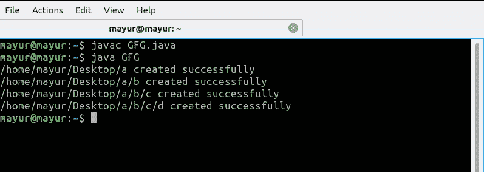
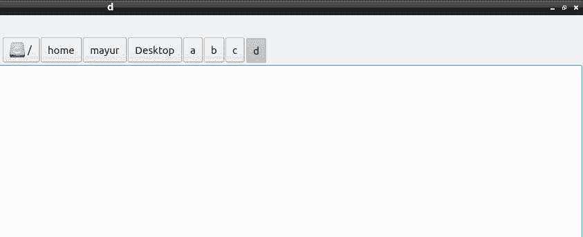
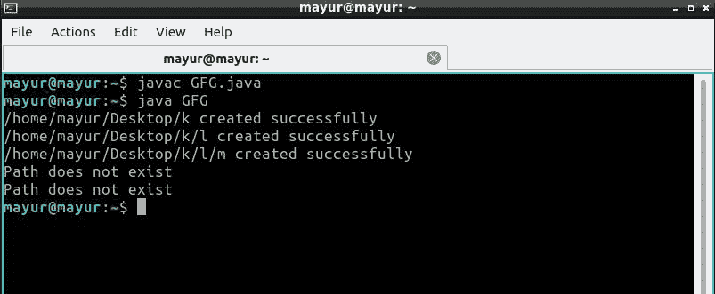
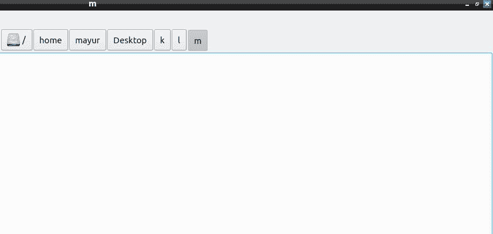

# 递归创建目录的 Java 程序

> 原文:[https://www . geesforgeks . org/Java-程序-创建-目录-递归/](https://www.geeksforgeeks.org/java-program-to-create-directories-recursively/)

目录/文件夹是一种用于计算的文件系统，它充当存储相关文件甚至子文件夹的命名内存位置。这允许更好地管理文件和文件夹，并且以用于存储文件的真实文件夹的概念为前提。这个系统实现了内存的划分，使工作空间更有条理。目录文件系统允许分层排列以及在其他目录中嵌套目录。

[**递归**](https://www.geeksforgeeks.org/recursion/) 是函数调用自身的过程。将复杂的问题分解成更小的部分是一种非常有用的方法。

**接近:**

1.  采用**[**mkdir()**](https://www.geeksforgeeks.org/file-mkdir-method-in-java-with-examples/)**的方法****
2.  ****使用[**createDirectory()**](https://docs.oracle.com/javase/tutorial/essential/io/dirs.html)**的方法**[**Java . nio 包**](https://www.geeksforgeeks.org/introduction-to-java-nio-with-examples/)********

******方法#1 :******

****第一种方法是导入 java.io.File 类，并定义一个名为 File()的方法，该方法在内部利用 mkdir()函数递归创建目录。文件()方法中使用的算法描述如下。****

******算法:******

1.  ****创建返回类型为 void 的 file()方法。****
2.  ****该方法采用三个参数:

    *   代表主目录的字符串 md。
    *   代表目录结构的字符串路径，其中每个字符表示一个新目录
    *   表示要创建的目录数量的 Int 深度。**** 
3.  ****将终止条件声明为(深度== 0)返回。****
4.  ****减少每次递归调用的深度。****
5.  ****检查路径字符串的长度是否为 0，并相应地显示消息。****
6.  ****将路径字符串的第一个字符附加到 md，并为每个递归调用从路径字符串中移除第一个字符。****
7.  ****用 md 作为参数创建文件类的对象。****
8.  ****使用 exists()方法检查目录是否已经存在，并显示消息。****
9.  ****否则使用 mkdir()方法创建目录。****
10.  ****进行递归调用**** 

****下面是上述方案的实现。****

## ****Java 语言(一种计算机语言，尤用于创建网站)****

```java
**// Java code to create directories recursively

import java.io.File;

class GFG {

    // function to create directories
    static void file(String md, String path, int depth)
    {

        // md stores the starting path
        // each character in path represents new
        // directory depth stores the number
        // ofdirectories to be created
        // terminating condition

        if (depth == 0)
            return;

        // decrementing the depth by 1
        depth -= 1;

        // checking if the path exists
        if (path.length() == 0)
            System.out.println("Path does not exist");

        // execute if the path has more directories
        else {

            // appending the next directory
            // would be md = md + "\\" +
            // path.charAt(0) for windows
            md = md + "/" + path.charAt(0);

            // removing the first character
            // from path string
            path = path.substring(1);

            // creating File object
            File f = new File(md);

            // if the directory already exists
            if (f.exists()) {
                System.out.println("The Directory "
                                   + "already exists");
            }
            else {

                // creating the directory
                boolean val = f.mkdir();
                if (val)
                    System.out.println(md + " created"
                                       + " successfully");
                else
                    System.out.println(
                        "Unable to "
                        + "create Directory");
            }
        }

        // recursive call
        file(md, path, depth);
    }

    // Driver method
    public static void main(String[] args)
    {

        // creating class object
        GFG ob = new GFG();

        // path for windows -> "C:\\Users\\
        // harshit\\Desktop"
        ob.file("/home/mayur/Desktop", "abcd", 4);
    }
}**
```

******输出:******

**** ****

******接近#2:******

****这种方法利用 java.nio 包来实现代码。我们在这里部署 createDirectories()方法来创建新的目录。我们还利用尝试捕获块来捕获输入输出错误。算法可以在下面找到。****

******算法:******

1.  ****按照方法 1 中的算法，重复步骤 1 至 6。****
2.  ****现在，使用 Path.gets()方法将字符串 md 转换为路径实例。****
3.  ****再次，使用 exists()方法检查目录是否已经存在。****
4.  ****如果目录不存在，请打开一个尝试捕获块，并使用 createDirectories()方法创建一个新目录。****
5.  ****否则，显示目录已经存在。****
6.  ****进行递归调用****

****下面是上述方案的实现。****

## ****Java 语言(一种计算机语言，尤用于创建网站)****

```java
**// Java code to create directories recursively

// importing the packages
import java.nio.file.Paths;
import java.nio.file.Path;
import java.nio.file.Files;
import java.io.IOException;

class GFG {

    // defining the recursive method
    static void file(String md, String path, int depth)
    {

        // base case
        if (depth == 0)
            return;

        // decrement the depth
        depth -= 1;

        // check if the path is empty
        if (path.length() == 0)
            System.out.println("Path does not exist");
        else {

            // appending the first character from
            // path string
            md = md + "/" + path.charAt(0);

            // removing the first character from
            // path string
            path = path.substring(1);

            // creating the path instance from
            // path string
            Path p = Paths.get(md);

            // if the directory already exists
            if (!Files.exists(p)) {
                try {

                    // creating directory
                    Files.createDirectories(p);
                    System.out.println(md + " created"
                                       + " successfully");
                }
                catch (IOException err) {
                    err.printStackTrace();
                }
            }
            else
                System.out.println("The directory "
                                   + "already exists");
        }

        // recursive call
        file(md, path, depth);
    }

    // Driver Code
    public static void main(String[] args)
    {

        // creating the object of the class
        GFG ob = new GFG();

        // md would be -> "C:\\Users\\harshit\\
        // Desktop for windows
        ob.file("/home/mayur/Desktop", "klm", 5);
    }
}**
```

******输出:******

**** ****