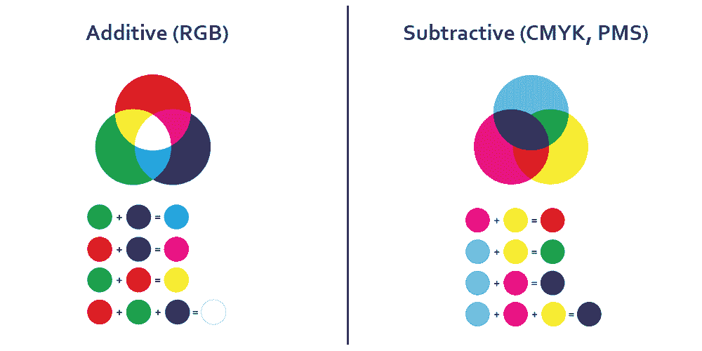
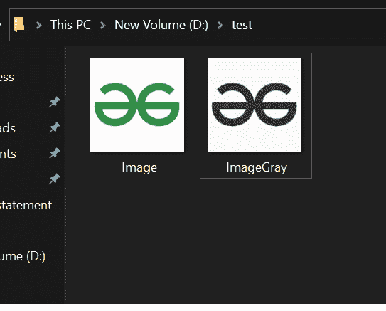

# 创建灰度图像的 Java 程序

> 原文:[https://www . geesforgeks . org/Java-程序-创建-灰度-图像/](https://www.geeksforgeeks.org/java-program-to-create-greyscale-image/)

RGB 模型，其中红色、绿色和蓝色光以各种不同的强度和排列以及它们的组合相加，产生宽光谱的颜色阵列，而灰度是指白色和黑色，只有最弱的强度产生黑色，最强的产生纯白色。灰度图像是一种黑白或灰色单色图像，仅由灰色阴影组成。对比度从最弱的黑色到最强的白色不等。



**进场:**

为了达到目标，该方法可能将图像视为多维阵列，其中每个元素相当于一个像素。现在我们将简单地迭代每个像素。此外，迭代每个像素，计算 RGB 灰度颜色，并将其调整为灰度。

**程序:**

我们将使用 BufferedImage 类的一些内置方法。执行操作所需的类:

*   要读写图像文件，我们必须导入文件类。这个类通常表示文件和目录路径名。

```java
import java.io.File ;
```

*   为了处理错误，我们使用了 IOException 类

```java
import java.io.IOException ;
```

*   为了保存图像，我们使用 BufferedImage 类为其创建 BufferedImage 对象。该对象用于在内存中存储图像。

```java
import java.awt.image.BufferedImage ;
```

*   为了执行图像读取**–**写入操作，我们将导入 ImageIO 类。这个类有读写图像的静态方法。

```java
import javax.imageio.ImageIO;
```

**实施:**

**例**

## Java 语言(一种计算机语言，尤用于创建网站)

```java
// Java Program to Create Grayscale Image
// implementation to Blurr RGB image

// Importing required libraries
import java.awt.*;
import java.awt.image.BufferedImage;
import java.io.File;
import java.io.IOException;
import javax.imageio.ImageIO;

// Main class
public class GFG {

    // Main driver method
    public static void main(String[] args)
        throws IOException, InterruptedException
    {
        // Declaring an array to hold color spectrum
        Color color[];

        // Reading the image in the form of file
        // from the directory
        File fin = new File("D:/test/Image.jpeg");

        // Convert file into into image form by
        // creating object of BufferedImage class
        BufferedImage input = ImageIO.read(fin);

        // Now creating output Image
        BufferedImage output = new BufferedImage(
            input.getWidth(), input.getHeight(),
            BufferedImage.TYPE_INT_RGB);

        // Setting attributes to image
        int i = 0;
        int max = 400, rad = 10;
        int a1 = 0, r1 = 0, g1 = 0, b1 = 0;
        color = new Color[max];

        // core section responsible for blurring of image
        int x = 1, y = 1, x1, y1, ex = 5, d = 0;

        // Running loop for each pixel and blurring it
        // Nested for loops
        for (x = rad; x < input.getHeight() - rad; x++) {
            for (y = rad; y < input.getWidth() - rad; y++) {
                for (x1 = x - rad; x1 < x + rad; x1++) {
                    for (y1 = y - rad; y1 < y + rad; y1++) {
                        color[i++] = new Color(
                            input.getRGB(y1, x1));
                    }
                }

                // Smoothing colors of image to
                // get grayscaled corresponding image

                i = 0;

                for (d = 0; d < max; d++) {
                    a1 = a1 + color[d].getAlpha();
                }

                a1 = a1 / (max);
                for (d = 0; d < max; d++) {
                    r1 = r1 + color[d].getRed();
                }

                r1 = r1 / (max);
                for (d = 0; d < max; d++) {
                    g1 = g1 + color[d].getGreen();
                }

                g1 = g1 / (max);
                for (d = 0; d < max; d++) {
                    b1 = b1 + color[d].getBlue();
                }

                b1 = b1 / (max);
                int sum1 = (a1 << 24) + (r1 << 16)
                           + (g1 << 8) + b1;
                output.setRGB(y, x, (int)(sum1));
            }
        }

        // Finally writing the blurred image on the disc
        // specifying type and location
        // to be written on machine
        ImageIO.write(
            output, "jpeg",
            new File("D:/test/BlurredImage.jpeg"));

        // Display message for successful execution of
        // program
        System.out.println("Image blurred successfully !");
    }
}
```

**输出:**

```java
Image blurred successfully !
```

还演示了可视化表示，其中在执行程序后，控制台将弹出程序的成功构建和运行，导致图像的灰度缩放，如下所示

