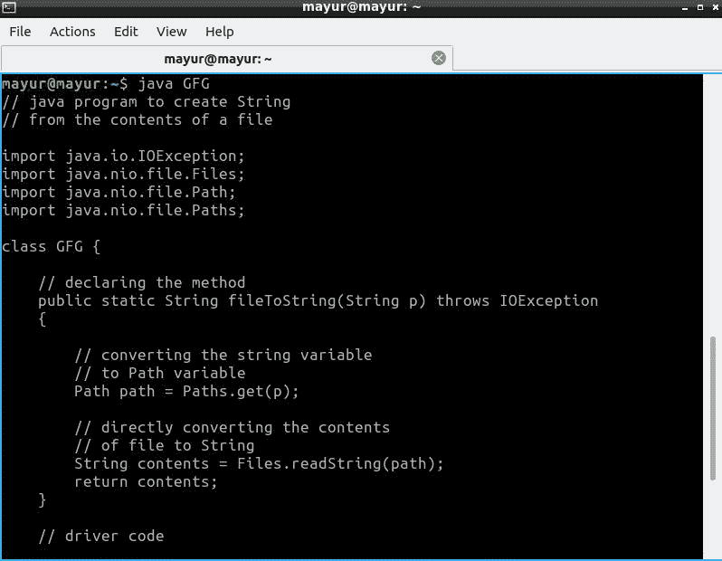

# 从文件内容创建字符串的 Java 程序

> 原文:[https://www . geesforgeks . org/Java-程序-从文件内容创建字符串/](https://www.geeksforgeeks.org/java-program-to-create-string-from-contents-of-a-file/)

文件**是一种计算机资源，用于存储不同类型的数据，如文本、图像、视频等。它基本上是绑定到单个实体的数据集合。使用计算机时，能够处理文件变得至关重要，在本文中，我们将学习从文件中读取数据的各种方法。我们将使用  [**文件类**](https://www.geeksforgeeks.org/file-class-in-java/#:~:text=The%20File%20class%20is%20Java's,file%20or%20directory%20path%20name.&text=A%20pathname%2C%20whether%20abstract%20or,()%20method%20of%20this%20class.) 进行广泛地相同。读取文件内容后，我们将把它们存储在一个字符串中，这个字符串通常是一个字符数组。关于 String 类的更多信息，点击这里  [**。**](https://www.geeksforgeeks.org/string-class-in-java/)**

有 4 种方法可以让我们读取文件的内容，并在 Java 中将它们转换成字符串。这 4 种方法如下:

1.  使用文件类的 readString()方法
2.  以字节数组的形式读取文件内容，然后将其转换为字符串
3.  使用 BufferedReader 类逐行读取文件
4.  以流的形式存储文件的内容，然后从中生成一个字符串

使用这种方法，我们部署了 readString()函数。

**算法:**

1.  以字符串形式读取文件的路径。
2.  将字符串转换为路径变量。
3.  将此路径变量作为参数提供给 readString()函数。
4.  将字符串返回给主函数。

**实施:**

## Java 语言(一种计算机语言，尤用于创建网站)

```java
// java program to create String
// from the contents of a file

import java.io.IOException;
import java.nio.file.Files;
import java.nio.file.Path;
import java.nio.file.Paths;

class GFG {

    // declaring the method
    public static String fileToString(String p) throws IOException
    {

        // converting the string variable
        // to Path variable
        Path path = Paths.get(p);

        // directly converting the contents
        // of file to String
        String contents = Files.readString(path);
        return contents;
    }

    // driver code
    public static void main(String[] args)
        throws IOException
    {

        // printing the contents of the string
        // by calling the fileToString() method

        // parameter would be "C:\\Users\\harshit\\"
        // + "Desktop\\text.txt" for Windows User
        System.out.print(fileToString("/home/mayur/GFG.java"));
    }
}
```



**方法 2 :**

使用这种方法，我们首先读取文件的内容，并将它们存储为字节数组。最后，我们将其转换为字符串。

**算法:**

1.  首先，将路径作为字符串变量传递给函数。
2.  接下来，将其转换为路径变量。
3.  将此变量作为参数传递给文件类的 readAllBytes()函数。
4.  接下来，将此数组转换为字符串。

**实施:**

## Java 语言(一种计算机语言，尤用于创建网站)

```java
// java program to create a String
// from the contents of a File

import java.io.IOException;
import java.nio.file.Path;
import java.nio.file.Paths;
import java.nio.file.Files;

class GFG {
    public static String fileToString(String p)
    {

        // converting string variable
        // to Path variable
        Path path = Paths.get(p);

        // initializing an empty byte array
        byte[] b = {};

        // try block
        try {

            // storing the bytes in the array
            b = Files.readAllBytes(path);
        }

        // catch block
        catch (IOException e) {

            // printing the error
            e.printStackTrace();
        }

        // converting the byte array to String
        String contents = new String(b);
        return contents;
    }

    // Driver Code
    public static void main(String[] args)
    {

        // printing the string returned by the
        // fileToString() method

        // path would have been "C:\\Users\\"
        // + "harshit\\Desktop\\text.txt"
        System.out.print(fileToString("/home/mayur/GFG.java"));
    }
}
```