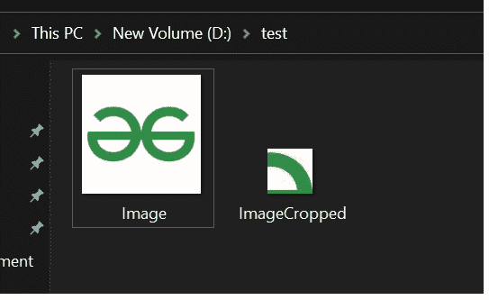

# 使用 BufferedImage 类裁剪图像的 Java 程序

> 原文:[https://www . geesforgeks . org/Java-program-to-crop-image-use-bufferedimage-class/](https://www.geeksforgeeks.org/java-program-to-crop-image-using-bufferedimage-class/)

在 Java 编程语言中，我们需要一些类来裁剪图像。所以这些类如下:

**1。**要读写图像文件，我们必须导入 file 类。这个类通常表示文件和目录路径名。

```
import java.io.File
```

**2。**为了处理错误，我们使用 IOException 类。

```
import java.io.IOException
```

**3。**为了保存图像，我们使用 BufferedImage 类为其创建 BufferedImage 对象。该对象用于在内存中存储图像。

```
import java.awt.image.BufferedImage
```

**4。**为了执行映像读写操作，我们将导入 ImageIO 类。这个类有读写图像的静态方法。

```
import javax.imageio.ImageIO
```

**进场:**

1.  更改图像的尺寸
2.  使用 BufferedImage 类和 Color c 的一些内置方法

**示例:**

## Java 语言(一种计算机语言，尤用于创建网站)

```
// Java Program to Crop Image Using BufferedImage Class

// Importing required packages
import java.awt.image.BufferedImage;
import java.io.File;
import java.io.IOException;
import javax.imageio.ImageIO;

// Main class
public class GFG {

    // Main driver method
    public static void main(String[] args)
    {
        // Try block to check for exceptions
        try {

            // Reading original image from local path by
            // creating an object of BufferedImage class
            BufferedImage originalImg = ImageIO.read(
                new File("D:/test/Image.jpeg"));

            // Fetching and printing alongside the
            // dimensions of original image using getWidth()
            // and getHeight() methods
            System.out.println("Original Image Dimension: "
                               + originalImg.getWidth()
                               + "x"
                               + originalImg.getHeight());

            // Creating a subimage of given dimensions
            BufferedImage SubImg
                = originalImg.getSubimage(50, 50, 50, 50);

            // Printing Dimensions of new image created
            System.out.println("Cropped Image Dimension: "
                               + SubImg.getWidth() + "x"
                               + SubImg.getHeight());

            // Creating new file for cropped image by
            // creating an object of File class
            File outputfile
                = new File("D:/test/ImageCropped.jpeg");

            // Writing image in new file created
            ImageIO.write(SubImg, "jpg", outputfile);

            // Display message on console representing
            // proper execution of program
            System.out.println(
                "Cropped Image created successfully");
        }

        // Catch block to handle the exceptions
        catch (IOException e) {

            // Print the exception along with line number
            // using printStackTrace() method
            e.printStackTrace();
        }
    }
}
```

**输出:**

```
Cropped Image created successfully
```

此外，在执行程序后，控制台将显示一条已执行的消息，并在输入的路径上创建一个新的裁剪图像，如下所示:

