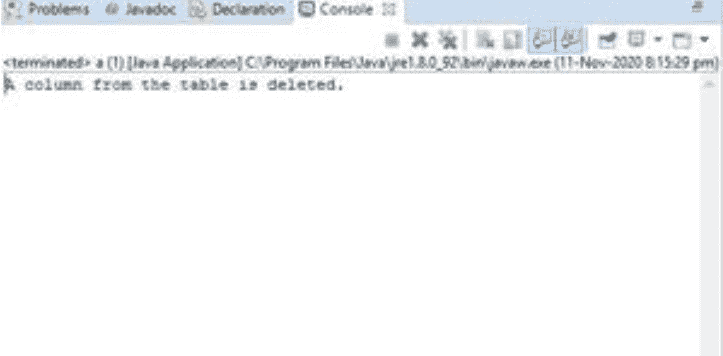

# 使用 JDBC 删除表中一列的 Java 程序

> 原文:[https://www . geesforgeks . org/Java-program-to-delete-a-column-in-a-table-use-JDBC/](https://www.geeksforgeeks.org/java-program-to-delete-a-column-in-a-table-using-jdbc/)

在删除表中的一列之前，首先需要将 java 应用程序连接到数据库。Java 有自己的应用编程接口，JDBC 应用编程接口使用 JDBC 驱动程序进行数据库连接。在 JDBC 之前，使用的是 ODBC API，但它是用 C 语言编写的，这意味着它依赖于平台。JDBC API 提供应用程序到 JDBC 的连接，JDBC 驱动程序提供管理器到驱动程序的连接。

**算法:**为了处理数据库以及 App(Main)类和它的连接类之间的关系，永远记住这 7 个对付 JDBC 的拇指金步。

1.  导入数据库
2.  注册 Java 类
3.  建立连接
4.  创建语句
5.  执行查询
6.  处理结果
7.  关闭连接

**过程**:从使用 JDBC 创建的数据库中删除表中的一列，如下所示:

**第一步:**在程序中加载“mysqlconnector.jar”。

**步骤 2:** 创建一个数据库并添加一个带有记录的表

*   使用 MySQL
    *   驱动程序
    *   [DriverManager()](https://www.geeksforgeeks.org/establishing-jdbc-connection-in-java/)
    *   [连接()](https://www.geeksforgeeks.org/establishing-jdbc-connection-in-java/)
    *   报表()
    *   结果集()包含 JDBC 应用编程接口提供的类
*   java 程序演示了另外 5 个步骤。连接类的(应用类或主类)。

**实现:**使用 JDBC 删除表中一列的 Java 程序

## Java 语言(一种计算机语言，尤用于创建网站)

```java
// Java program using  JDBC to
// Delete a Column in a Table

// Step 1: Importing database files
import java.sql.*;

public class GFG {

    // URL that points to mysql database
    // DB stands for database
    static final String url
        = "jdbc:mysql://localhost:3306/db";

    // Main driver method
    public static void main(String[] args) throws ClassNotFoundException
    {

        // Try block to check exceptions
        try {

            // Step 2: Load and Register drivers

            // Class.forName() method is user for
            // driver registration with name of the driver
            // as argument that used MySQL driver
            Class.forName("com.mysql.jdbc.Driver");

            // Step 3: Create a connection

            // getConnection() establishes a connection
            // It takes url that points to your database
            // username and password of MySQL connections as
            // arguments
            Connection conn = DriverManager.getConnection(
                url, "root", "1234");

            // create.Statement() creates statement object
            // which is responsible for executing queries on
            // table
            Statement stmt = conn.createStatement();

            // Executing the query student is the table
            // name & address is column

            // Step 4: Create a statement
            String query
                = "ALTER TABLE student Drop address";

            // Step 5: Execute the query

            // executeUpdate() returns number of rows
            // affected by the execution of the statement
            int result = stmt.executeUpdate(query);

            // Step 6: Process the results

            // if result is greater than 0
            // it means values has been added
            if (result > 0)
                System.out.println(
                    "A column from the table is deleted.");
            else
                System.out.println("unsuccessful deletion ");

            // Step 7: Closing connection
            conn.close();
        }

        // Catch block to handle exceptions
        catch (SQLException e) {

            // Print the exception
            System.out.println(e);
        }
    }
}
```

**输出:**

