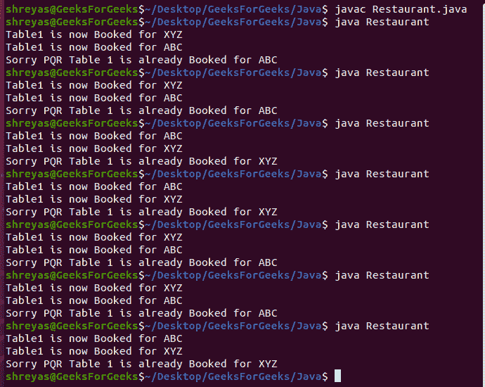

# 演示惰性初始化非线程安全的 Java 程序

> 原文:[https://www . geesforgeks . org/Java-程序-演示-惰性-初始化-非线程安全/](https://www.geeksforgeeks.org/java-program-to-demonstrate-the-lazy-initialization-non-thread-safe/)

近年来，面向对象编程已经成为网站和应用(软件)开发的支柱/基础。Java 和 Python 是流行的面向对象编程语言，其中前者由 Oracle 提供和维护，而后者是开源的。Java 加上健壮且易于设置的框架，如[spring framework](https://www.geeksforgeeks.org/introduction-to-spring-framework/)，使得软件开发的集成和配置部分变得非常容易和优化。Java 面向对象的四个核心支柱之一被称为封装，这意味着将实例变量和方法(通常可互换地称为函数)绑定到一个类中。在 java 中，使用那些实例变量和使用新关键字的方法来创建类对象的过程称为实例化。我们有两种在 Java 中进行对象实例化的方法，一种是渴望&懒惰，两种方法在现实世界中都有实际应用。

惰性实例化也被称为****按需实例化**，其中类的对象只在需要时被实例化(即动态)。当我们谈论大型软件程序时，这有助于我们节省计算处理能力和内存。线程就像程序的一个小的简单计算函数/进程，可以并行方式同时运行，以提高处理速度。随着时间的推移，我们正在向多核强大的处理系统迈进，高图形处理器/时钟速度多线程在编程中发现了广泛的应用。线程安全的环境/代码是这样一种代码，即使运行不止一次(多次)，也会产生所需的业务逻辑输出，并且不会表现出异常行为。本文试图帮助我们理解惰性实例化在非线程安全的环境中是如何工作的，以及如果我们没有线程安全的代码会出现什么问题。**

****进场:****

**借助一个简单的**餐厅餐桌预订**的案例研究，我们将试图理解惰性实例化是如何工作的，以及在多线程环境中非线程**–**安全代码会发生什么。以下是我们案例研究“餐厅餐桌预订”的方法，**

1.  **程序中有一个**餐厅**类，里面有 main()方法，充当可以在线预定/预订餐桌的餐厅。**
2.  ****表 1** 图示为 *Singleton* 班，是本餐厅网上预定的餐桌之一。**
3.  **程序中创建了各种线程，以试图通过 table1 类的*惰性实例化*预订/预订 Table1 的客户为例。**
4.  **有一个简单的检查来查看表 1 是否已经为另一个客户预订/预订如果是这样，则显示一条对当前客户请求的抱歉消息，以及表 1 已经为谁预订，否则表 1 为当前客户名称预订。**
5.  **然后，我们能够同时运行两个线程，我们演示了异常行为是如何导致的，因为代码不是线程安全的，说明如果两个客户试图同时预订/预订 table1，那么两个客户都可能获得预订成功的消息，但不幸的是，table1 将只为其中一个客户预订/预订。**
6.  **最后，我们引入 [*Thread.sleep()*](https://www.geeksforgeeks.org/thread-sleep-method-in-java-with-examples/) 来延迟启动第三个线程(客户)，该线程获得了表的正确消息已经被保留/预订，这表明 Lazy Instantiation 工作得非常好，但是代码在多线程环境中是非线程安全的。**

****实施:**餐厅餐桌预订**

**下面的餐厅餐桌预订案例研究将帮助我们理解惰性实例化非线程安全。在本案例研究中，我们有一家餐厅，它有一张名为表 1 的桌子，可以在线预订。制作了各种各样的主题，以试图预订或预订桌子的顾客为例 1。在现实世界中，如果表 1 没有被预订，它应该为第一个客户请求预订，并且应该相应地显示。如果它已经被预订了，它应该显示抱歉它已经被其他顾客预订了(指定它的名字)。我们将看到，如果两个线程(客户)试图同时预订该表，将会导致错误。**

****例****

## **Java 语言(一种计算机语言，尤用于创建网站)**

```java
// Java Program to Demonstrate the Lazy initialization
// non-thread-safe

// Importing input output classes
import java.io.*;

// Class 1
// Helper class behaving as a Singleton Class
class Table1 {

    // Lazy Instantiation also referred as On-demand
    // Instantiation

    // Private static member variables
    private static Table1 table1;
    private static String customerNameBooked;

    // Constructor of this class which is private
    // To display customer name whom table1 is booked for
    private Table1(String customerName)
    {

        // Print and display the customer name
        System.out.println("Table1 is now Booked for "
                           + customerName);

        // Booking under the same person
        customerNameBooked = customerName;
    }

    // Non thread-safe block of code to
    // demonstrate thread safe with updation in its methods

    // Method 1
    // To get the status of table
    public static Table1
    getTable1Instance(String customerName)
    {

        // If table is nor book/reserve
        if (table1 == null) {

            // book under the derired customer name
            table1 = new Table1(customerName);
        }

        // If table is already booked
        else

            // Calling th method
            tableBooked(customerName);

        return table1;
    }

    // Method 2 (auxiliary)
    // To display whom table is booked for
    private static void tableBooked(String customerName)
    {

        // Print the custom name and
        // name of customer under which table i booked
        System.out.println(
            "Sorry " + customerName
            + " Table 1 is already Booked for "
            + customerNameBooked);
    }
}

// Class 2
// Main class
public class Restaurant {

    // Main driver method
    public static void main(String args[])
    {

        // Now we will be creating various threads as
        // customer who wish to book Table1 in Restaurant

        // Creating first customer(Thread-0)
        // using Runnable interface
        Thread t1 = new Thread(new Runnable() {
            // run() method for the thread
            public void run()
            {

                // Getting the table status
                Table1 customer1
                    = Table1.getTable1Instance("ABC");
            }
        });

        // Similarly repeating same for other customers

        // Again creating second customer(Thread-1)
        // using Runnable interface
        Thread t2 = new Thread(new Runnable() {
            // run() method for this thread
            public void run()
            {

                Table1 customer2
                    = Table1.getTable1Instance("XYZ");
            }
        });

        // Creating third customer(Thread-2)
        // using Runnable interface
        Thread t3 = new Thread(new Runnable() {
            // run() method for this thread
            public void run()
            {

                Table1 customer3
                    = Table1.getTable1Instance("PQR");
            }
        });

        // Now starting the threads
        // using start() method
        t1.start();
        t2.start();

        // Try block to check for exceptions if any
        try {

            // Intentionally having a Thread.sleep(1000) to
            // demonstrate not Thread-safe environment
            Thread.sleep(1000);
        }

        // Catch block to handle the exceptions
        catch (InterruptedException e) {
        }

        // Now starting the last thread via same means
        t3.start();
    }
}
```

****输出:****

**

图 1:非线程安全环境中的惰性实例化演示。** 

****输出解释:**显示上面的脚本代码执行，为此我们将收集所有方面，以了解它如何是非线程安全的。**

*   **最初，我们有 3 条线索，即 *t1、t2* 、*T3、 *t3* ，分别以名称为 *ABC、XYZ、*和 *PQR* 的客户为例，他们试图在*餐厅*类预订/预订*表 1* 。***
*   ***t1* 和 *t2* 在线程中同时启动，演示多线程环境。两者都调用方法 *getTable1Instance()* 来预订表，这里 *Table1* 类的行为类似于 Java 的 singleton 类，其实例应该只创建一次，说明 Table1 一次只能被一个客户占用。**
*   **但是由于代码是非线程安全的，所以表是为两个客户(即 *ABC* 和 *XYZ* 预订的，因为我们可以看到表 1 的实例被创建了两次，尽管它被标记为具有*Singleton 类的惰性实例化的*属性。**
*   **然后我们通过拥有 *Thread.sleep()* 来引入线程 *t3* (客户名称为 *PQR* )开始执行的延迟，所以我们现在可以看到显示给 *PQR* 的消息是正确的，根据业务逻辑，一旦该表被预订，它应该只向当前客户显示抱歉消息，并显示该表是为哪个客户预订的。这证明了惰性实例化在线程的串行执行中工作得很好，这是非线程安全的代码。**
*   **如果有多个线程以并行方式工作，那么代码通过为试图同时预订的两个客户预订相同的表实例来显示异常行为，但是最终只为一个客户预订，该客户的名字随后被显示为线程 *t3* ( *PQR* )，如下图 1 所示，这是示例输出截图。**

****结论:**因此，借助于一个餐厅餐桌预订的简单案例研究，上面解释了非**–**线程安全环境/代码中的惰性实例化概念。**