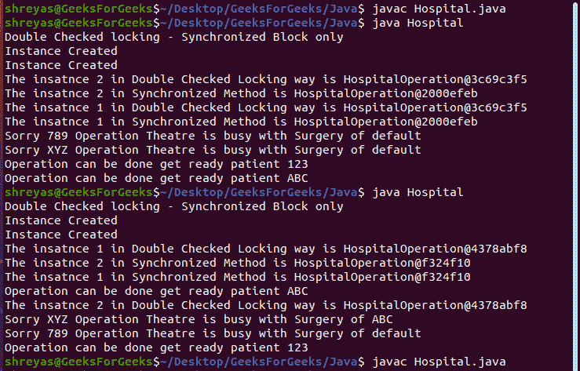
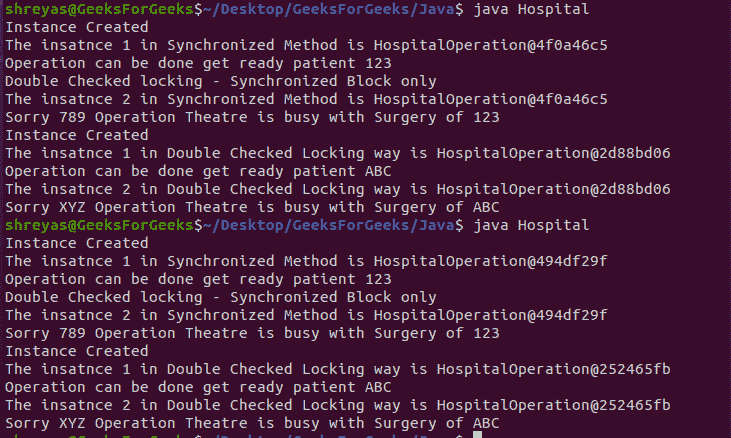

# 演示惰性初始化线程安全的 Java 程序

> 原文:[https://www . geesforgeks . org/Java-程序-演示-惰性-初始化-线程安全/](https://www.geeksforgeeks.org/java-program-to-demonstrate-the-lazy-initialization-thread-safe/)

Java 是一种流行的面向对象编程语言，被开发人员和程序员用于网站/应用程序开发。使用****新关键字**创建类对象被称为对象实例化。默认情况下，Java 允许用户定义两种对象实例化方式，分别是**渴望**和**懒惰**。java 解释器在执行时逐行解释程序/脚本代码，但是 Java 编译器在开始解释之前会编译完整的程序。在急切实例化中，对象创建发生在编译时，因此当我们有大型程序或许多对象实例化时，这被认为是不够有效的，因为那些可能不会被使用。惰性实例化意味着只在需要的时候实例化一个对象。这被认为是有效的，因为当我们考虑大型程序或许多对象实例化时，它节省了空间和处理能力。**

**[线程](https://www.geeksforgeeks.org/multithreading-in-java/)被认为是处理的小型独立组件，可以以并行方式执行，以提高/加快计算时间。随着先进的多核计算机的出现，线程在编程中得到了广泛的应用。在 java 的上下文中，线程安全的代码是无论执行多少次都不会提供异常输出的代码。线程安全的代码对于避免编程缺陷非常重要，比如竞争条件、死锁等。**

****方法:****

**回到惰性实例化，它通常可互换地称为按需实例化，它有两种实现自己的方法，如下所示:**

1.  **在整个方法/函数上使用 synchronize 关键字是很好的，当方法很小，并且由于计算量很大，没有多少线程会很快访问它。**
2.  **下一个更有效的方式是同步块方式，在这种方式中，您只需要包装那些需要线程安全的代码，为了确保更多的保证，我们用双重检查锁定来包装它。医院案例研究的以下方法将有助于在实际应用中更好地理解这些概念**

****进场:****

**下面是脚本中遵循的方法，在医院操作案例研究的帮助下，演示线程安全环境中的 Lazy 实例化(包括同步方法和同步块，即双重检查锁定)，如下所示:**

1.  **假设有一家医院可能有一个手术室，在那里对病人进行手术。**
2.  **这里的问题是，我们希望创建一个 ***【医院】*** 类对象，只在需要的时候(当有病人需要进行手术时)才创建，否则就不会创建 ***【医院】*** 对象——这被称为惰性实例化**
3.  **为了演示多线程环境，我们将不同的线程(t1、t2、t3 和 t4)显示为患者。**
4.  **假设一个病人需要进行手术，我们将医院作为对象，调用*手术()方法*，该方法以病人姓名作为参数。**
5.  **然后，如果手术室是空的或不是空的，将显示适当的消息，分别为准备手术或其手术正在进行。**
6.  **为了使事情更加真实，并解释双重检查锁定的概念，我们正在演示两种惰性实例化的方式，它们是同步方法*(getinstancesynchronizedsblockway())*，如上所述，这比同步块方式*getinstancesynchronizedsblockway()*效率低一点/贵一点**
7.  **另外**、**还有几个[*thread . sleep()*](https://www.geeksforgeeks.org/thread-sleep-method-in-java-with-examples/)**在代码内部进行注释，目的是演示线程的线程安全/串行执行以及跟踪输出是一种受控的方式，这将在解释部分进一步解释。****

******实施:******

****下面是一个只有一个手术室的医院的场景。因此，如果手术室是空的，那么带病人去手术，否则显示抱歉的手术是为另一个病人进行的。该脚本中创建了多个线程，每个线程都以患者的身份显示。****

******示例:******

## ****Java 语言(一种计算机语言，尤用于创建网站)****

```
**// Java Program to Demonstration of Lazy Instantiation in
// Thread-Safe Environment Using synchronized method and
// Double-Checked Locking

// Class 1
// Helper class acting as Singleton Class
class HospitalOperation {

    // Private class variables
    private static HospitalOperation _instance;
    private static HospitalOperation
        _instanceForDoubleCheckLocking;
    private boolean empty = false;
    private String patientName = "default";

    // Method 1
    // Displays Instance created only when new Instance is
    // Created
    private HospitalOperation()
    {
        System.out.println("Instance Created");
    }

    // Method 2
    // Synchronized method() Approach
    public static synchronized HospitalOperation
    getInstanceSynchronizedWay()
    {

        if (_instance == null)
            _instance = new HospitalOperation();

        return _instance;
    }

    // Method 3
    // Double Checked Locking- Synchronized Block
    public static HospitalOperation
    getInstanceSynchronizedBlockWay()
    {

        // Checking for double locking
        if (_instanceForDoubleCheckLocking == null)
            synchronized (HospitalOperation.class)
            {
                if (_instanceForDoubleCheckLocking == null)
                    _instanceForDoubleCheckLocking
                        = new HospitalOperation();
            }

        return _instanceForDoubleCheckLocking;
    }

    // Method 4
    // Checks if operation theatre is empty or not
    public boolean isOperationTheatreEmpty()
    {
        return empty;
    }

    // Method 5
    // Called when Operation is finished
    public void endOperation() { empty = true; }

    // Method 6
    // Accessed by more than one threads
    public synchronized void operation(String aName)
    {

        // When flag variables changes from false to true
        if (empty == true) {
            patientName = aName;

            // Get the patient ready as operation can be
            // performed
            System.out.println("Operation can be done "
                               + "get ready patient "
                               + patientName);
            empty = false;
        }

        // Operation can not be performed
        else {
            // Print and display
            System.out.println(
                "Sorry " + aName
                + " Operation Theatre is busy with Surgery of "
                + patientName);
        }
    }
}

// Class 2
// Main class
public class Hospital {

    // Main driver method
    public static void main(String args[])
    {

        // Synchronized method

        // Now creating a thread in main() method
        Thread t1 = new Thread(new Runnable() {
            // run() method for this thread
            public void run()
            {

                // Creating object of above class in
                // this class main() method
                HospitalOperation i1
                    = HospitalOperation
                          .getInstanceSynchronizedWay();

                // Print statement only
                System.out.println(
                    "The instance 1 in Synchronized Method is "
                    + i1);

                // Calling the method
                // passing custom argument as input
                i1.endOperation();
                i1.operation("123");
            }
        });

        // Thread 2
        // Again creating another thread
        Thread t2 = new Thread(new Runnable() {
            // run() method for this thread
            public void run()
            {

                HospitalOperation i2
                    = HospitalOperation
                          .getInstanceSynchronizedWay();

                System.out.println(
                    "The instance 2 in Synchronized Method is "
                    + i2);
                i2.operation("789");
            }
        });

        // We delay thread also to ensure that
        // sequence of output is correct

        // Starting the first thread
        // using start() method for threads
        t1.start();

        // try {
        //     Thread.sleep(1000);
        // }
        // catch (InterruptedException e)
        //     {}

        //  Similarly, starting the second thread
        t2.start();

        // Double Checked Locking

        // Print statement only
        System.out.println(
            "Double Checked locking - Synchronized Block only");

        // Thread 3
        // Again creating a thread using runnable ineterface
        Thread t3 = new Thread(new Runnable() {
            // run() method for this thread
            public void run()
            {

                HospitalOperation i1
                    = HospitalOperation
                          .getInstanceSynchronizedBlockWay();

                System.out.println(
                    "The instance 1 in Double Checked Locking way is "
                    + i1);

                i1.endOperation();
                i1.operation("ABC");
            }
        });

        // Thread 4
        // LAstly creating anotherr thread
        Thread t4 = new Thread(new Runnable() {
            // run() method for this thread
            public void run()
            {
                HospitalOperation i2
                    = HospitalOperation
                          .getInstanceSynchronizedBlockWay();

                System.out.println(
                    "The instance 2 in Double Checked Locking way is "
                    + i2);

                i2.operation("XYZ");
            }
        });
        // We delay thread also to ensure that
        // sequence of output is correct
        // try {
        //     Thread.sleep(1000);
        // }
        // catch (InterruptedException e)
        //     {}
        t3.start();
        // try {
        //     Thread.sleep(1000);
        // }
        // catch (InterruptedException e)
        //     {}
        t4.start();
    }
}**
```

 ******说明:**以下为上述案例分析医院一个手术剧场的说明，****

1.  ****最初，在 main()方法中(在 ***【医院】*** 类中)创建 2 个线程，即**和**(图示为**患者**)，然后这些线程与程序同时运行。********
2.  ****然后这些线程调用 Synchronized Method(***)getinstance Synchronized blockway()***)的方式创建/使用 ***医院操作*** 类的惰性实例化，分别对名为 **123** 和 **789** 的患者进行操作。****
3.  ****最初说 ***默认*** 患者的手术/手术是在手术室进行的。所以直到 ***内操作()*** 方法没有在 ***操作()*** 方法之前调用，它才会忙，并相应地向名为 **789** (线程 ***t2*** 的患者显示抱歉消息)而是将患者名 **123** (线程 ***t1*** )作为 ***内操作()*******
4.  ****对患者 **ABC** 和 **XYZ** (线程 ***t1*** 和 ***t2*** )重复与上述完全相同的过程，以演示双重检查锁定的概念，这是一种进行对象惰性实例化的同步块方式。****
5.  ****有一点需要注意的是 ***医院手术***类的对象 id 是为*T5***和 ***t2*** 打印的，这和他们演示的同步方法方法是一样的 ***t3*** 和 ***t4*** 的对象 id 也是一样的，这也说明了 ***医院手术*********
6.  ****此外，当从代码中取消对 ***Thread.sleep()*** 方法的注释时，输出几乎就像线程以串行方式而不是并行方式进行处理一样，这确保了相同的业务逻辑(比较示例输出截图的图 1 和图 2**)在输出中找到，这表明脚本是线程安全的。******

********输出:******** 

****

图 1:没有 Thread.sleep()的多线程环境—线程安全演示**** ****

图 2:带有 Thread.sleep()的多线程环境—为了更好的输出可读性—线程安全演示**** 

******输出解释:******

****因此，上面的文章借助医院运营案例研究示例解释了 Java 类(单例类)的惰性实例化(包括同步块以及双重检查锁定和同步方法方法)。****