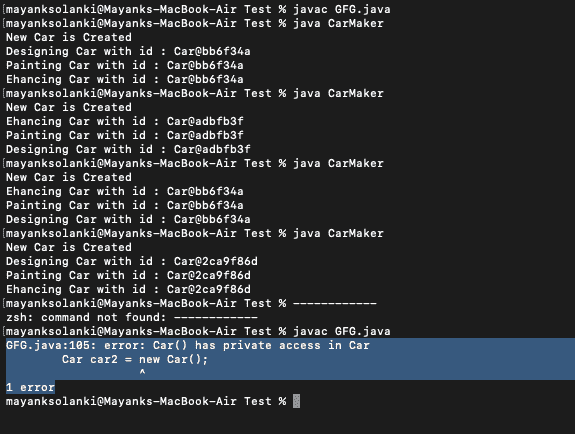

# 演示非惰性初始化线程安全的 Java 程序

> 原文:[https://www . geesforgeks . org/Java-program-to-演示-非惰性-初始化-线程安全/](https://www.geeksforgeeks.org/java-program-to-demonstrate-the-non-lazy-initialization-thread-safe/)

Java 是 Oracle 提供的最流行的面向对象编程语言之一，在网站和开发人员探索的应用程序开发中有广泛的应用。Java 以及一些众所周知的健壮框架，如 Spring、Spring-Boot 等。在开发/编码软件时，让开发人员的生活变得轻松。Java 提供了两种对象实例化方法(对象实例创建)，即渴望和懒惰。本文主要关注非惰性实例化(即渴望实例化)。

Java 中的线程是独立的小编码单元，可以单独执行(在 CPU 的多个内核上以并行方式执行)，以提高处理速度等。因此，java 中的线程安全意味着无论有多少线程被同时创建和执行，程序执行的输出或业务逻辑都保持在预期或期望的状态。举一个简单的例子，比如 java 中的 Singleton(在代码执行过程中只应该有一个实例，除了创建第一个实例之外，这个类的新的/不同的实例都允许被实例化)

因此，本文试图阐明线程安全环境中的非懒惰实例化，并通过汽车制造商(制造商)案例研究实例的实际说明来帮助解释它。

**实施:**

下面将以一个**CarMaker.java**(下面的脚本)为例来演示如何解释对象的非惰性实例化。

1.  我们有一个 **Car** java 类(作为 Singleton Class)，所以在整个程序流中只需要创建和提供一个对象。
2.  我们有一个**汽车制造商**类(Runner 类中有 *main()方法*，它试图采用基本的 Car 实例，并使用它执行设计、绘制和增强等操作(在我们的确切情况下，这些是带有适当消息的简单打印语句)
3.  我们正在为上面提到的所有操作创建单独的线程，以展示线程安全的行为(在我们的例子中，这意味着无论同时执行的线程是否达到***getcarinstance()***方法，只有一个实例会在程序中循环)
4.  线程执行的顺序可能会改变，但是使用非惰性实例创建来创建单个对象(在终端上打印相同的对象标识时可见)的结果将在这里得到满足。

**例**

## Java 语言(一种计算机语言，尤用于创建网站)

```java
// Java Program to illustrate Implementation of non
// Lazy-Instantiation (Eager Instantiation)
// which is Thread-Safe

// Importing required libraries
import java.io.*;
import java.util.*;
import java.util.concurrent.*;

// 'CarMaker' class is trying to Manufacture a Car
// So the Base vehicle 'Car' should remain same and
// operations like paintCar,designCar,enhanceCar etc.
// will execute with the same Car (Object Instance here.)

// Class 1
// Helper class
// Refers to a Singleton Class in General
class Car {

    // Creating eager instance variable for Car
    // Thread-Safe as marked final
    private static final Car car = new Car();

    // Only executes when new Car Instance is created
    // So Ideally this should be executed only once as
    // we are working with same Car

    // Constructor of Car class
    private Car()
    {

        // Print and display message
        // should be displayed only once on terminal.
        System.out.println("New Car is Created");
    }

    // Method of Car class
    static Car getCarInstance()
    {

        // Returns the Car Instance
        return car;
    }
}

// Class 2
// Main class
class CarMaker {

    // Main driver method
    public static void main(String args[])
    {

        // We make threads dynamically for
        // each operation specified above

        // Thread 1
        // Thread for designing the Car
        Thread designCar = new Thread(new Runnable() {
            // run() method for thread
            public void run()
            {

                // Creating and getting the Car instance
                Car car = Car.getCarInstance();

                // Print and display the ID
                System.out.println(
                    "Designing Car with id : " + car);
            }
        });

        // Thread 2
        // Thread for Painting the Car
        Thread paintCar = new Thread(new Runnable() {
            // run() method for thread
            public void run()
            {

                // Creating and getting Car instance by
                // calling the Car class method
                Car car = Car.getCarInstance();

                // Print and display the ID
                System.out.println("Painting Car with id : "
                                   + car);
            }
        });

        // Thread 3
        // Thread for Enhancing the Car
        Thread enhanceCar = new Thread(new Runnable() {
            // run() method for the thread
            public void run()
            {

                // Creating and getting Car instance by
                // calling the Car class method
                Car car = Car.getCarInstance();

                // Print and display the ID
                System.out.println("Enhancing Car with id : "
                                   + car);
            }
        });

        // Note: Second object of Car class can not be
        // created Cannot create new Instance as Constructor
        // is not Visible

        // Below object is not created
        // in first compile and run
        // It is cleared here in second go
        // during compile and run

        // Car car2 = new Car();

        // Running the above 3 threads as created above
        designCar.start();
        paintCar.start();
        enhanceCar.start();
    }
}
```

**输出:**



在这里，我们已经编译了两次程序，其中第二次我们强制创建了第二个“汽车”类对象。请注意，我们不能创建“Car”类的第二个实例，因为第二次的构造函数不可见。它会抛出一个错误，如下图中下划线部分的硬编码输出所示，当我们编译并通过创建另一个对象再次运行时，它会在终端上抛出。

输出解释:

在这里，为了解释 Java 类对象的非惰性实例化，我们进行了一个简单的案例研究，让一个 Car Marker 制造汽车。它采用基本的“汽车”车辆，并执行诸如油漆汽车、设计汽车和增强汽车等操作。为了使处理尽可能简单，我们在每个操作中都有简单的打印语句，并显示汽车对象标识，以确保它们在同一辆汽车上工作。

正如我们在输出中看到的，操作的执行顺序(在这种情况下是线程)可能不同，但是通过程序的执行来说明每个操作(绘制、设计和增强)是在同一辆车上执行的，汽车对象标识保持不变。正如代码注释“ ***”中所解释的那样，singleton (Car)实例创建时的 final“***关键字使其对于执行来说是线程安全的，因此我们得到了始终拥有相同 Car 对象的期望结果。

> **结论:** [一定要参考](https://docs.oracle.com/javase/specs/jls/se8/html/jls-17.html#jls-17.5.1)才能弄清楚“***final”***如何让代码在没有同步的情况下线程安全。因此，上面的文章借助 Car Maker 案例研究示例解释了 Java 类(Singleton 类)的非惰性实例化(渴望实例化)。