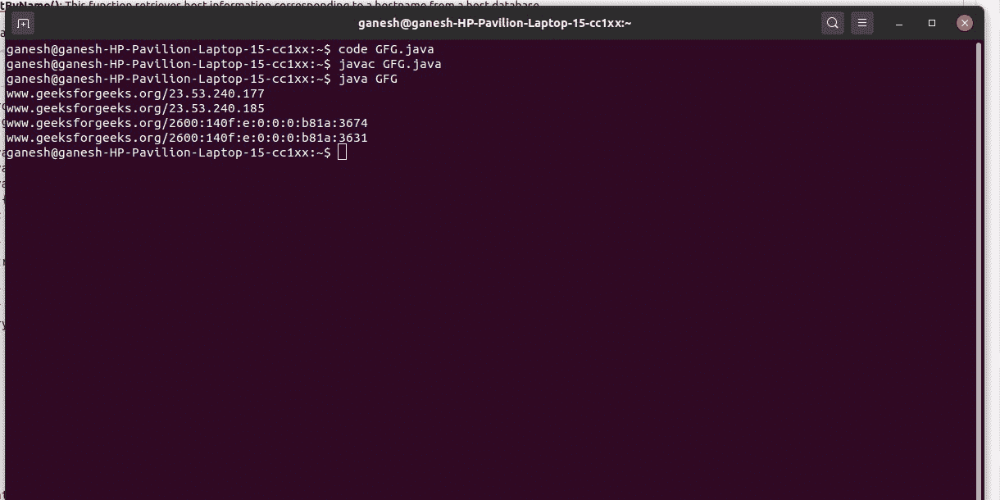

# 从 IP 地址确定主机名的 Java 程序

> 原文:[https://www . geesforgeks . org/Java-程序-从 ip 地址确定主机名/](https://www.geeksforgeeks.org/java-program-to-determine-hostname-from-ip-address/)

**IP 地址**代表**互联网协议地址。**是与特定计算机或计算机网络相关联的识别号。 IP 地址通常以人类可读的符号书写和显示，例如 IPv4(32 位 IP 地址)中的 192.168.1.35。当连接到互联网时，该 IP 地址允许计算机发送和接收信息。每个站点都有自己的主机链接到自己的 IP 地址，这有助于将用户的请求发送到 HTTP 流量，并有助于收集用户想要的信息。这就是 IP 地址对每个主机的必要性。

有许多方法可以获得特定主机的 IP 地址。所以帮助获取任何主机的 IP 地址的方法是 [InetAddress](https://www.google.com/url?client=internal-element-cse&cx=009682134359037907028:tj6eafkv_be&q=https://www.geeksforgeeks.org/networking-class-in-java/&sa=U&ved=2ahUKEwix_dnJ1ejsAhWkxDgGHT80A6QQFjAAegQIBBAC&usg=AOvVaw3CKUn-bgO4xg4C2HvpBObw) 类的 **getHostAddress()** 。

**语法:**

```java
public String getHostAddress() 

```

**返回:**以字符串格式返回原始 IP 地址。

**注意:**从主机名中很容易找到 IP 地址。但是由于安全原因，很难从 IP 地址中获取主机名，因为所有的 IP 地址都是安全的。

以下方法用于获取主机名。

*   **getHostName()** :这个函数检索本地计算机的标准主机名。
*   **getHostByName()** :该函数从主机数据库中检索主机名对应的主机信息。

**示例:**从给定主机获取 IP 地址

## Java 语言(一种计算机语言，尤用于创建网站)

```java
// Java program to obtain IP Address
// from a given host

import java.io.*;
import java.util.*;
import java.net.*;
class GFG {
    public static void main(String[] args)
    {
          // Host
        String host = "www.geeksforgeeks.org";

        // Using try Logic So that if there is an error then
        // easily get the error
        try {

            // calling the function which gives the IP
            // Address from the given host
            InetAddress[] iaddress
                = InetAddress.getAllByName(host);

            for (InetAddress ipaddresses : iaddress) {
                System.out.println(ipaddresses.toString());
            }
        }
        catch (UnknownHostException e) {
            System.out.println(e);
        }
    }
}
```



**示例:**从给定的 IP 地址获取主机名。出于安全原因，所有服务器和 IP 都是安全的，因此无法找到直接来自 IP 地址的主机名。但是该方法类似于从不安全的 IP 地址中找到任何主机名。

## Java 语言(一种计算机语言，尤用于创建网站)

```java
// Java program to get Host name
// from an ipaddress

import java.io.*;
import java.net.*;
class GFG {
    public static void main(String[] args)
    {
        try {
            // IP Address
            InetAddress addr
                = InetAddress.getByName("23.229.203.68");

            // Host name
            System.out.println("Host name is: "
                               + addr.getHostName());

            // Host Address
            System.out.println("Ip address is: "
                               + addr.getHostAddress());
        }
        catch (UnknownHostException e) {
            System.out.println(e);
        }
    }
}
```

**Output**

```java
Host name is: 23.229.203.68
Ip address is: 23.229.203.68

```