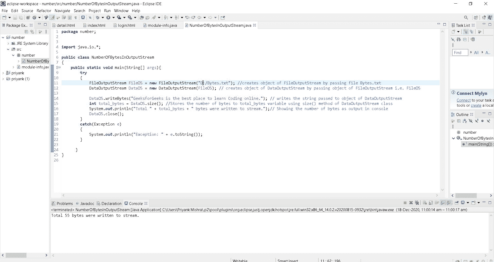
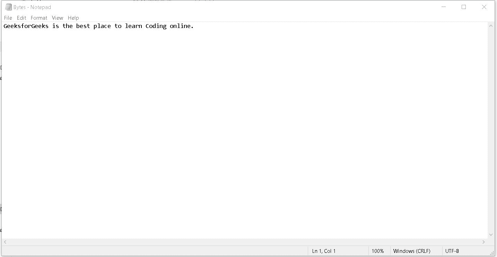
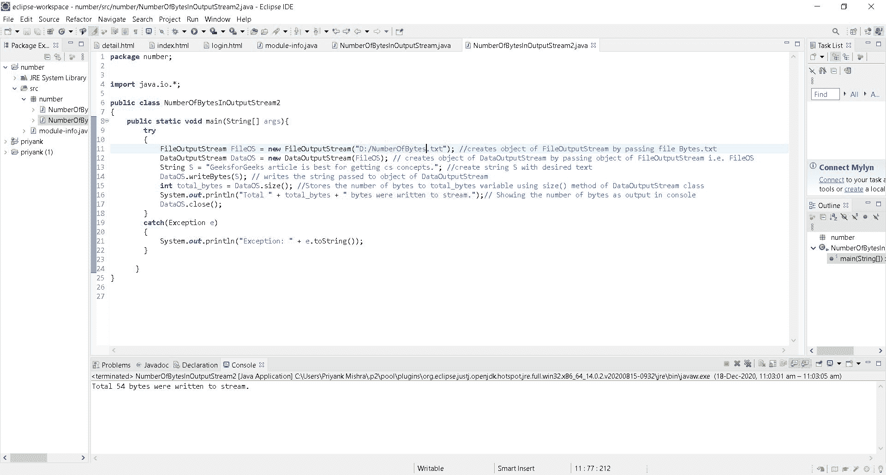
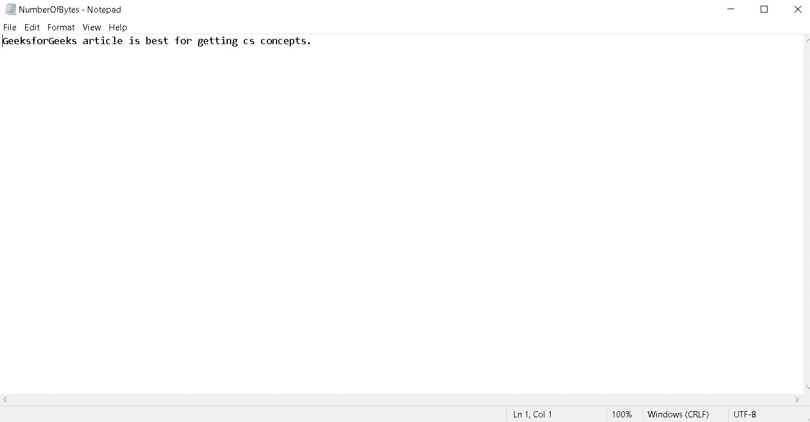

# 使用数据输出流确定写入文件的字节数的 Java 程序

> 原文:[https://www . geesforgeks . org/Java-程序确定写入文件的字节数-使用-dataoutputstream/](https://www.geeksforgeeks.org/java-program-to-determine-number-of-bytes-written-to-file-using-dataoutputstream/)

Java OutputStream 类，**[**Java . IO . OutputStream**](https://www.geeksforgeeks.org/java-io-outputstream-class-java/)，是 [**Java IO API**](https://www.geeksforgeeks.org/java-io-packag/) 中所有输出流的基类。输出流接受输出字节并将它们发送到某个接收器。需要定义 OutputStream 子类的应用程序必须始终提供至少一个写入一个字节输出的方法。**

*   **为了获得写入的字节数，我们首先创建一个对象[**【文件输出流】**](https://www.geeksforgeeks.org/fileoutputstream-in-java/) ，方法是传递文件路径，该路径在下面的代码中显示为文件操作系统。**
*   **然后我们通过传递文件创建一个 [**数据输出流**](https://www.geeksforgeeks.org/dataoutputstream-in-java/) 的对象，即文件输出流的对象，在下面的代码中显示为数据对象。**
*   **现在，我们将使用数据输出流的 **writeBytes()** 方法向该文本文件中注入文本。为了得到写入字节的大小，我们在对象数据对象上使用了数据输出流类的大小方法。**

****程序 1:****

## **Java 语言(一种计算机语言，尤用于创建网站)**

```java
// Java program to determine number of bytes
// written to DataOutputStream

import java.io.*;

public class NumberOfBytesInOutputStream {
    public static void main(String[] args)
    {
        try {

            // creates object of FileOutputStream by passing
            // file Bytes.txt
            FileOutputStream FileOS
                = new FileOutputStream("C:/Bytes.txt");

            // creates object of DataOutputStream by
            // passing object of FileOutputStream i.e.
            // FileOS
            DataOutputStream DataOS = new DataOutputStream(FileOS);

            // writes the string passed to object of
            // DataOutputStream
            DataOS.writeBytes(
                 "GeeksforGeeks is the best place to learn Coding online.");

            // Stores the number of bytes to total_bytes
            // variable using size() method of
            // DataOutputStream class
            int total_bytes = DataOS.size();

            // Showing the number of bytes as output in
            // console
            DataOS.close();

            System.out.println("Total " + total_bytes
                        + " bytes were written to stream.");
        }
        catch (Exception e) 
        {
            System.out.println("Exception: " + e.toString());
        }
    }
}
```

****输出:****

****

****

****

****程序 2:****

## **Java 语言(一种计算机语言，尤用于创建网站)**

```java
// Java program to determine number of bytes
// written to DataOutputStream

import java.io.*;

public class NumberOfBytesInOutputStream2 {
    public static void main(String[] args)
    {
        try {

            // creates object of FileOutputStream by passing
            // file Bytes.txt
            FileOutputStream FileOS = new FileOutputStream("C:/NumberOfBytes.txt");

            // creates object of DataOutputStream by passing
            // object of FileOutputStream i.e. FileOS
            DataOutputStream DataOS = new DataOutputStream(FileOS);

            // create string S with the desired text
            String S = "GeeksforGeeks article is best for getting cs concepts.";

            // writes the string passed to object of
            // DataOutputStream
            DataOS.writeBytes(S);

            // Stores the number of bytes to total_bytes
            // variable using size() method of
            // DataOutputStream class
            int total_bytes = DataOS.size();

            // Showing the number of bytes as output in
            // console
            System.out.println("Total " + total_bytes
                      + " bytes were written to stream.");

            DataOS.close();

        }
        catch (Exception e) 
        {
            System.out.println("Exception: " + e.toString());
        }
    }
}
```

****输出:****

****

****

****