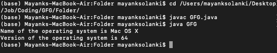

# 确定操作系统名称和版本的 Java 程序

> 原文:[https://www . geesforgeks . org/Java-程序确定操作系统的名称和版本/](https://www.geeksforgeeks.org/java-program-to-determine-the-name-and-version-of-the-operating-system/)

Java 中内置的 System 类提供了[*【getProperty()*](https://www.geeksforgeeks.org/getproperty-and-getproperties-methods-of-system-class-in-java/)方法，用于获取当前工作操作系统的属性。系统类有两个版本的 *getProperty()* 。两者都检索参数列表中命名的属性值。

**方法:**

1.  [*getProperty()*](https://www.geeksforgeeks.org/getproperty-and-getproperties-methods-of-system-class-in-java/) 版本 1
2.  [*getProperty()*](https://www.geeksforgeeks.org/getproperty-and-getproperties-methods-of-system-class-in-java/) 版本 2

**版本 1:** 版本之一 [*的**s**getProperty()*](https://www.geeksforgeeks.org/properties-getpropertykey-method-in-java-with-examples/)方法将一个单参数作为属性，返回一个包含该属性值的字符串。如果属性不存在，此版本的 getProperty 将返回 null。

**语法:**

```
String System.getProperty( String key ) ;
```

**参数:** Key only，是操作系统的属性。

**返回类型:**

*   返回包含属性值的字符串。
*   如果属性不存在，则返回空值。

**版本 2:**getProperty()的另一个版本采用两个 String 参数，第一个参数作为属性，第二个参数是在找不到键或者键没有值的情况下返回的默认值。

**语法:**

```
String System.getProperty( String key, String value ) ;
```

**参数:**

*   关键是操作系统的属性。
*   属性无效时要指定的键的默认值。

**返回类型:**

*   返回包含属性值的字符串。
*   如果系统属性无效，则返回作为第二个参数提供的默认值。

**示例:**算出操作系统的名称和版本。

## Java 语言(一种计算机语言，尤用于创建网站)

```
// Java Program to Determine the name
// and version of the operating system

// Importing all classes of
// java.util package
import java.util.*;

public class GFG {

    // Getting name of the OS
    private static final String nameOfOs
        = System.getProperty("os.name");

    // Getting version of the OS
    private static final String versionOfOS
        = System.getProperty("sun.arch.data.model");

    // Main driver method
    public static void main(String[] args)
    {
        // Printing name of OS
        System.out.println(
            "Name of the operating system is " + nameOfOs);

        // Printing version of the OS
        System.out.println(
            "Version of the operating system is "
            + versionOfOS);
    }
}
```

**输出:**以上程序编译运行于终端，输出如下:

