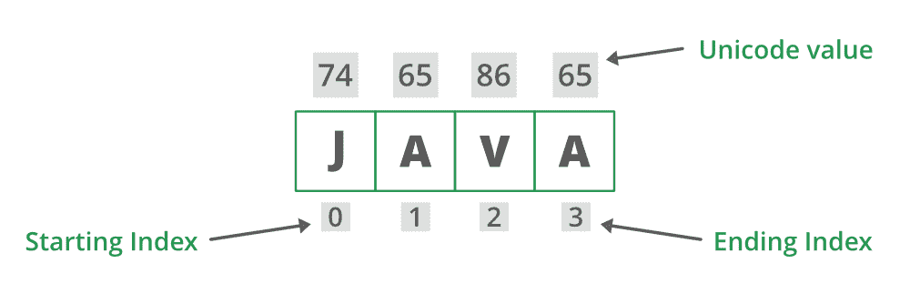

# 确定字符串中给定索引处的 Unicode 代码点的 Java 程序

> 原文:[https://www . geesforgeks . org/Java-程序确定字符串中给定索引处的 unicode 代码点/](https://www.geeksforgeeks.org/java-program-to-determine-the-unicode-code-point-at-given-index-in-string/)

ASCII 是一种将英文字母转换成数字的代码，因为数字可以转换成我们的计算机能够理解的汇编语言。为此，我们为每个字符分配了一个数字，范围从 0 到 127。字母区分大小写，大写字母区别对待。完整的 [ASCII](https://sqlandplsql.com/2012/07/01/ascii-chart-oracle/) 值表是可以解释的，但是最好坚持下图中的表格，不需要在表格中查找完整的 ASCII 值。末端分配如下，以便在记忆完整表格的情况下正确猜测 Unicode 值。有了这个表，人们可以提取所有的 Unicode 字母，无论是大写字母还是小写字母。



插图:

<figure class="table">

| S.No | 必须记住案例 | Unicode 值 |
| --- | --- | --- |
| one | 字母的小写开头 | Sixty-five |
| Two | 字母的小写结尾 | Ninety |
| three | 字母的大写开头 | Ninety-seven |
| four | 字母的大写结尾 | One hundred and twenty-two |

</figure>

由此，我们可以得到其他值的 Unicode，比如 b 是 66，因为小写的开头是 a，从上表可以看出，它是 65。B 的是 98。同样，对于 Unicode 来说，“G”是 71，“E”是 69，“K”是 75，以此类推。

[***CodePointat()***](https://www.geeksforgeeks.org/stringbuilder-codepointat-in-java-with-examples/)**内置方法用于**用户想要返回特定索引处的字符的地方。索引引用字符值(Unicode 单位)，范围从 0 到 length()-1****

******定义** i **函数:**这是一个内置函数，返回特定索引处的字符(Unicode 点)。索引引用字符值(Unicode 单位)，范围从 0 到 length()-1。****

******语法:******

```java
**java.lang.String.codePointAt();**
```

******参数:**字符值的索引。****

******返回类型:**该方法返回指定索引处的 Unicode 值。索引指的是字符值(Unicode 代码单位)，范围从 0 到[ [*长度()*](https://www.geeksforgeeks.org/length-vs-length-java/) *-1]。*简单来说就是在索引处字符的码点值。****

******实现:**考虑到这个函数涉及异常的情况和另一个简单描述函数内部使用的情况，有两个例子正在讨论以便清楚理解。****

******示例 1:** 在这种边缘情况下，不考虑上述方法抛出的异常处理。****

## ****Java 语言(一种计算机语言，尤用于创建网站)****

```java
**// Importing Files and Classes
import java.io.*;

class GFG {

    // Main driver method
    public static void main(String[] args)
    {
        // Considering random string for input
        String str = "GEEKS";

        // Unicode at index 0
        // Input is a small string
        int result_1 = str.codePointAt(0);
        int result_2 = str.codePointAt(1);
        int result_3 = str.codePointAt(2);
        int result_4 = str.codePointAt(3);
        int result_5 = str.codePointAt(4);

        // Printing the input string
        System.out.println("Original String : " + str);

        // Prints unicode character at index 0 to 4
        // in above input string
        // to show usage of codePointAt()
        System.out.println("unicode point at 0 = "
                           + result_1);
        System.out.println("unicode point at 1 = "
                           + result_2);
        System.out.println("unicode point at 2 = "
                           + result_3);
        System.out.println("unicode point at 3 = "
                           + result_4);
        System.out.println("unicode point at 4 = "
                           + result_5);
    }
}**
```

******输出:******

```java
**Original String : GEEKS
unicode point at 0 = 71
unicode point at 1 = 69
unicode point at 2 = 69
unicode point at 3 = 75
unicode point at 4 = 83**
```

******上述代码的时间复杂度 O(n)** 。****

****现在考虑一下这里的异常概念，异常只是运行时中断程序正常流程时出现的一个问题。它们可以是两种类型的检查异常和未检查异常。如果编译器检测不到未检查的异常，我们的编译器可以检测到已检查的异常。为此，java 中的异常处理技术也是如此。现在处理函数中的异常。当试图访问超出内存的索引时，有时会引发异常。以下是*代码点(*)方法中异常的概念细节。同样，讨论**[***indexout of bound***](https://www.geeksforgeeks.org/understanding-array-indexoutofbounds-exception-in-java/)*异常下行以及为了处理它[*试捕*](https://www.geeksforgeeks.org/flow-control-in-try-catch-finally-in-java/) 的手法。*******

*******示例 2: IndexOutOfBoundsException** 被抛出以指示某种类型的索引(如数组、字符串或向量)超出范围，如下所示。下面的示例说明了抛出异常的代码点()。*****

## *****Java 语言(一种计算机语言，尤用于创建网站)*****

```java
***import java.io.*;

class GFG {

    // Main driver method
    public static void main(String[] args)
    {

        // Try block to check exceptions
        try {

            // Input string
            String str = "Geeksforgeeks";

            // unicode at index 0
            // Storing it in integer variable
            int result_1 = str.codePointAt(0);

            // unicode at index 4
            int result_2 = str.codePointAt(-4);

            // Printing input/original string
            System.out.println("Original String : " + str);

            // Prints unicode character at index 1 in string
            System.out.println("Character(unicode point) = "
                               + result_1);

            // Prints unicode character at index 4 in string
            System.out.println("Character(unicode point) = "
                               + result_2);
        }

        // Catch block to handle exception
        catch (IndexOutOfBoundsException e) {

            // Message printed if exception occurs
            System.out.println("Exception thrown  :" + e);
        }
    }
}***
```

*******Output**

```java
Exception thrown  :java.lang.StringIndexOutOfBoundsException: index -4,length 13
```*****