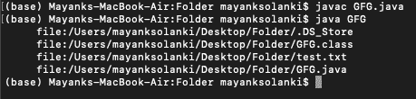
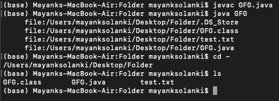

# 显示一个目录中所有目录的 Java 程序

> 原文:[https://www . geesforgeks . org/Java-program-to-display-all-in-a-directory/](https://www.geeksforgeeks.org/java-program-to-display-all-the-directories-in-a-directory/)

[目录](https://www.geeksforgeeks.org/structures-of-directory-in-operating-system/)是计算机文件系统的组织结构，它不仅负责存储文件，还负责在内存中定位文件。文件组织结构是一种层次结构，它涉及父关系和子关系，就像树数据结构一样。它将因操作系统而异，相反，操作系统的效率是用最终用户的文件组织结构的难易程度来衡量的。

Java 中的下列类列出了目录内容

*   java.nio.file.Files
*   apache.commons.io.FileUtils 组织
*   [java.io.File](https://www.geeksforgeeks.org/file-class-in-java/)

目录的层次结构


**先决条件:**文件和目录命令

1.  用于在机器上编译任何 java 代码的终端命令
2.  用于在机器上运行任何 java 代码的终端命令

```
javac class_name.java // For Compilation
java class_name       // For Execution
```

<figure class="table">

| 行动 | 命令 |
| --- | --- |
| 要导航到根目录 | cd / |
| 要导航到您的主目录 | 激光唱片 |
| 要向上导航一个目录级别 | 激光唱片.. |
| 要导航到上一个目录 | CD– |
| 查找当前实例目录中的文件 | 限位开关（Limit Switch） |

</figure>

**方法:**在 Java 中访问目录有两种标准方法。关于方法的讨论如下:

*   **方法 1:** 使用[列表文件()](https://www.geeksforgeeks.org/file-listfiles-method-in-java-with-examples/)方法
*   **进场 2:** 使用[蛮力](https://www.geeksforgeeks.org/brute-force-attack/)攻击

**方法 1:** [listFiles()](https://www.geeksforgeeks.org/file-listfiles-method-in-java-with-examples/) 方法将所有文件存储在一个数组中，以打印当前文件夹中存在的所有文件。

下面是相同的实现。

## Java 语言(一种计算机语言，尤用于创建网站)

```
// Java Program to Display all directories in a directory

// Importing Classes/Files
import java.io.*;
// Importing  specific File Class for directory access
import java.io.File;

class GFG {
    // Main Driver code
    public static void main(String[] args)
    {
        // Creating object of class File where
        // Dot represents the current directory
        File currentDir = new File(".");
        displayDirectory(currentDir);
    }

    // Function displaying all the directories
    // present in the directory
    public static void displayDirectory(File dir)
    {

        try {
            File[] files = dir.listFiles();

            // For-each loop for iteration
            for (File file : files) {

                // Checking of file inside directory
                if (file.isDirectory()) {

                    // Display directories inside directory
                    System.out.println(
                        "directory:"
                        + file.getCanonicalPath());
                    displayDirectory(file);
                }

              // Simply get the path
                else {
                    System.out.println(
                        "     file:"
                        + file.getCanonicalPath());
                }
            }
        }

        // if any exceptions occurs printStackTrace
        catch (IOException e) {
            e.printStackTrace();
        }
    }
}
```

**输出:**终端显示一个目录中的所有目录



**方法 2:** 现在，这里简单地考虑[蛮力](https://www.geeksforgeeks.org/brute-force-attack/)攻击，即访问给定的目录并简单地打印存在于指定文件夹中的目录/文件。下面是相同的实现。

## Java 语言(一种计算机语言，尤用于创建网站)

```
// Java Program to Display all directories in a directory

// Importing Classes/Files
import java.io.*;

public class GFG {

    // Driver main method
    public static void main(String[] args)
    {
        /*For windos user write path in below format-:
              ("F:\\folder name \\ subfolder")
           */

        // Creating new instance of File
        File file = new File("/Desktop");

        // returns an array of all files
        String[] fileList = file.list();

        for (String str : fileList) {
            System.out.println(str);
        }
    }
}
```

**输出:**

此代码通过网络卷访问。



**注意:**在上面的例子中我们已经为 [Linux](https://www.geeksforgeeks.org/linux-commands/) 用户写了路径。对于 Windows 用户，您必须在指定路径时使用双反斜杠。这是因为\字符在 Java 中用作转义字符。因此，第一个反斜杠被用作第二个反斜杠的转义字符。